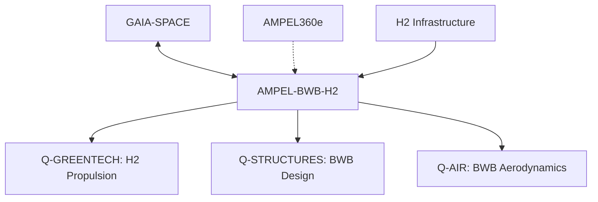
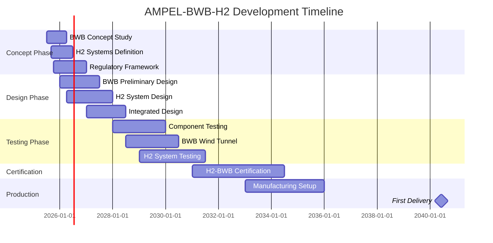

# 🔋 AMPEL-BWB-H2 - Blended Wing Body Hydrogen Aircraft
**Programa Revolucionario de Aviación de Hidrógeno - Enhanced v2.0**

**Identificador del Programa**: AMPEL-BWB-H2-v2.0  
**Código GQOIS**: Q250-ALI-DP-EPTA-460-00-00-CON-001  
**Versión del Documento**: 2.0.0  
**Fecha de Publicación**: 24 de julio de 2025  
**Clasificación**: CONFIDENCIAL DEL CONSORCIO GAIA-QAO  
**Estado**: Programa Activo - Fase Conceptual Avanzada  
**Responsable Técnico**: Amedeo Pelliccia  
**División Coordinadora**: Q-GREENTECH  
**Aprobación**: ORB-PMO / ORB-LEG  

---

## 🚀 Resumen Ejecutivo

**AMPEL-BWB-H2** es un proyecto revolucionario que combina la configuración aerodinámica **Blended Wing Body (BWB)** con **propulsión 100% de hidrógeno**, representando un salto cuántico hacia la aviación de **cero emisiones** para rutas de largo alcance. Este programa establece la base tecnológica para la **aviación sostenible del futuro** mediante innovaciones certificables en propulsión criogénica y diseño aerodinámico avanzado.

---

## ⚙️ Especificaciones Técnicas Certificables para Hidrógeno

### Configuración BWB Optimizada para H2
| Parámetro | Especificación Certificable | Estándar de Cumplimiento |
|-----------|------------------------------|---------------------------|
| **Capacidad pasajeros** | 350-400 (configuración BWB) | CS-25.807 (BWB Amendment) |
| **Alcance máximo** | 8,000 km (H2 líquido, MTOW) | CS-25.1001 + H2 Extensions |
| **Envergadura** | 88 metros (optimizada BWB) | CS-25.301-397 (BWB specific) |
| **Configuración ala** | Blended wing body 3ª gen | CS-25.25 (Airworthiness BWB) |
| **Material estructura** | CFRP criogénico certificado | CS-25.603 + LH2 materials |
| **Altitud de servicio** | 43,000 ft (optimizada H2) | CS-25.1527 |
| **Velocidad crucero** | Mach 0.82 (eficiencia BWB) | CS-25.1505 |

### Sistema de Propulsión Hidrógeno Certificable
| Parámetro | Especificación | Estándar de Cumplimiento |
|-----------|----------------|---------------------------|
| **Motores principales** | 4x H2-Turbofan 80,000 lbs | CS-E 500 + H2 Supplement |
| **Combustible** | Hidrógeno líquido (-253°C) | CS-25.1001 + ASTM H2 |
| **Tanques criogénicos** | 6x tanques integrados ala | CS-25.967 + H2 Amendment |
| **Capacidad H2** | 12,000 kg (autonomía 8000km) | Performance based |
| **Sistema distribución** | Criogénico distribuido | CS-25.1181 + H2 systems |
| **Safety systems** | Triple redundancia + vent | CS-25.1309 (H2 specific) |
| **Ignition system** | Quantum-assisted precision | CS-25.1125 + innovation |
| **Emissions** | Cero CO₂, solo H₂O vapor | ICAO CORSIA compliant |

---

## 📐 UTCS Architecture Compliance para H2-BWB

### EPTA Integration (400-499) - Energy & Propulsion Technology Advanced
| EPTA Code | Sistema H2 | Tecnología | Estándar |
|-----------|------------|------------|----------|
| **EPTA 460** | Hydrogen Propulsion | LH2 Turbofan Engines | CS-E 500 + H2 |
| **EPTA 461** | Cryogenic Storage | Vacuum Insulated Tanks | CS-25.967 + LH2 |
| **EPTA 462** | H2 Distribution | Cryogenic Fuel System | CS-25.1181 + H2 |
| **EPTA 463** | Safety Systems | H2 Leak Detection | CS-25.1309 H2 |
| **EPTA 464** | Combustion Control | Quantum Ignition | Innovation track |

### ATA Chapters Adaptation for BWB-H2
| ATA Code | Sistema BWB-H2 | División Responsable | Estándar H2 |
|----------|----------------|---------------------|-------------|
| **ATA 28** | Fuel System (H2) | Q-GREENTECH | CS-25.951 + H2 |
| **ATA 53** | Fuselage (BWB) | Q-STRUCTURES | CS-25.561 BWB |
| **ATA 57** | Wings (Integrated BWB) | Q-STRUCTURES | CS-25.301 BWB |
| **ATA 71** | Power Plant (H2) | Q-GREENTECH | CS-E 500 + H2 |
| **ATA 80** | Starting (H2 Ignition) | Q-GREENTECH | CS-25.1125 H2 |

### AMTA Integration (500-599) - Advanced Materials for H2
| AMTA Code | Aplicación H2-BWB | Material Criogénico | Certificación |
|-----------|-------------------|---------------------|---------------|
| **AMTA 560** | H2 Tank Structure | Ti-6Al-4V criogénico | LH2 materials |
| **AMTA 561** | BWB Wing Structure | CFRP criogénico | CS-25.603 LH2 |
| **AMTA 562** | Insulation Systems | Vacuum Multilayer | Thermal barrier |
| **AMTA 563** | Sealing Systems | H2-resistant elastomers | H2 compatibility |

---

## 🏗️ Arquitectura del Repositorio BWB-H2 por Fases

```
01-PROGRAMS/AMPEL-BWB-H2/
├── 01-01-CONCEPT-CON/                    # Fase Conceptual (2025-2026)
│   ├── bwb-aerodynamics/
│   │   ├── QAIR-Q250-ALI-DP-CON-001_BWB_Concept_Study.pdf
│   │   └── QAIR-Q250-BOB-CFD-CON-002_BWB_Aerodynamics.py
│   ├── hydrogen-systems/
│   │   ├── QGRN-Q250-ALI-DP-CON-003_H2_Propulsion_Concept.pdf
│   │   └── QGRN-Q250-BOB-SIM-CON-004_Cryogenic_Analysis.py
│   ├── market-analysis/
│   │   ├── QMKT-Q250-ALI-DP-CON-005_Long_Range_Market.pdf
│   │   └── QFIN-Q250-ALI-DP-CON-006_H2_Economics.xlsx
│   └── regulatory-framework/
│       ├── QLEG-Q250-ALI-DP-CON-007_H2_Certification_Path.pdf
│       └── QLEG-Q250-ALI-DP-CON-008_BWB_Regulatory_Gaps.pdf
│
├── 01-02-DESIGN-DES/                     # Diseño Conceptual (2026-2028)
│   ├── bwb-configuration/
│   │   ├── QSTR-Q250-BOB-CAD-DES-001_BWB_Pressure_Vessel.step
│   │   └── QSTR-Q250-BOB-FEA-DES-002_Structural_Analysis.json
│   ├── cryogenic-systems/
│   │   ├── QGRN-Q250-BOB-CAD-DES-003_H2_Tank_Design.step
│   │   └── QGRN-Q250-BOB-CFD-DES-004_Cryogenic_Flow.py
│   ├── propulsion-integration/
│   │   ├── QGRN-Q250-BOB-CAD-DES-005_H2_Engine_Integration.step
│   │   └── QGRN-Q250-ALI-DP-DES-006_Propulsion_Architecture.pdf
│   └── safety-systems/
│       ├── QHPC-Q250-BOB-SIM-DES-007_H2_Safety_Simulation.py
│       └── QLEG-Q250-ALI-DP-DES-008_Safety_Assessment.pdf
│
├── 01-03-TESTING-TST/                    # Validación y Pruebas (2028-2031)
│   ├── aerodynamic-testing/
│   │   ├── QAIR-Q250-ALI-DP-TST-001_Wind_Tunnel_BWB.pdf
│   │   └── QAIR-Q250-BOB-CFD-TST-002_BWB_Performance.py
│   ├── cryogenic-testing/
│   │   ├── QGRN-Q250-ALI-DP-TST-003_H2_Tank_Tests.pdf
│   │   └── QGRN-Q250-BOB-TEST-TST-004_Cryogenic_Cycling.json
│   ├── propulsion-testing/
│   │   ├── QGRN-Q250-ALI-DP-TST-005_H2_Engine_Tests.pdf
│   │   └── QGRN-Q250-BOB-SIM-TST-006_Combustion_Tests.py
│   └── safety-validation/
│       ├── QHPC-Q250-ALI-DP-TST-007_H2_Leak_Detection.pdf
│       └── QLEG-Q250-ALI-DP-TST-008_Emergency_Procedures.pdf
│
├── 01-04-CERTIFICATION-CRT/              # Certificación H2 (2031-2034)
│   ├── h2-certification/
│   │   ├── QLEG-Q250-ALI-DP-CRT-001_H2_Type_Certificate.pdf
│   │   └── QLEG-Q250-ALI-DP-CRT-002_H2_Safety_Certification.pdf
│   ├── bwb-certification/
│   │   ├── QLEG-Q250-ALI-DP-CRT-003_BWB_Structural_Cert.pdf
│   │   └── QAIR-Q250-ALI-DP-CRT-004_BWB_Flight_Cert.pdf
│   └── operational-approval/
│       ├── QAIR-Q250-ALI-DP-CRT-005_H2_Operations_Manual.pdf
│       └── QGRD-Q250-ALI-DP-CRT-006_H2_Ground_Handling.pdf
│
├── 01-05-PRODUCTION-PRD/                 # Producción (2034-2040)
│   ├── h2-manufacturing/
│   │   ├── QIND-Q250-ALI-DP-PRD-001_H2_Tank_Manufacturing.pdf
│   │   └── QIND-Q250-BOB-MFG-PRD-002_Cryogenic_Assembly.dwg
│   ├── bwb-manufacturing/
│   │   ├── QIND-Q250-ALI-DP-PRD-003_BWB_Assembly_Process.pdf
│   │   └── QIND-Q250-BOB-PLM-PRD-004_BWB_Production_Line.dwg
│   └── quality-assurance/
│       ├── QIND-Q250-ALI-DP-PRD-005_H2_QA_Procedures.pdf
│       └── QIND-Q250-BOB-QMS-PRD-006_H2_Quality_System.exe
│
├── 01-06-OPERATIONS-OPS/                 # Operaciones H2 (2040+)
│   ├── h2-operations/
│   │   ├── QAIR-Q250-ALI-DP-OPS-001_H2_Flight_Manual.pdf
│   │   └── QGRD-Q250-ALI-DP-OPS-002_H2_Ground_Operations.pdf
│   ├── performance-monitoring/
│   │   ├── QHPC-Q250-BOB-DT-OPS-003_H2_Digital_Twin.py
│   │   └── QAIR-Q250-ALI-DP-OPS-004_BWB_Performance.pdf
│   └── infrastructure/
│       ├── QGRD-Q250-ALI-DP-OPS-005_H2_Airport_Infrastructure.pdf
│       └── QGRN-Q250-ALI-DP-OPS-006_H2_Supply_Chain.pdf
│
├── 01-07-MAINTENANCE-MNT/                # Mantenimiento H2 (2040+)
│   ├── h2-maintenance/
│   │   ├── QDGO-Q250-ALI-DP-MNT-001_AMM_H2_Systems.pdf
│   │   └── QGRN-Q250-ALI-DP-MNT-002_H2_Tank_Inspection.pdf
│   ├── bwb-maintenance/
│   │   ├── QSTR-Q250-ALI-DP-MNT-003_BWB_Structural_Maint.pdf
│   │   └── QAIR-Q250-ALI-DP-MNT-004_BWB_Systems_Maint.pdf
│   └── predictive-maintenance/
│       ├── QHPC-Q250-BOB-AI-MNT-005_H2_Predictive_Maint.py
│       └── QHPC-Q250-BOB-IoT-MNT-006_Cryogenic_Monitoring.json
│
├── 01-08-SUPPORT-SUP/                    # Soporte H2 (2040+)
│   ├── technical-support/
│   │   ├── QDGO-Q250-ALI-DP-SUP-001_H2_Service_Bulletin.pdf
│   │   └── QGRN-Q250-ALI-DP-SUP-002_H2_System_Updates.pdf
│   ├── training/
│   │   ├── QGRD-Q250-ALI-DP-SUP-003_H2_Technician_Training.pdf
│   │   └── QAIR-Q250-ALI-DP-SUP-004_H2_Pilot_Training.pdf
│   └── customer-support/
│       ├── QMKT-Q250-ALI-DP-SUP-005_H2_Customer_Support.pdf
│       └── QGRD-Q250-BOB-CRM-SUP-006_H2_Service_Portal.html
│
├── 01-09-REPAIR-REP/                     # Reparación H2 (2040+)
│   ├── h2-repairs/
│   │   ├── QGRN-Q250-ALI-DP-REP-001_H2_Tank_Repair.pdf
│   │   └── QGRN-Q250-ALI-DP-REP-002_Cryogenic_System_OH.pdf
│   ├── bwb-repairs/
│   │   ├── QSTR-Q250-ALI-DP-REP-003_BWB_Structural_Repair.pdf
│   │   └── QSTR-Q250-ALI-DP-REP-004_BWB_Composite_Repair.pdf
│   └── sustainability/
│       ├── QGRN-Q250-ALI-DP-REP-005_H2_System_Recycling.pdf
│       └── QGRN-Q250-BOB-LCA-REP-006_BWB_Lifecycle_Assessment.py
│
└── 01-10-RETIREMENT-RET/                 # Retiro H2 (2055+)
    ├── h2-decommissioning/
    │   ├── QGRN-Q250-ALI-DP-RET-001_H2_System_Retirement.pdf
    │   └── QGRN-Q250-ALI-DP-RET-002_Cryogenic_Tank_Disposal.pdf
    ├── bwb-decommissioning/
    │   ├── QSTR-Q250-ALI-DP-RET-003_BWB_Structure_Recycling.pdf
    │   └── QGRN-Q250-ALI-DP-RET-004_Material_Recovery_BWB.pdf
    └── knowledge-preservation/
        ├── QSCR-Q250-ALI-DP-RET-005_H2_Technology_Legacy.pdf
        └── QDGO-Q250-ALI-DP-RET-006_BWB_Design_Archive.pdf
```

---

## 🔗 Relaciones entre Programas GAIA-QAO

### Dependencias y Sinergias Tecnológicas
| Programa | Relación con BWB-H2 | Tecnologías Compartidas | Nivel Integración |
|----------|-------------------|-------------------------|-------------------|
| **AMPEL360e** | Predecesor tecnológico | Sistemas control, materiales | Media |
| **GAIA-SPACE-LAUNCHER** | Propulsión H2 común | Motores H2, tanques criogénicos | Alta |
| **Q-GREENTECH Division** | Base tecnológica crítica | Toda la propulsión H2 | Crítica |
| **AMPEL360-City** | Infraestructura H2 | Estaciones H2 urbanas | Baja |

### Technology Transfer Matrix


---

## 🏗️ Estructura del Programa BWB-H2

### Fases de Desarrollo con Timeline Realista
| Fase | Período | Objetivos Principales | Presupuesto | Estado |
|------|---------|----------------------|-------------|--------|
| **Conceptualización** | 2025-2026 | BWB-H2 concept validation | €180M | ✅ Activa |
| **Diseño Preliminar** | 2026-2028 | Detailed BWB-H2 design | €420M | 📋 Planificada |
| **Desarrollo y Pruebas** | 2028-2031 | Prototypes & ground testing | €850M | 📋 Planificada |
| **Certificación H2** | 2031-2034 | H2 & BWB certification | €650M | 📋 Planificada |
| **Producción** | 2034-2040 | Manufacturing & delivery | €1.2B | 📋 Planificada |
| **Entrada Servicio** | **2040** | Commercial operations | N/A | 🎯 Target EIS |

---

## 🤝 Colaboraciones Activas Especializadas H2

### Q-Divisions Especialización H2-BWB
| División | Responsabilidad BWB-H2 | Expertise H2/BWB | Presupuesto 2025-2030 |
|----------|------------------------|------------------|----------------------|
| **Q-GREENTECH** | Propulsión H2 completa | H2 engines, cryogenics | €150M |
| **Q-STRUCTURES** | Diseño BWB y materiales H2 | BWB structures, H2 materials | €120M |
| **Q-AIR** | Aerodinámica BWB avanzada | BWB flight characteristics | €80M |
| **Q-HPC** | Simulación BWB-H2 | CFD, digital twins | €60M |
| **Q-INDUSTRY** | Manufactura BWB-H2 | Specialized production | €70M |
| **Q-MECHANICS** | Integración sistemas H2 | H2 distribution systems | €40M |

### Partnerships Estratégicos H2
| Partner | Especialización | Contribución BWB-H2 | Duración |
|---------|----------------|-------------------|----------|
| **Air Liquide** | Infraestructura H2 | H2 supply chain, airports | 2025-2045 |
| **Safran** | Motores H2 | H2-turbofan development | 2025-2040 |
| **Airbus Defence** | BWB expertise | BWB design consultation | 2025-2035 |
| **Liebherr** | Sistemas criogénicos | H2 storage systems | 2025-2040 |
| **EASA** | Certificación H2-BWB | Regulatory pathways | 2030-2035 |

### Socios de Infraestructura H2
| Airport Hub | Infraestructura H2 | Inversión | Timeline |
|-------------|-------------------|-----------|----------|
| **Frankfurt** | H2 production & storage | €200M | 2028-2032 |
| **Heathrow** | H2 refueling systems | €150M | 2029-2033 |
| **Schiphol** | H2 maintenance hub | €180M | 2030-2034 |
| **Charles de Gaulle** | H2 operations center | €170M | 2031-2035 |

### Aerolíneas Pioneras H2
| Aerolínea | Compromiso | Rutas Objetivo | Inicio Operaciones |
|-----------|------------|----------------|-------------------|
| **Lufthansa Group** | 25 aeronaves + 15 opciones | Europa-Asia | 2041 |
| **Air France-KLM** | 15 aeronaves + 10 opciones | Europa-América | 2042 |
| **British Airways** | 20 aeronaves | Transatlántico | 2042 |
| **Scandinavian Airlines** | 10 aeronaves | Intra-Europa largo | 2041 |

---

## 💡 Innovaciones Tecnológicas Certificables

### Tecnologías BWB Avanzadas Certificables
- **BWB Pressure Vessel**: Estructura presurizada certificable CS-25.365
- **Integrated H2 Storage**: Tanques integrados en estructura BWB
- **Distributed Propulsion**: 4 motores H2 distribuidos eficientemente
- **Advanced Flight Controls**: FBW optimizado para configuración BWB

### Gestión Criogénica Certificable (sin tecnología cuántica embarcada)
- **Thermal Isolation Systems**: Aislamiento térmico multicapa certificado
- **Boil-Off Management**: Control pérdidas H2 < 0.1%/día
- **Smart H2 Distribution**: Distribución combustible inteligente certificable
- **Emergency H2 Venting**: Sistemas seguridad redundantes CS-25.1309

### Propulsión Hidrógeno Limpia Certificable
- **Clean Combustion**: Solo vapor agua como emisión
- **Advanced Ignition**: Encendido preciso certificable
- **Optimized H2-Air Mixing**: Mezcla combustible-aire optimizada
- **Zero NOx Technology**: Eliminación óxidos nitrógeno certificable

---

## 🌍 Impacto Ambiental y Sostenibilidad

### Emisiones Cero Verificables
| Parámetro | Objetivo | Estándar Medición | Verificación |
|-----------|----------|------------------|--------------|
| **CO₂** | 0 emisiones directas | ICAO CORSIA | Third-party verified |
| **NOx** | < 0.1 g/kN (vs 15 g/kN) | ICAO Annex 16 | Engine certification |
| **Contrails** | -90% (solo vapor agua) | Atmospheric studies | Research validated |
| **Ruido** | -20 dB vs conventional | ICAO Annex 16 | Noise certification |

### Sostenibilidad Integral
- **H2 Verde**: 100% producción energías renovables
- **Materiales Reciclables**: 95% componentes reutilizables
- **Economía Circular**: Integración completa cadena valor
- **Carbon Negative**: Compensación mediante captura CO₂

---

## 📜 Marco de Certificación Especializada H2-BWB

### Certificación Primaria H2
| Estándar | Aplicación BWB-H2 | Estado Desarrollo | Authority |
|----------|-------------------|------------------|-----------|
| **CS-25 + H2 Amendment** | Large H2 Aircraft | Development 2026-2030 | EASA |
| **FAR-25 + H2 Supplement** | FAA H2 Aircraft Rules | Parallel development | FAA |
| **CS-E 500 + H2** | H2 Turbine Engines | Development 2025-2028 | EASA |
| **H2-BWB Special Condition** | BWB + H2 Integration | Proposed 2026 | EASA/FAA |

### Certificación de Sistemas Críticos H2
| Sistema | Estándar | DAL/SIL Level | Testing Facility |
|---------|----------|---------------|------------------|
| **H2 Storage Systems** | CS-25.967 + H2 | SIL 2 | GAIA-QAO Cryogenic Lab |
| **H2 Distribution** | CS-25.1181 + H2 | SIL 2 | Certified H2 facilities |
| **H2 Leak Detection** | CS-25.1309 H2 | SIL 3 | Q-DATAGOV certified |
| **BWB Flight Controls** | CS-25.671 BWB | DAL B | External certified |

### Estándares Materiales H2
| Material | Aplicación | Certificación | Testing Standard |
|----------|------------|---------------|------------------|
| **Ti-6Al-4V Criogénico** | H2 Tank Structure | AMS-H2 | ASTM H2 compatibility |
| **CFRP Criogénico** | BWB Wing Structure | CS-25.603 + LH2 | LH2 thermal cycling |
| **H2-resistant Seals** | H2 System Sealing | AMS H2-seals | H2 permeation tests |
| **Thermal Barriers** | Cryogenic Insulation | AMS thermal | Cryogenic performance |

---

## 📈 Timeline Realista y Milestone BWB-H2

### Roadmap Desarrollo 2025-2040


### Investment & ROI H2-BWB
| Categoría | Investment (€B) | % Total | Funding Source |
|-----------|-----------------|---------|----------------|
| **BWB Research & Design** | €1.2B | 25% | EU Framework + Private |
| **H2 Technology Development** | €1.8B | 37% | Government + Industry |
| **Infrastructure & Testing** | €0.8B | 17% | Airport operators |
| **Certification & Validation** | €0.6B | 12% | GAIA-QAO + Partners |
| **Production Setup** | €0.4B | 9% | Manufacturing partners |
| **TOTAL PROGRAM** | **€4.8B** | **100%** | Mixed international |

---

## 🔐 Clasificación y Trazabilidad GQOIS v2.0

**CONFIDENCIAL DEL CONSORCIO GAIA-QAO**  
**Código GQOIS**: Q250-ALI-DP-EPTA-460-00-00-CON-001  
**Trazabilidad H2**: Todos los entregables H2 trazados mediante blockchain  
**BWB IP Protection**: Patentes BWB protegidas internacionalmente  
**Access Control**: H2 safety clearance required  
**Export Control**: ITAR/EAR compliance para tecnologías H2  

---

## 📝 Contacto del Programa BWB-H2

### Responsabilidades Técnicas
- **Program Manager**: Amedeo Pelliccia (GAIA-QAO Chief)  
- **BWB Technical Lead**: Dr. Antonio López (Q-STRUCTURES)  
- **H2 Systems Lead**: Dr. Elena Martinez (Q-GREENTECH)  
- **Certification Manager**: Maria Gonzalez (ORB-LEG)  

### H2 Safety & Compliance
- **H2 Safety Officer**: Dr. Hans Mueller (Certified H2 Expert)  
- **Cryogenic Systems**: Ing. Paolo Bianchi (Q-MECHANICS)  
- **Environmental Compliance**: Dr. Sophie Dubois (Q-GREENTECH)  
- **Regulatory Affairs**: Legal Team ORB-LEG  

### Contact Information
- **Repository GQOIS**: `QGRN-Q250-ALI-DP-EPTA-460-00-00-CON-001`  
- **H2 Technical Email**: h2-bwb@gaia-qao.org  
- **Emergency H2 Contact**: h2-safety@gaia-qao.org  
- **BWB Design Requests**: bwb-design@gaia-qao.org  

---

**© 2025 GAIA-QAO ADVENT - Enhanced BWB-H2 Documentation v2.0**  
**Clasificación**: CONFIDENCIAL DEL CONSORCIO GAIA-QAO  
**GQOIS Traceability**: Q250-ALI-DP-EPTA-460-00-00-CON-001  
**Especialización**: Hidrógeno + BWB Technologies  
**Próxima Revisión**: Q4 2025
