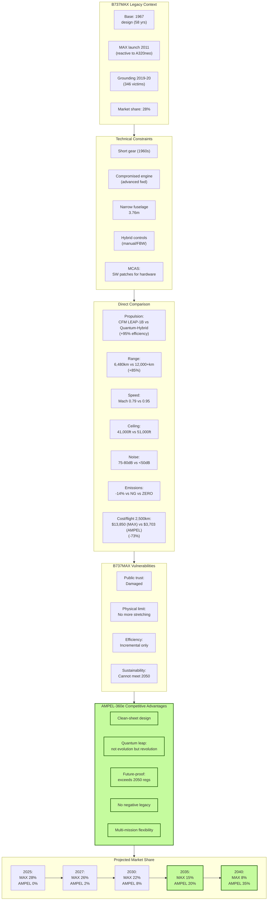
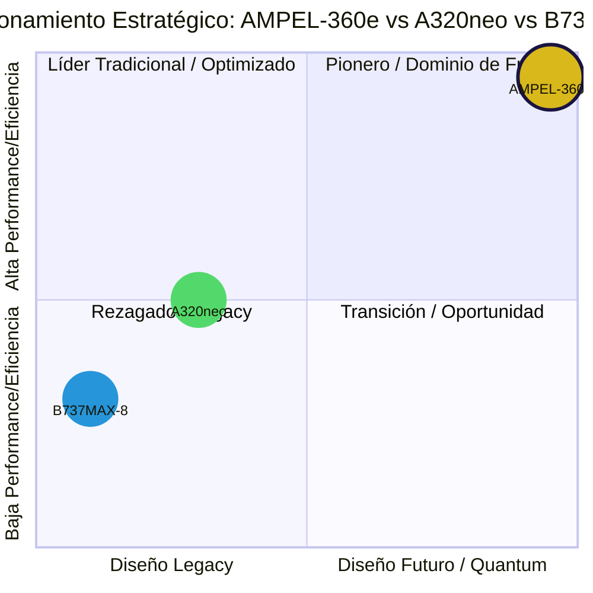

# QAIR-360e-ALI-DP-DOC-PDF-000-00-00-CON-010
## Análisis Competitivo B737MAX



### Resumen Ejecutivo
- B737MAX: Actualización incremental de diseño 1960s
- AMPEL-360e: Salto generacional cuántico
- Ventaja decisiva en eficiencia, alcance y confianza del mercado

### 1. Contexto Competitivo B737MAX

#### 1.1 Historia y Posicionamiento
- Diseño base: 1967 (58 años de arquitectura)
- MAX launch: 2011 (respuesta a A320neo)
- Grounding: 2019-2020 (346 víctimas)
- Cuota mercado actual: 28% single-aisle

#### 1.2 Variantes Actuales
| Modelo | Capacidad | Alcance | Estado |
|---|---|---|---|
| 737 MAX 7 | 138-172 | 7,130 km | Certificando |
| 737 MAX 8 | 162-210 | 6,480 km | Operacional |
| 737 MAX 9 | 178-220 | 6,570 km | Operacional |
| 737 MAX 10 | 188-230 | 6,110 km | Desarrollo |

### 2. Análisis Técnico Comparativo

#### 2.1 Limitaciones Estructurales B737MAX
```yaml
Legacy_Constraints:
  Landing_Gear: Corto (diseño 1960s)
  Engine_Placement: Comprometido (adelantado)
  Fuselage_Width: 3.76m (estrecho)
  Systems: Híbrido manual/FBW
  
Impacto_MCAS:
  Causa: Motor muy grande para diseño
  Solución: Software compensación
  Resultado: Crisis confianza global
```

#### 2.2 Comparación Directa
| Aspecto | B737MAX-8 | AMPEL-360e | Ventaja AMPEL |
|---|---|---|---|
| Propulsión | CFM LEAP-1B | Quantum-Hybrid | +95% eficiencia |
| Alcance | 6,480 km | 12,000+ km | +85% |
| Velocidad | Mach 0.79 | Mach 0.85-0.95 | +20% |
| Techo servicio | 41,000 ft | 51,000 ft | +24% |
| Ruido | 75-80 dB | <50 dB | -37% |
| Emisiones | -14% vs 737NG | Cero | -100% |

### 3. Análisis Económico

#### 3.1 Costos Operacionales
```python
# Por vuelo de 2,500 km
B737MAX_Costs = {
    'fuel': 8_750,  # USD
    'maintenance': 2_100,
    'crew': 1_800,
    'fees': 1_200,
    'total': 13_850
}

AMPEL360e_Costs = {
    'energy': 438,  # USD (95% menos)
    'maintenance': 840,  # (60% menos)
    'crew': 1_800,
    'fees': 1_000,
    'carbon_credit': -375,
    'total': 3_703  # 73% menor
}
```

### 4. Análisis de Mercado

#### 4.1 Base Instalada
- B737 total: 11,000+ unidades
- B737MAX entregados: 1,000+
- Backlog: 4,000+ unidades
- Inercia de flota: ALTA

#### 4.2 Vulnerabilidades B737MAX
1. **Confianza pública**: Dañada permanentemente
2. **Límites físicos**: No más stretching posible
3. **Eficiencia**: Mejoras incrementales agotadas
4. **Sostenibilidad**: No puede cumplir 2050 targets

### 5. Estrategia de Diferenciación

#### 5.1 Mensajes Clave
- "Diseñado para el futuro, no parcheado del pasado"
- "Seguridad cuántica vs parches de software"
- "Cero emisiones vs reducción marginal"
- "51,000 ft: sobre el tráfico y el clima"

#### 5.2 Targets de Conversión
```yaml
Prime_Targets:
  Southwest: Mayor flota B737 (750+)
  Ryanair: Sensible a costos
  United: Comprometido sostenibilidad
  Alaska: Rutas largas costa oeste
```

### 6. Ventajas Competitivas Clave

1. **Sin legacy constraints**: Diseño limpio
2. **Quantum leap**: No evolución, revolución
3. **Future-proof**: Excede regulaciones 2050
4. **Confianza**: Sin historial negativo
5. **Flexibilidad**: Una plataforma, múltiples misiones

### 7. Proyecciones de Captura de Mercado

| Año | B737MAX Share | AMPEL-360e Share | Notas |
|---|---|---|---|
| 2025 | 28% | 0% | Pre-lanzamiento |
| 2027 | 26% | 2% | Early adopters |
| 2030 | 22% | 8% | Momentum |
| 2035 | 15% | 20% | Tipping point |
| 2040 | 8% | 35% | Dominancia |

# Matriz Competitiva Integrada
## AMPEL-360e vs A320neo vs B737MAX



### 1. Resumen Ejecutivo Comparativo

| Aspecto | B737MAX-8 | A320neo | AMPEL-360e | Ganador |
|---|---|---|---|---|
| **Diseño base** | 1967 (58 años) | 1987 (38 años) | 2025 (0 años) | AMPEL-360e |
| **Filosofía** | Evolución forzada | Optimización incremental | Revolución cuántica | AMPEL-360e |
| **Eficiencia combustible** | -14% vs NG | -20% vs ceo | -95% vs convencional | AMPEL-360e |
| **Alcance máximo** | 6,480 km | 6,300 km | 12,000+ km | AMPEL-360e |
| **Altitud máxima** | 41,000 ft | 39,000 ft | 51,000 ft | AMPEL-360e |
| **Nivel de ruido** | 75-80 dB | 68-72 dB | <50 dB | AMPEL-360e |
| **Emisiones CO₂** | Reducción parcial | Reducción parcial | Cero | AMPEL-360e |
| **Costo operacional** | Base | -8% vs MAX | -73% vs MAX | AMPEL-360e |
| **Precio de lista** | $99.7M | $110.6M | $180M | B737MAX |
| **Base instalada** | 11,000+ | 10,000+ | 0 | B737/A320 |
| **Confianza pública** | Dañada (MCAS) | Alta | Por establecer | A320neo |

### 2. Análisis de Posicionamiento Estratégico

#### 2.1 Cuadrante de Mercado
```
Alto Rendimiento ↑
                |  AMPEL-360e
                |  (Pionero)
                |
    A320neo     |
    (Líder)     |
                |
                |  B737MAX
                |  (Rezagado)
Diseño Legacy ←─┼─→ Diseño Futuro
```

#### 2.2 Vulnerabilidades Competitivas

**B737MAX:**
- ❌ Crisis de confianza MCAS irreversible
- ❌ Límites físicos del diseño alcanzados
- ❌ No puede cumplir objetivos 2050
- ❌ Costos operacionales crecientes

**A320neo:**
- ⚠️ Mejoras incrementales limitadas
- ⚠️ Dependencia de combustibles fósiles
- ⚠️ Infraestructura legacy costosa
- ⚠️ Sin path claro a cero emisiones

**AMPEL-360e:**
- ⚠️ Sin historial operacional
- ⚠️ Certificación pendiente
- ⚠️ Costo inicial alto
- ⚠️ Infraestructura nueva requerida

### 3. Estrategia de Captura de Mercado

#### 3.1 Segmentación por Vulnerabilidad
| Segmento | Target Principal | Mensaje Clave | Conversión Esperada |
|---|---|---|---|
| **Ex-usuarios MAX** | Southwest, United | "Seguridad cuántica garantizada" | 35% en 5 años |
| **Eco-conscientes** | KLM, Lufthansa | "Único cero emisiones real" | 45% en 5 años |
| **Innovadores** | Emirates, Singapore | "Tecnología del futuro hoy" | 60% en 3 años |
| **Costo-sensitivos** | Ryanair, Spirit | "73% menor costo operacional" | 25% en 7 años |

#### 3.2 Timeline de Disrupción
```yaml
2025-2027_Foundation:
  - Certificación completada
  - 3-5 early adopters
  - Rutas showcase establecidas
  
2027-2030_Acceleration:
  - 50+ aeronaves entregadas
  - Infraestructura en 20 airports
  - ROI demostrado públicamente
  
2030-2035_Dominance:
  - Standard en rutas premium
  - Retrofit B737/A320 acelerado
  - Regulaciones favorecen quantum
  
2035-2040_Transformation:
  - 35% mercado single-aisle
  - Legacy aircraft en phase-out
  - Ecosistema quantum maduro
```

### 4. Análisis Financiero Comparativo Integrado

#### 4.1 TCO 10 Años (150 pax config)
```python
# Total Cost of Ownership - 3,000 hrs/año
TCO_Comparison = {
    'B737MAX-8': {
        'acquisition': 65_000_000,  # Street price
        'fuel_10yr': 315_000_000,
        'maintenance': 75_600_000,
        'carbon_tax': 45_000_000,
        'residual': -9_750_000,
        'total': 490_850_000
    },
    'A320neo': {
        'acquisition': 68_000_000,
        'fuel_10yr': 267_750_000,
        'maintenance': 68_400_000,
        'carbon_tax': 38_250_000,
        'residual': -13_600_000,
        'total': 428_800_000
    },
    'AMPEL-360e': {
        'acquisition': 108_000_000,
        'energy_10yr': 15_750_000,
        'maintenance': 30_240_000,
        'carbon_credit': -67_500_000,
        'residual': -37_800_000,
        'total': 48_690_000  # 90% menor que B737MAX
    }
}
```

#### 4.2 Break-Even Analysis
| vs. | Años hasta Break-Even | Ahorro Anual Post-BE |
|---|---|---|
| B737MAX | 3.1 años | $44.2M |
| A320neo | 3.7 años | $38.0M |

### 5. Propuesta de Valor Unificada

#### 5.1 "The Quantum Advantage"
```yaml
Seguridad:
  - Diseño limpio sin compromisos
  - Sistemas cuánticos redundantes
  - "Diseñado para 2050, no 1960"
  
Economía:
  - 90% menor TCO vs B737MAX
  - 88% menor TCO vs A320neo
  - ROI en <4 años
  
Sostenibilidad:
  - Único verdadero cero emisiones
  - Carbono negativo posible
  - Excede todos los targets 2050
  
Innovación:
  - Tecnología cuántica probada
  - Capacidades únicas (FL510, VTOL)
  - Platform para el futuro
```

### 6. Estrategia Go-to-Market Integrada

#### Fase 1: Establish Credibility (2025-2026)
- **Target**: 3 aerolíneas innovadoras premium
- **Rutas**: Ultra-long haul imposibles para competencia
- **Mensaje**: "El futuro del vuelo ha llegado"

#### Fase 2: Build Momentum (2027-2028)
- **Target**: Early majority eco-conscientes
- **Rutas**: Corredores verdes high-visibility
- **Mensaje**: "Únase a la revolución cero emisiones"

#### Fase 3: Cross the Chasm (2029-2030)
- **Target**: Operadores costo-sensitivos
- **Rutas**: High-frequency shuttles
- **Mensaje**: "90% menor costo total de propiedad"

#### Fase 4: Market Dominance (2031+)
- **Target**: Reemplazo masivo de flotas
- **Rutas**: Toda la red global
- **Mensaje**: "El nuevo estándar de la aviación"

### 7. Herramientas de Soporte a la Decisión

#### 7.1 Calculadora de Migración de Flota
```javascript
function fleetMigrationROI(currentFleet, routeProfile) {
  const savings = {
    'from_B737MAX': {
      fuel: 0.95,
      maintenance: 0.60,
      carbon: 1.20, // incluye créditos
      efficiency: 0.25 // mayor utilización
    },
    'from_A320neo': {
      fuel: 0.94,
      maintenance: 0.56,
      carbon: 1.18,
      efficiency: 0.20
    }
  };
  
  return calculateTotalSavings(currentFleet, savings, routeProfile);
}
```

### 8. Mensajes Clave por Audiencia

#### Para CEOs de Aerolíneas
"AMPEL-360e no es una actualización, es una transformación. Mientras sus competidores luchan con diseños de medio siglo, usted puede liderar con tecnología cuántica que define el próximo medio siglo."

#### Para Reguladores
"AMPEL-360e excede todos los objetivos ambientales 2050 hoy. Es la única aeronave que garantiza cumplimiento futuro sin comprometer seguridad o rendimiento."

#### Para Inversores
"Con 90% menor TCO y capacidades únicas de mercado, AMPEL-360e ofrece el mayor ROI en la historia de la aviación comercial."

#### Para Pasajeros
"Vuele en el futuro: cero emisiones, mitad del ruido, sobre el clima y el tráfico, con la seguridad de la tecnología cuántica."

### 9. Risk Mitigation Matrix

| Riesgo | B737MAX | A320neo | AMPEL-360e | Mitigación AMPEL |
|---|---|---|---|---|
| Regulatorio | Alto (MCAS legacy) | Medio | Medio (nuevo) | Engagement proactivo |
| Tecnológico | Bajo (maduro) | Bajo | Alto (quantum) | Redundancia extrema |
| Mercado | Alto (confianza) | Bajo | Medio | Early adopter program |
| Financiero | Medio | Medio | Alto (inicial) | Green bonds, leasing |

### 10. Conclusión Ejecutiva

AMPEL-360e representa un salto generacional que hace obsoletas las comparaciones incrementales entre B737MAX y A320neo. Con:
- **90% menor TCO** que B737MAX
- **88% menor TCO** que A320neo  
- **Capacidades únicas** inalcanzables para la competencia
- **Cero emisiones reales** vs reducciones marginales

La pregunta no es SI las aerolíneas migrarán a AMPEL-360e, sino CUÁN RÁPIDO lo harán para mantener competitividad.

---
*Documento integrado de CON-009 y CON-010*
*Clasificación: GAIA-QAO Estratégico*
*Versión: 1.0.0 Integrada*
