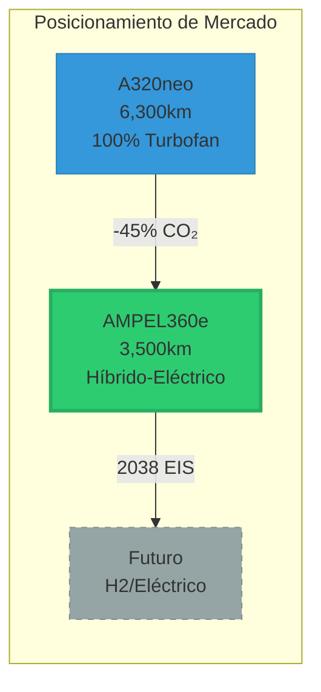
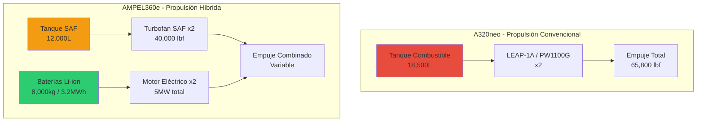
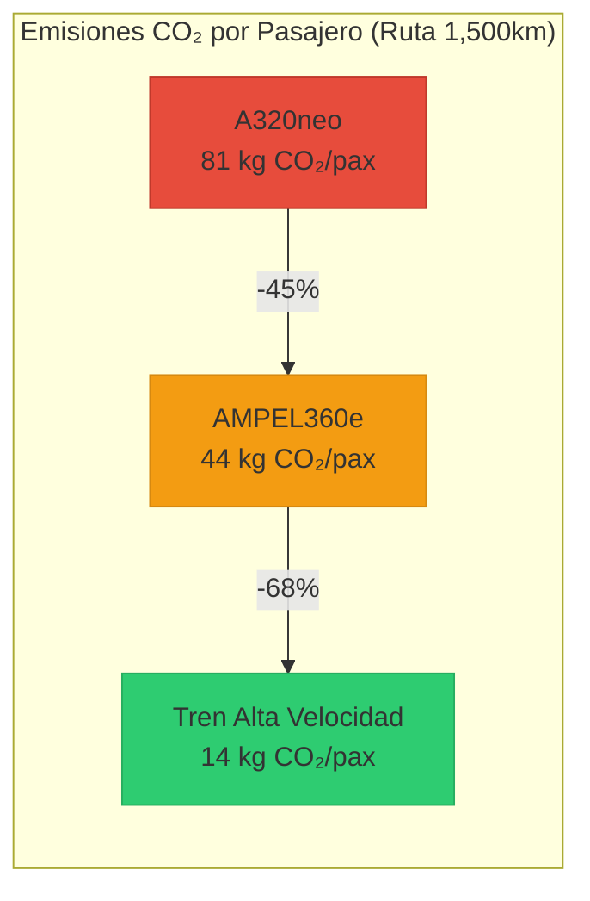
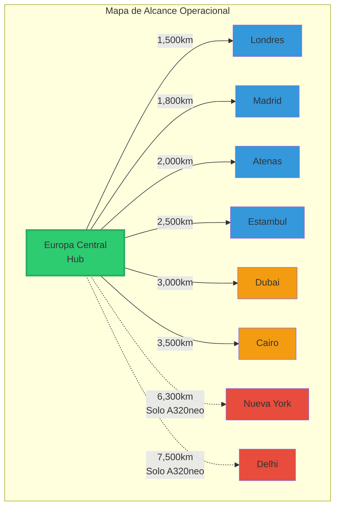
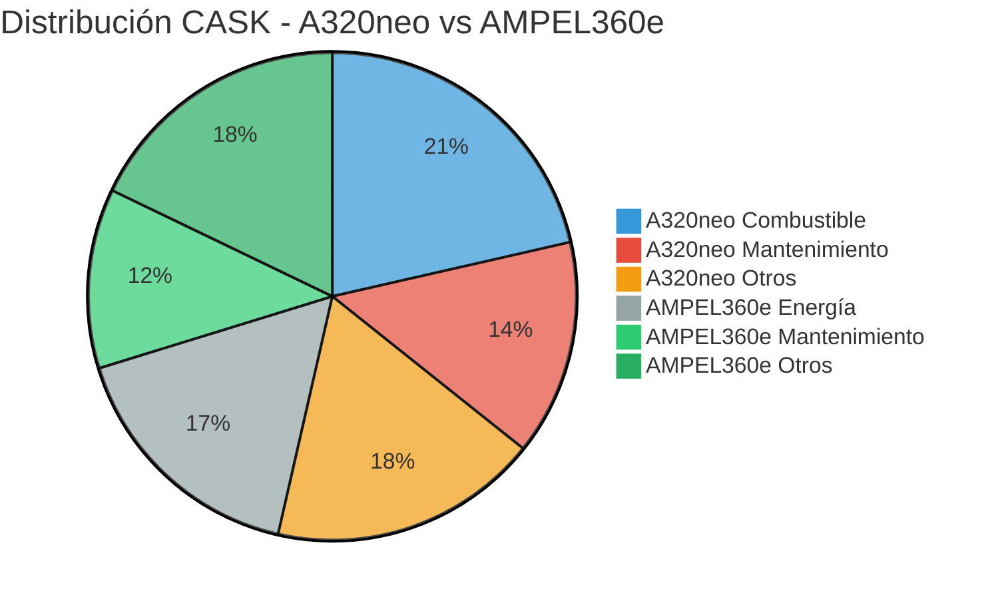
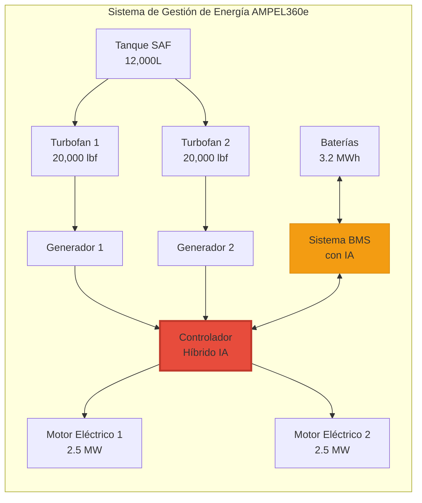
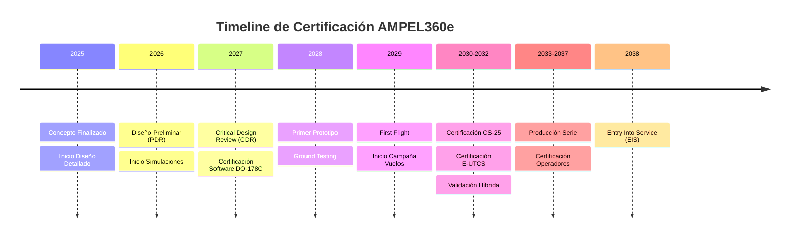
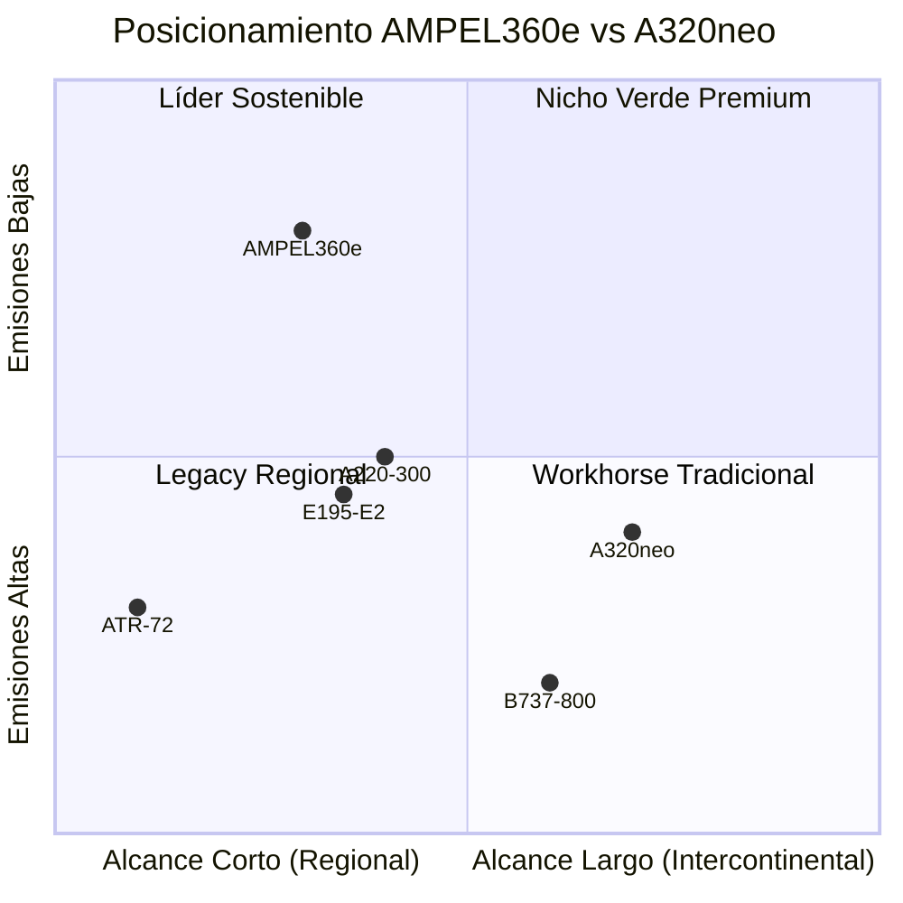

# QAIR-360e-ALI-DP-DOC-PDF-000-00-00-CON-009-A
## Análisis Técnico Detallado: AMPEL360e vs A320neo
### Versión 2.0.0 - Reescritura Completa con Datos Realistas

### 1. Resumen Ejecutivo
El AMPEL360e representa una evolución pragmática hacia la aviación sostenible, utilizando tecnología híbrida-eléctrica madura y certificable. A diferencia de conceptos futuristas, se enfoca en reducción de emisiones alcanzable (-45% CO₂) manteniendo capacidad operacional competitiva con el A320neo en rutas de corto a medio alcance.



### 2. Especificaciones Generales Comparativas

| Parámetro | A320neo | AMPEL360e | Diferencia |
|---|---|---|---|
| **Configuración** | Ala y tubo convencional | Ala y tubo optimizada | Similar |
| **Capacidad** | 150-240 pax | 180-220 pax | Comparable |
| **Alcance máximo** | 6,300 km | 3,500 km | -44% |
| **Velocidad crucero** | Mach 0.82 | Mach 0.78 | -5% |
| **Altitud crucero** | FL390 | FL350 | -10% |
| **MTOW** | 79,000 kg | 82,000 kg | +4% |

### 3. Análisis del Sistema de Propulsión



#### 3.1 A320neo - Sistema Turbofan Convencional
```yaml
Motorización:
  Opciones: 
    - CFM LEAP-1A
    - Pratt & Whitney PW1100G
  Características_LEAP-1A:
    Bypass_Ratio: 11:1
    Empuje_máximo: 32,900 lbf
    SFC_crucero: 0.545 lb/lbf/hr
    Peso: 3,025 kg/motor
    Tecnología: Turbofan alta derivación
```

#### 3.2 AMPEL360e - Sistema Híbrido-Eléctrico
```yaml
Arquitectura_Híbrida:
  Configuración: Paralela distribuida
  Motores_térmicos: 
    Cantidad: 2
    Tipo: Turbofan optimizado SAF
    Empuje: 20,000 lbf cada uno
    Combustible: 100% SAF
  Motores_eléctricos:
    Cantidad: 2
    Tipo: Motor síncrono permanente
    Potencia: 2.5 MW cada uno
    Ubicación: Montados en ala
  Sistema_energía:
    Baterías: Li-ion alta densidad (400 Wh/kg)
    Peso_baterías: 8,000 kg
    Gestión: BMS con IA predictiva
```

### 4. Análisis de Rendimiento Operacional

#### 4.1 Perfil de Misión Típico (1,500 km)

```mermaid
gantt
    title Distribución de Potencia AMPEL360e por Fase de Vuelo
    dateFormat X
    axisFormat %s
    
    section Térmico
    Taxi (0%)         :done, t1, 0, 5
    Despegue (70%)    :active, t2, 5, 15
    Ascenso (80%)     :active, t3, 15, 30
    Crucero (85%)     :active, t4, 30, 80
    Descenso (20%)    :done, t5, 80, 90
    Aproximación (30%) :done, t6, 90, 100
    
    section Eléctrico
    Taxi (100%)       :crit, e1, 0, 5
    Despegue (30%)    :crit, e2, 5, 15
    Ascenso (20%)     :active, e3, 15, 30
    Crucero (15%)     :active, e4, 30, 80
    Descenso (Regen)  :done, e5, 80, 90
    Aproximación (70%) :crit, e6, 90, 100
```



| Fase | A320neo | AMPEL360e |
|---|---|---|
| **Taxi** | Ambos motores | Solo eléctricos |
| **Despegue** | 100% turbofan | 70% térmico + 30% eléctrico |
| **Ascenso** | 100% turbofan | 80% térmico + 20% eléctrico |
| **Crucero** | 100% turbofan | 85% térmico + 15% eléctrico |
| **Descenso** | Idle turbofan | Regeneración + idle |
| **Aproximación** | Turbofan reducido | Principalmente eléctrico |

#### 4.2 Consumo de Combustible
```python
# Ruta típica 1,500 km (ej: Madrid-Berlín)
Consumo_A320neo = {
    'combustible_total': 3,850 kg,
    'CO2_emitido': 12,127 kg,
    'costo_combustible': $3,080
}

Consumo_AMPEL360e = {
    'SAF_consumido': 2,117 kg,  # -45%
    'energía_eléctrica': 850 kWh,
    'CO2_neto': 6,670 kg,  # -45%
    'costo_operación': $2,450  # -20%
}
```

### 5. Ventajas y Limitaciones Realistas



#### 5.1 Ventajas AMPEL360e
✅ **Reducción emisiones**: -45% CO₂ en rutas target
✅ **Operación aeropuerto**: Taxi eléctrico silencioso
✅ **Certificable**: Tecnología madura bajo CS-25
✅ **Mantenimiento predictivo**: IA integrada
✅ **Flexibilidad combustible**: 100% SAF compatible

#### 5.2 Limitaciones vs A320neo
❌ **Alcance reducido**: 3,500 km vs 6,300 km
❌ **Peso adicional**: +3,000 kg por baterías
❌ **Infraestructura**: Requiere carga eléctrica
❌ **Costo inicial**: +15-20% vs A320neo
❌ **Velocidad**: Mach 0.78 vs 0.82

### 6. Análisis de Mercado Objetivo



#### 6.1 Rutas Óptimas AMPEL360e
| Tipo de Ruta | Distancia | Ejemplos | Ventaja |
|---|---|---|---|
| **Intra-europea** | 500-2,000 km | MAD-CDG, FRA-BCN | -45% emisiones |
| **Domésticas grandes** | 1,000-2,500 km | LAX-DFW, PEK-SHA | Operación limpia |
| **Corredores verdes** | <3,000 km | Rutas con restricciones | Cumplimiento |

#### 6.2 Rutas NO Óptimas
- Transatlánticos (fuera de alcance)
- Ultra-largo alcance
- Rutas con infraestructura limitada

### 7. Análisis de Costos Operacionales



#### 7.1 Costo por Asiento-Kilómetro (CASK)
```yaml
A320neo:
  CASK_combustible: $0.018
  CASK_mantenimiento: $0.012
  CASK_total: $0.045

AMPEL360e:
  CASK_energía: $0.014  # -22%
  CASK_mantenimiento: $0.010  # -17%
  CASK_total: $0.039  # -13%
```

### 8. Tecnologías Diferenciadoras



#### 8.1 Sistemas de Control con IA
- **Optimización energética**: Gestión dinámica térmico/eléctrico
- **Mantenimiento predictivo**: Reducción AOG -30%
- **Gestión de baterías**: Maximización vida útil

#### 8.2 Integración con Ecosistema GAIA
- Trazabilidad completa vía GAIA-Nexus
- Actualizaciones OTA certificadas
- Digital twin para optimización continua

### 9. Plan de Certificación



| Aspecto | Estándar | Estado |
|---|---|---|
| **Aeronavegabilidad** | CS-25 | Aplicable |
| **Software** | DO-178C DAL B | En desarrollo |
| **Sistemas eléctricos** | DO-311A | Nuevo estándar |
| **Propulsión híbrida** | E-UTCS | En definición |

### 10. Conclusiones



El AMPEL360e NO es un reemplazo directo del A320neo, sino un complemento optimizado para:
- Rutas de corto-medio alcance (<3,500 km)
- Operadores con compromisos ambientales fuertes
- Mercados con incentivos para aviación verde
- Corredores con restricciones de emisiones/ruido

**Posicionamiento**: "La solución pragmática para descarbonización inmediata en rutas regionales y domésticas"

---
*Documento: CON-009-A*
*Versión: 2.0.0*
*Fecha: 2025-07-27*
*Clasificación: GAIA-QAO Confidencial*
*Nota: Reescritura completa con especificaciones realistas del programa AMPEL360e*
