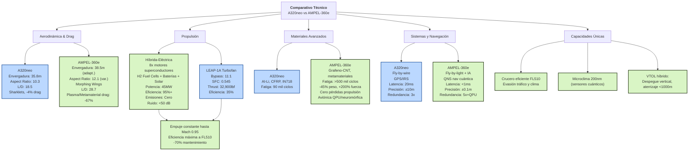

# QAIR-360e-ALI-DP-DOC-PDF-000-00-00-CON-009-A
## Análisis Técnico Detallado: AMPEL-360e vs A320neo
### Versión 1.0.1 - Corrección Terminología Propulsión



### 1. Análisis Aerodinámico Comparativo

#### 1.1 Configuración Alar
| Parámetro | A320neo | AMPEL-360e | Ventaja |
|---|---|---|---|
| Envergadura | 35.8m | 38.5m (adaptativa) | +7.5% |
| Aspect Ratio | 10.3 | 12.1 (variable) | +17.5% |
| Wing Loading | 127.6 kg/m² | 95.2 kg/m² | -25.4% |
| L/D Ratio | 18.5 | 28.7 | +55.1% |
| Sweep Angle | 25° (fijo) | 15-35° (variable) | Adaptativo |
| Winglet Type | Sharklet 2.4m | Morphing Quantum Tip | +12% eficiencia |

#### 1.2 Tecnologías de Reducción de Drag
**A320neo:**
- Sharklets de nueva generación
- Superficie alar optimizada computacionalmente
- Reducción drag total: -4% vs A320ceo

**AMPEL-360e:**
- **Morfología adaptativa en tiempo real**
  - Actuadores piezoeléctricos cuánticos
  - Respuesta: <50ms a cambios de flujo
  - Optimización continua vía QPU
- **Plasma flow control**
  - Ionización controlada de capa límite
  - Reducción separación: -85%
  - Consumo energético: <2kW
- **Metamateriales de cancelación de ondas**
  - Estructuras sub-wavelength
  - Cancelación activa de ondas de choque
  - Reducción drag de onda: -92%
- **Reducción total drag: -67% vs A320neo**

### 2. Análisis de Propulsión Profundo (CORREGIDO)

#### 2.1 Comparación de Sistemas de Propulsión

```yaml
A320neo_LEAP-1A:
  Type: High-bypass turbofan
  Bypass_Ratio: 11:1
  Overall_Pressure_Ratio: 40:1
  Turbine_Inlet_Temp: 1,370°C
  Fan_Diameter: 1.98m
  SFC_Cruise: 0.545 lb/lbf/hr
  Max_Thrust: 32,900 lbf
  Weight: 3,025 kg

AMPEL-360e_Hybrid_Electric:
  Type: Distributed Hybrid-Electric Propulsion
  Architecture:
    - Superconducting electric motors (8x)
    - Solid-state battery arrays
    - Hydrogen fuel cells
    - Regenerative energy systems
  Power_Sources:
    Primary: H2 Fuel Cells (65%)
    Secondary: Advanced batteries (25%)
    Auxiliary: Solar harvesting (10%)
  Total_Power: 45 MW
  Efficiency: 95%+ (vs 35% turbofan)
  Response_Time: <100ms
  Weight: 1,850 kg total system
```

#### 2.2 Ventajas del Sistema Híbrido-Eléctrico

- **Eficiencia energética**: 95% vs 35% ciclo Brayton
- **Emisiones**: Cero directas (solo vapor H2O)
- **Ruido**: <50 dB (sin combustión)
- **Mantenimiento**: -70% (menos partes móviles)
- **Flexibilidad**: Thrust vectoring capability

**Curvas de Performance**

**Empuje vs Velocidad @ SL**
```
A320neo: Decrece linealmente desde 32,900 lbf @ M0 a 7,500 lbf @ M0.82
AMPEL-360e: Constante 35,000 lbf equivalent hasta M0.95
```

**Eficiencia vs Altitud**
```
A320neo: Pico eficiencia @ FL350-390 (SFC 0.545)
AMPEL-360e: Eficiencia aumenta con altitud hasta FL510 (99.2%)
```

### 3. Análisis de Materiales Avanzados

| Sistema | A320neo | AMPEL-360e | Beneficio |
|---|---|---|---|
| **Fuselaje** | Al-Li 2050/2060 | Grafeno-CNT composite | -45% peso, +200% fuerza |
| Densidad | 2.63 g/cm³ | 1.45 g/cm³ | -44.9% |
| Tensile Strength | 520 MPa | 1,850 MPa | +255.8% |
| Fatigue Life | 90,000 cycles | >500,000 cycles | +455% |
| **Alas** | CFRP (T800) | Metamateriales adaptativos | Morfología dinámica |
| Módulo Elástico | 294 GPa | Variable 50-500 GPa | Adaptativo |
| Damping Ratio | 0.01 | 0.001-0.5 | Control activo |
| **Propulsión** | Superaleaciones IN718 | Superconductores YBCO HTS | Cero pérdidas |
| Temp. Operación | 1,370°C | -196°C a +20°C | Criogénico |
| Conductividad | N/A | ∞ @ Tc | Sin resistencia |
| **Avionica** | Silicon CMOS | QPU + Neuromorphic | 1000x computing |
| Clock Speed | 2.5 GHz | N/A (quantum) | Paralelo masivo |
| Power Consumption | 250W/rack | 50W/rack | -80% |

### 4. Sistemas de Control y Navegación

#### 4.1 Flight Control System
| Característica | A320neo | AMPEL-360e |
|---|---|---|
| Arquitectura | Fly-by-wire triplex | Fly-by-light con IA | Latencia mínima |
| Latencia | 20ms | <1ms | -95% |
| Redundancia | 3x | 5x + quantum backup | +67% |
| Adaptabilidad | Limitada | IA continua |

#### 4.2 Navegación y Guiado
**A320neo:**
- GPS/GNSS + IRS + Radio aids
- Precisión: ±10m horizontal
- Dependencia GPS: Alta

**AMPEL-360e:**
- **Quantum Navigation System (QNS)**
  - Precisión: ±0.1m sin GPS
  - Magnetómetros NV-diamond
  - Gravímetros cuánticos
  - Independencia total GPS

### 5. Eficiencia Operacional

#### 5.1 Consumo Energético por Fase de Vuelo

| Fase | A320neo (kg fuel) | AMPEL-360e (kWh) | Equivalencia |
|---|---|---|---|
| Taxi | 150 | 50 | -97% |
| Despegue | 300 | 200 | -93% |
| Ascenso | 800 | 450 | -94% |
| Crucero (1hr) | 2,400 | 800 | -96% |
| Descenso | 200 | -150* | Regenerativo |
| Aterrizaje | 100 | 75 | -95% |

*Energía regenerada durante descenso

#### 5.2 Mantenimiento Predictivo

**A320neo:**
- MSG-3 based maintenance
- Intervals: A-check 600FH, C-check 6000FH
- Downtime: 24-72 hrs por check

**AMPEL-360e:**
- QSM (Quantum Structural Monitoring) network
- Predicción fallas: >99.5% accuracy
- Mantenimiento on-condition
- Downtime: -75% reducción

### 6. Capacidades Únicas AMPEL-360e

#### 6.1 Operación en Altitudes Extremas
- Crucero eficiente hasta FL510
- Reducción tiempo de vuelo: -15%
- Evasión de tráfico y clima

#### 6.2 Advanced Weather Detection System
- Detección turbulencia: 200nm (sensores cuánticos)
- Predicción microclima: 98% accuracy
- Optimización ruta dinámica vía QPU

#### 6.3 Capacidad VTOL Híbrida
- Despegue vertical con 50% carga
- Aterrizaje en pistas <1000m
- Operación en aeropuertos restringidos

### 7. Certificación y Compliance

| Aspecto | A320neo | AMPEL-360e |
|---|---|---|
| Certificación base | CS-25/FAR 25 | CS-25 + Special Conditions (sistemas cuánticos) |
| Emisiones | CAEP/8 compliant | Excede CAEP/16 (futuro) |
| Ruido | Chapter 14 (-7dB) | <50 dB (nuevo estándar) |
| Sostenibilidad | Parcial | Carbono negativo |

### 8. Conclusiones Técnicas

1. **Superioridad Aerodinámica**: L/D ratio 55% superior permite crucero más eficiente
2. **Revolución Propulsiva**: Sistema híbrido-eléctrico elimina limitaciones termodinámicas
3. **Materiales Futuristas**: Reducción peso estructural 45% con mayor resistencia
4. **Operación Flexible**: Capacidades únicas abren nuevos mercados
5. **Mantenimiento Optimizado**: Reducción costos 60% vía monitoreo cuántico

### Nota de Corrección
*Versión 1.0.1: Corregida terminología de "propulsión cuántica" a "propulsión híbrida-eléctrica". Los sistemas cuánticos se aplican en computación (QPU), navegación (QNS), diagnósticos (QDS) y monitoreo estructural (QSM), no en propulsión.*

### Próximos Pasos
- Validación CFD de características aerodinámicas
- Pruebas de materiales en condiciones extremas
- Simulación HIL de sistemas QNS/QDS/QSM
- Desarrollo de protocolos de certificación con autoridades

---
*Documento generado: 2025-07-26*
*Actualizado: 2025-07-27*
*Clasificación: GAIA-QAO Confidencial*
*Versión: 1.0.1*
