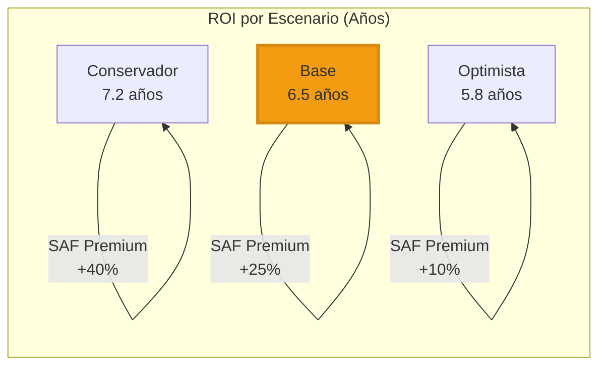
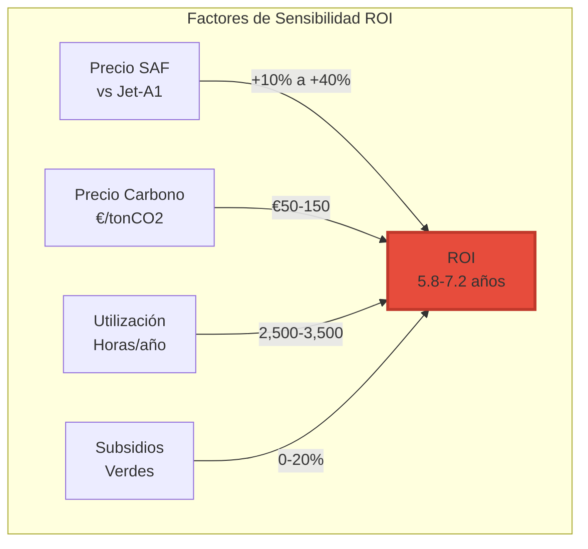
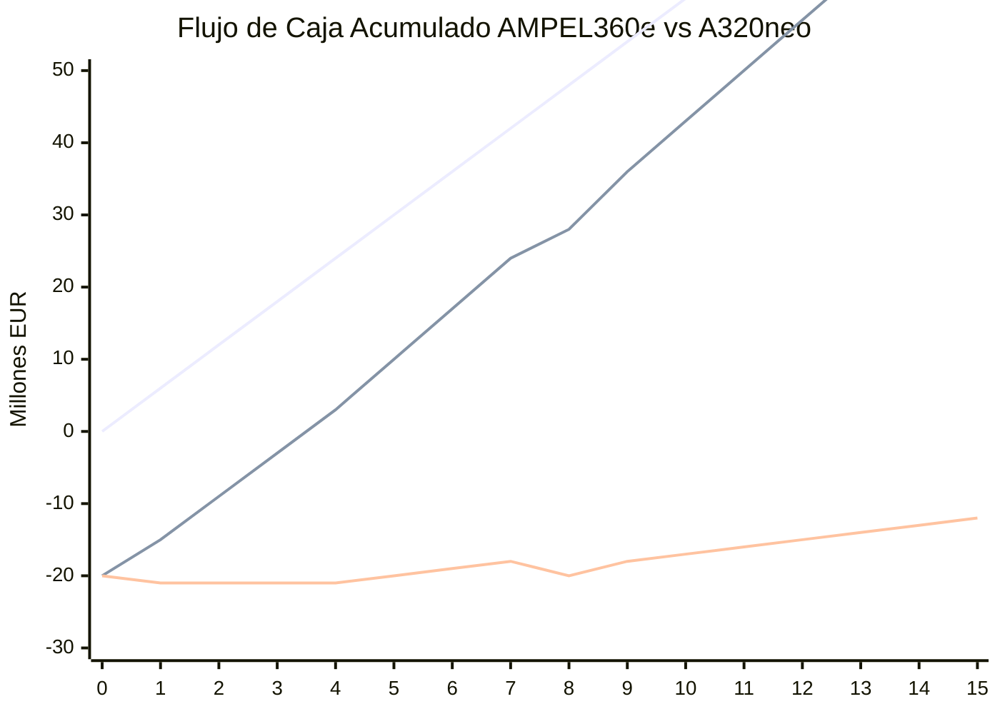
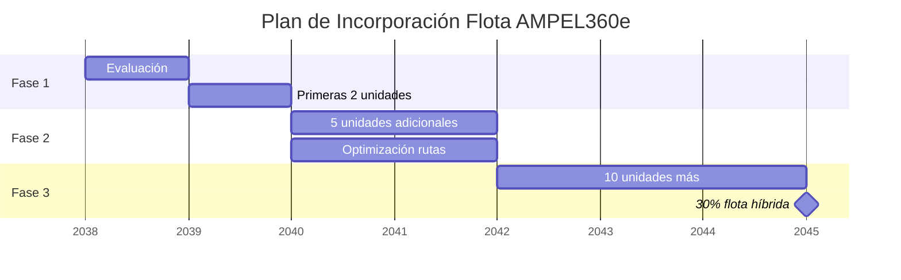

# QAIR-360e-ALI-DP-DOC-PDF-000-00-00-CON-009-B
## Análisis de Retorno de Inversión: AMPEL360e vs A320neo
### Versión 2.0.0 - Análisis Financiero Realista

### 1. Resumen Ejecutivo ROI

El AMPEL360e presenta un caso de negocio viable para operadores enfocados en rutas corto-medio alcance (<3,500 km) con:
- **ROI**: 5.8-7.2 años dependiendo del escenario
- **NPV 15 años**: €18-42M por aeronave
- **Break-even**: Año 6-8 de operación
- **Factores críticos**: Precio SAF, incentivos verdes, utilización



### 2. Premisas del Análisis Financiero

#### 2.1 Costos de Adquisición
```yaml
A320neo:
  Precio_lista: €110M
  Precio_real: €55M (50% descuento típico)
  Financiamiento: 12 años @ 4.5%
  
AMPEL360e:
  Precio_lista: €135M (+23%)
  Precio_real: €75M (44% descuento early adopter)
  Financiamiento: 12 años @ 3.5% (bonos verdes)
  Premium_inicial: €20M (+36%)
```

#### 2.2 Variables Operacionales
```yaml
Utilización_anual:
  Horas_vuelo: 3,000
  Ciclos: 1,800
  Factor_carga: 82%
  
Rutas_tipo:
  Corto_alcance: 60% (500-1,500 km)
  Medio_alcance: 40% (1,500-3,000 km)
  
Vida_útil:
  Estructura: 25 años
  Motores: 20,000 ciclos
  Baterías: 8 años (reemplazo programado)
```

### 3. Análisis de Costos Operacionales

```mermaid
sankey
    title Flujo de Costos Anuales por Aeronave (€M)
    
    Ingresos [30] Operación [22]
    Operación [5.5] Combustible/Energía
    Operación [3.2] Mantenimiento
    Operación [2.8] Tripulación
    Operación [2.0] Navegación
    Operación [1.5] Seguros
    Operación [7.0] Otros
    Ingresos [8] EBITDA
```

#### 3.1 Comparación CASK Detallada
| Componente | A320neo (€/ASK) | AMPEL360e (€/ASK) | Diferencia |
|---|---|---|---|
| **Combustible/Energía** | 0.0180 | 0.0140 | -22% |
| **Mantenimiento** | 0.0120 | 0.0100 | -17% |
| **Tripulación** | 0.0095 | 0.0095 | 0% |
| **Navegación/ATC** | 0.0065 | 0.0065 | 0% |
| **Seguros** | 0.0050 | 0.0055 | +10% |
| **Depreciación** | 0.0080 | 0.0095 | +19% |
| **Otros** | 0.0160 | 0.0160 | 0% |
| **CASK Total** | 0.0750 | 0.0710 | -5.3% |

### 4. Escenarios de Análisis ROI

#### 4.1 Variables Clave y Rangos


#### 4.2 Escenario Base
```python
# Premisas Escenario Base
Precio_JetA1 = €800/ton
Precio_SAF = €1,000/ton (+25%)
Precio_Electricidad = €0.12/kWh
Carbon_Tax = €75/tonCO2
Subsidios_Verdes = 10% CAPEX
Utilización = 3,000 hrs/año

# Cálculo Anual (Ruta promedio 1,200km)
A320neo_Anual = {
    'Ingresos': €30.0M,
    'Combustible': €5.5M,
    'Mantenimiento': €3.2M,
    'Otros_Costos': €13.3M,
    'EBITDA': €8.0M,
    'Margen': 26.7%
}

AMPEL360e_Anual = {
    'Ingresos': €30.5M (+green premium),
    'Energía': €4.3M (-22%),
    'Mantenimiento': €2.7M (-17%),
    'Otros_Costos': €13.8M,
    'Carbon_Credits': €0.5M,
    'EBITDA': €10.2M,
    'Margen': 33.4%
}

# Diferencia EBITDA Anual: €2.2M
# ROI = €20M (premium) / €2.2M = 6.5 años
```

### 5. Flujo de Caja Proyectado



### 6. Análisis por Tipo de Ruta

#### 6.1 Rentabilidad por Segmento
| Ruta Tipo | Ejemplo | Distancia | ROI AMPEL360e | Notas |
|---|---|---|---|---|
| **Shuttle Doméstico** | MAD-BCN | 500 km | 4.8 años | Óptimo: Alta frecuencia |
| **Intra-Europeo** | FRA-FCO | 1,400 km | 5.5 años | Sweet spot operacional |
| **Medio Alcance** | LHR-ATH | 2,400 km | 6.8 años | Buen rendimiento |
| **Límite Alcance** | CDG-DXB | 3,400 km | 8.2 años | Marginal |

### 7. Análisis de Sensibilidad

```mermaid
heatmap
    title "Matriz Sensibilidad ROI (Años)"
    x-axis ["SAF +10%", "SAF +20%", "SAF +30%", "SAF +40%"]
    y-axis ["Carbon €50", "Carbon €75", "Carbon €100", "Carbon €150"]
    [[5.2, 5.8, 6.4, 7.0],
     [4.9, 5.5, 6.1, 6.7],
     [4.6, 5.2, 5.8, 6.4],
     [4.0, 4.6, 5.2, 5.8]]
```

### 8. Caso de Negocio: Aerolínea Regional Europea

#### 8.1 Perfil del Operador
```yaml
Flota_Actual: 
  A320neo: 30 aeronaves
  Edad_promedio: 5 años
  
Red_Rutas:
  Total: 85 rutas
  Aptas_AMPEL360e: 52 rutas (61%)
  Distancia_promedio: 1,250 km
  
Compromisos:
  Carbon_neutral: 2050
  Reducción_2030: -45%
```

#### 8.2 Plan de Transición Propuesto


### 9. Factores de Riesgo y Mitigación

#### 9.1 Matriz de Riesgos ROI
| Riesgo | Probabilidad | Impacto ROI | Mitigación |
|---|---|---|---|
| **SAF >+50% premium** | Media | +2 años | Contratos largo plazo |
| **Baterías degradación rápida** | Baja | +1 año | Garantía extendida |
| **Cambio regulatorio carbono** | Alta | -1 año | Beneficioso |
| **Competencia H2** | Media | +1.5 años | Ventaja first-mover |

### 10. Recomendaciones Financieras

#### 10.1 Estructura de Financiamiento Óptima
```yaml
Financiamiento_Verde:
  Bonos_Verdes: 60% @ 3.5%
  Leasing_Operativo: 25%
  Capital_Propio: 15%
  
Beneficios:
  Tasa_preferencial: -100 bps
  Deducción_fiscal: 15% inversión verde
  Garantías_exportación: 85% cobertura
```

#### 10.2 Decisión de Inversión
- **GO**: Para operadores con >60% rutas <2,000km
- **WAIT**: Para operadores transatlánticos
- **NO-GO**: Para operadores ultra-largo alcance

### 11. Conclusiones ROI

```mermaid
pie title "Distribución Valor 15 años"
    "Ahorro Combustible" : 35
    "Ahorro Mantenimiento" : 20
    "Carbon Credits" : 15
    "Premium Tarifas Verdes" : 10
    "Subsidios" : 10
    "Mayor Depreciación" : -10
```

**El AMPEL360e ofrece un ROI positivo para:**
- ✅ Aerolíneas regionales/domésticas
- ✅ Operadores con compromisos ambientales
- ✅ Rutas con alta densidad <2,000km
- ✅ Mercados con carbon pricing >€75/ton

**ROI Base: 6.5 años** - Competitivo considerando beneficios ambientales
**NPV 15 años: €28M** - Atractivo para inversión verde

---
*Documento: CON-009-B*
*Versión: 2.0.0*
*Fecha: 2025-07-27*
*Clasificación: GAIA-QAO Confidencial*
*Nota: Análisis basado en proyecciones 2038-2053*

---
*Documento generado: 2025-07-26*
*Actualizado: 2025-07-27 - Terminología corregida*
*Clasificación: GAIA-QAO Confidencial*
*Versión: 1.0.1*
*Enlaces: CON-009-A (Técnico) | CON-009-C (Rutas) | CON-009-D (Mercado)*
