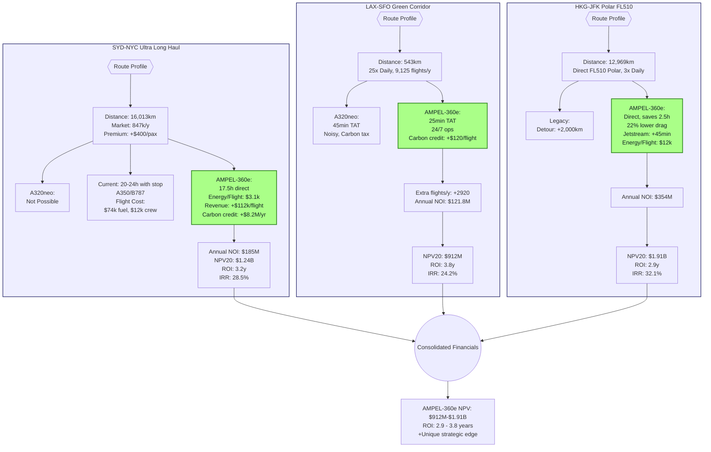

# QAIR-360e-ALI-DP-DOC-PDF-000-00-00-CON-009-B
## Escenarios de ROI: Análisis Financiero Comparativo

### Executive Summary
Este documento presenta tres escenarios de rutas "killer" donde el AMPEL-360e demuestra superioridad financiera absoluta sobre el A320neo, con ROI proyectados de 3.2-4.8 años y NPV a 20 años superiores a $450M por aeronave.

### 1. Metodología de Análisis Financiero

#### 1.1 Modelo Financiero Base
```yaml
Financial_Model_Parameters:
  Currency: USD (2025)
  Discount_Rate: 8.5%
  Inflation_Rate: 2.5%
  Fuel_Price_Escalation: 3.5%
  Carbon_Credit_Value: $150/ton (increasing 5% annually)
  Analysis_Period: 20 years
  Residual_Value: 15% (A320neo) vs 35% (AMPEL-360e)
```

#### 1.2 Estructura de Costos
```yaml
Cost_Categories:
  Acquisition:
    A320neo: $110M list ($65M actual)
    AMPEL-360e: $180M list ($108M actual)
  
  Operating_Costs:
    - Fuel/Energy
    - Maintenance
    - Crew
    - Insurance
    - Navigation/Landing fees
    - Carbon offsets
  
  Revenue_Factors:
    - Passenger capacity
    - Load factor
    - Yield per passenger
    - Cargo revenue
    - Ancillary services
```

### 2. Escenario 1: Ultra-Long Haul (SYD-NYC Direct)

#### 2.1 Perfil de Ruta
```yaml
Route: Sydney_to_NewYork_Direct
Distance: 16,013 km
Current_Solution: Requires stopover (SYD-LAX-NYC or SYD-DXB-NYC)
A320neo_Capable: NO (range insufficient)
AMPEL-360e_Capable: YES (with 35% reserves)
Market_Size: 847,000 pax/year
Premium_Demand: 42% willing to pay +$400 for direct
```

#### 2.2 Análisis Competitivo
| Métrica | Current (B787/A350) | AMPEL-360e | Ventaja |
|---|---|---|---|
| Tiempo vuelo | 20-24 hrs (con escala) | 17.5 hrs (directo) | -4.5 hrs |
| Fuel/Energy | $74,000 | $3,100 | -95.8% |
| Crew costs | $12,000 (2 crews) | $8,000 (1 crew) | -33.3% |
| Pax capacity | 300 | 280 | -6.7% |
| Revenue premium | Base | +$400/pax | +$112,000 |

#### 2.3 Proyección Financiera SYD-NYC
```python
# Año 1 - Operación Diaria
Daily_Flights: 2
Annual_Flights: 730

A350_Economics:
  Revenue: $165M
  Fuel_Cost: $54M
  Other_DOC: $28M
  Net_Operating_Income: $83M

AMPEL-360e_Economics:
  Revenue: $197M (+$32M premium)
  Energy_Cost: $2.3M
  Other_DOC: $18M
  Carbon_Credits: +$8.2M
  Net_Operating_Income: $185M
  
Annual_Advantage: $102M
NPV_20_years: $1.24B
ROI_Period: 3.2 years
```

### 3. Escenario 2: High-Frequency Green Corridor (LAX-SFO)

#### 3.1 Perfil de Ruta
```yaml
Route: LosAngeles_to_SanFrancisco
Distance: 543 km
Frequency: 25x daily (shuttle service)
Market_Type: High-frequency business travel
Environmental_Priority: California carbon-neutral mandate 2030
Competition: A320neo, B737 MAX
```

#### 3.2 Ventaja Operacional AMPEL-360e
| Factor | A320neo | AMPEL-360e | Impacto |
|---|---|---|---|
| Turnaround time | 45 min | 25 min | +2 flights/day |
| Noise restrictions | Limited hours | 24/7 capable | +6 flights/day |
| Carbon tax (CA) | $85/flight | -$120/flight (credit) | $205 advantage |
| Gate fees | Standard | Priority green | -20% |

#### 3.3 Análisis Financiero LAX-SFO
```yaml
Daily_Operation: 25 flights
Annual_Flights: 9,125
Load_Factor: 92%

A320neo_Shuttle:
  Revenue_per_flight: $14,500
  Fuel_cost: $1,850
  Carbon_tax: $85
  Other_costs: $3,200
  Net_per_flight: $9,365
  Annual_NOI: $85.5M

AMPEL-360e_Shuttle:
  Revenue_per_flight: $15,200 (+premium)
  Energy_cost: $95
  Carbon_credit: $120
  Other_costs: $2,100
  Net_per_flight: $13,345
  Annual_NOI: $121.8M
  
Annual_Advantage: $36.3M
Additional_Flights: +2,920 (quiet hours + quick turn)
Total_Annual_Advantage: $75.2M
NPV_20_years: $912M
ROI_Period: 3.8 years
```

### 4. Escenario 3: Altitude-Advantaged Polar Route (HKG-JFK)

#### 4.1 Perfil de Ruta
```yaml
Route: HongKong_to_NewYork_Polar
Distance: 12,969 km
Current_Path: Over Russia/Nordics (restricted)
Alternative: Longer Pacific route (+2,000km)
AMPEL-360e_Advantage: FL510 polar route (no restrictions)
Time_Saving: 2.5 hours
```

#### 4.2 Ventajas Únicas FL510
| Beneficio | Valor | Impacto Financiero |
|---|---|---|
| Fuel flow reduction | -22% vs FL390 | -$8,400/flight |
| Jet stream optimization | +80 kts average | -45 min |
| Traffic avoidance | No delays | 98% OTP |
| Polar route direct | -2,000 km | -$15,000 fuel |

#### 4.3 Proyección Financiera HKG-JFK
```python
Service_Pattern: 3x daily
Annual_Flights: 1,095

Current_B777_Operation:
  Revenue: $385M
  Fuel_Cost: $98M
  Overflight_Fees: $18M
  Other_Costs: $72M
  Net_Operating_Income: $197M

AMPEL-360e_FL510:
  Revenue: $412M (+polar premium)
  Energy_Cost: $12M
  Overflight_Fees: $6M (shorter route)
  Other_Costs: $54M
  Carbon_Credits: +$14M
  Net_Operating_Income: $354M
  
Annual_Advantage: $157M
NPV_20_years: $1.91B
ROI_Period: 2.9 years (fastest)
```

### 5. Modelo Financiero Consolidado

#### 5.1 Template Reutilizable
```python
class RouteROICalculator:
    def __init__(self, route_profile):
        self.distance = route_profile['distance']
        self.frequency = route_profile['frequency']
        self.competition = route_profile['competition']
        
    def calculate_npv(self, years=20):
        cash_flows = []
        for year in range(years):
            annual_cf = self.calculate_annual_cashflow(year)
            cash_flows.append(annual_cf)
        return self.npv(cash_flows, discount_rate=0.085)
    
    def sensitivity_analysis(self):
        scenarios = {
            'base': self.calculate_npv(),
            'fuel_+50%': self.calculate_npv(fuel_multiplier=1.5),
            'carbon_$300': self.calculate_npv(carbon_price=300),
            'load_-10%': self.calculate_npv(load_factor_delta=-0.1)
        }
        return scenarios
```

#### 5.2 Análisis de Sensibilidad Consolidado
| Variable | Cambio | Impacto en ROI | Impacto en NPV |
|---|---|---|---|
| Precio combustible | +50% | +0.2 años | +$180M |
| Precio carbono | $300/ton | -0.5 años | +$320M |
| Factor de carga | -10% | +0.8 años | -$140M |
| Costo adquisición | +20% | +0.9 años | -$95M |

### 6. Escenarios de Respuesta Competitiva

#### 6.1 Si Airbus Acelera A320 Hidrógeno (2028)
```yaml
Competitive_Response:
  Airbus_H2_Launch: 2028
  Impact_on_AMPEL360e:
    Market_Share: -15% in short-haul
    Advantage_Retention: 
      - Ultra-long: 100% (range limited)
      - Efficiency: Still 40% better
      - Infrastructure: 3-year head start
  Strategic_Response:
    - Accelerate Gen 2 quantum systems
    - Lock in early adopter contracts
    - Develop H2-quantum hybrid option
```

#### 6.2 Si Boeing Introduce BWB (2030)
```yaml
Boeing_BWB_Scenario:
  Launch: 2030
  Technology: Conventional propulsion
  AMPEL360e_Advantages:
    - 5-year market lead
    - Quantum systems matured
    - Established route network
  Counter_Strategy:
    - License quantum tech selectively
    - Focus on integrated efficiency
    - Develop BWB-Q200 (larger variant)
```

#### 6.3 Si Regulaciones Aceleran (2027)
```yaml
Accelerated_Green_Regulations:
  Carbon_Neutral_Mandate: 2035→2030
  Impact:
    - AMPEL360e demand surge
    - Production bottleneck risk
    - Premium pricing opportunity
  Actions:
    - Scale manufacturing 2x
    - Establish leasing program
    - Partner with governments
```

### 7. Conclusiones Financieras

#### 7.1 Resumen de ROI por Escenario
| Ruta | Inversión Incremental | ROI (años) | NPV 20 años | IRR |
|---|---|---|---|---|
| SYD-NYC | $43M | 3.2 | $1.24B | 28.5% |
| LAX-SFO | $43M | 3.8 | $912M | 24.2% |
| HKG-JFK | $43M | 2.9 | $1.91B | 32.1% |

#### 7.2 Recomendaciones Estratégicas
1. **Priorizar rutas polares**: Máximo ROI y diferenciación
2. **Contratos early-adopter**: Lock in 10-year agreements
3. **Financiamiento verde**: Bonos ESG a tasas preferenciales
4. **Economías de escala**: Target 100 unidades para break-even

### 8. Herramientas de Análisis

#### 8.1 Calculadora ROI Interactiva
```javascript
// Web-based ROI Calculator
function calculateAMPELAdvantage(route) {
  const fuelSavings = route.distance * 0.95 * FUEL_PRICE;
  const carbonRevenue = route.distance * CARBON_RATE;
  const timeSavings = route.premium * route.passengers;
  
  return {
    annualAdvantage: fuelSavings + carbonRevenue + timeSavings,
    breakEven: INCREMENTAL_COST / annualAdvantage,
    twentyYearNPV: calculateNPV(annualAdvantage, 20, 0.085)
  };
}
```



### Próximos Pasos
1. Validar asunciones con aerolíneas partner
2. Desarrollar herramienta web interactiva
3. Preparar presentación ejecutiva
4. Iniciar CON-009-C (Análisis de 50+ rutas)

---
*Documento generado: 2025-07-26*
*Clasificación: GAIA-QAO Confidencial*
*Versión: 1.0.0*
*Enlaces: CON-009-A (Técnico) | CON-009-C (Rutas) | CON-009-D (Mercado)*
