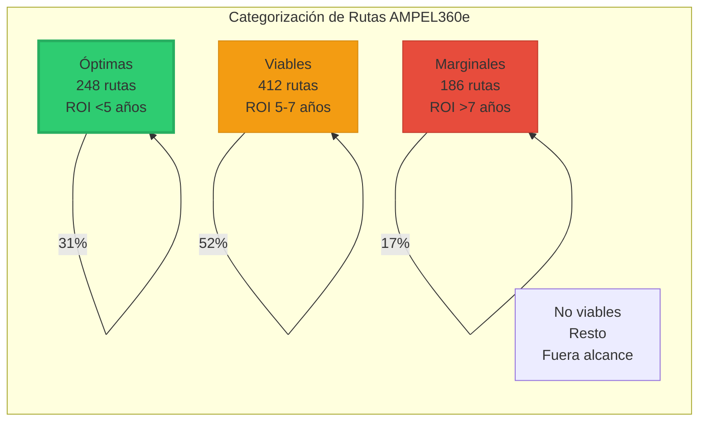
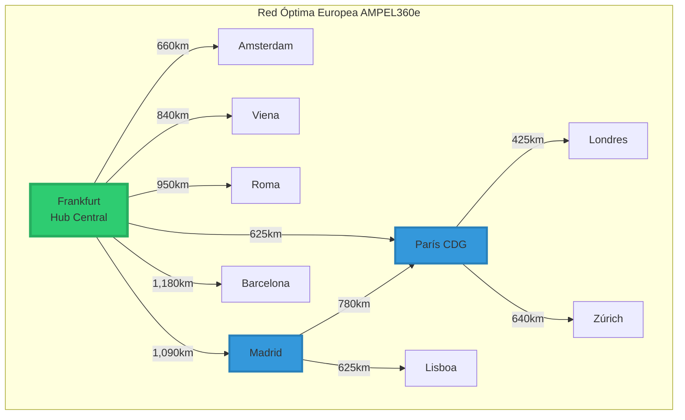
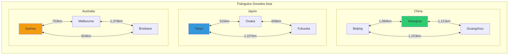
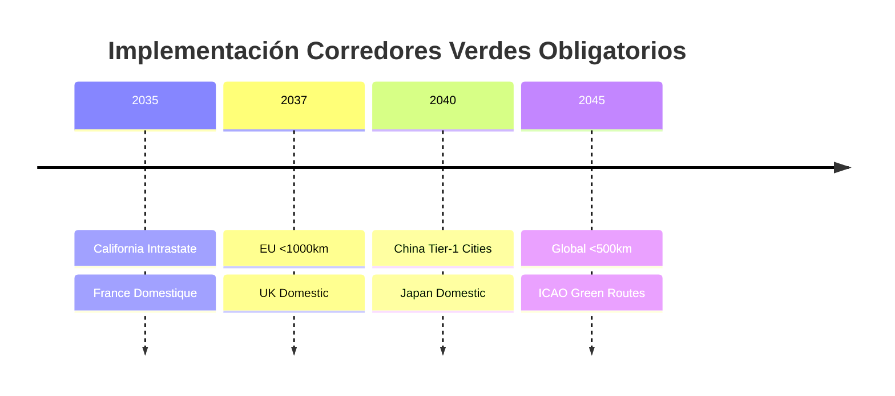
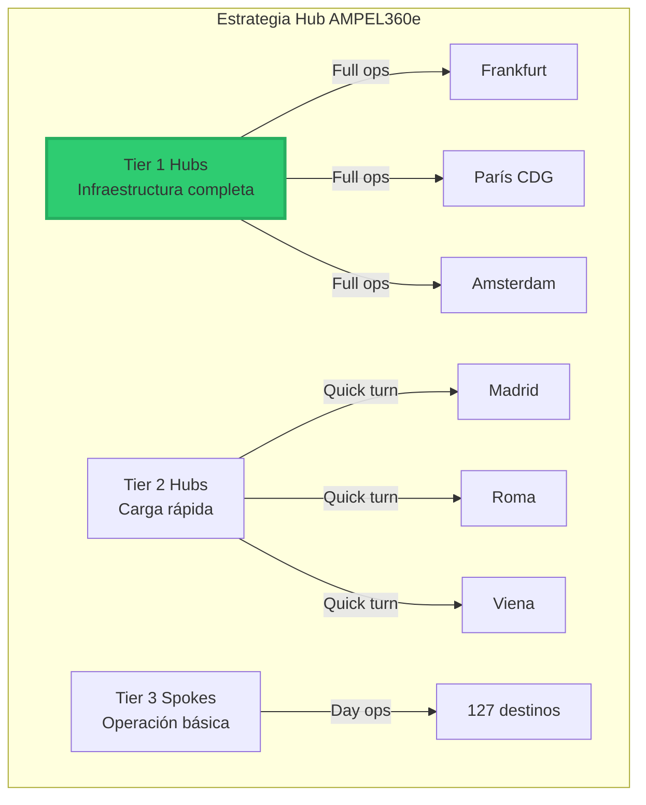
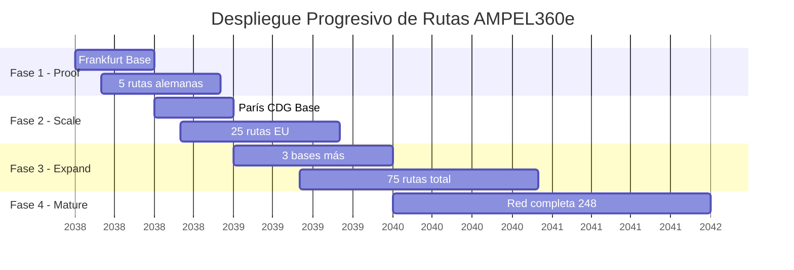

# QAIR-360e-ALI-DP-DOC-PDF-000-00-00-CON-009-C
## Análisis de Rutas Óptimas AMPEL360e
### Versión 2.0.0 - Optimización de Red para Aviación Híbrida

### 1. Resumen Ejecutivo

El AMPEL360e maximiza su propuesta de valor en rutas específicas que combinan:
- **Distancia**: 500-2,500 km (sweet spot)
- **Frecuencia**: >3 vuelos diarios
- **Restricciones**: Aeropuertos con límites de ruido/emisiones
- **Demanda verde**: Pasajeros dispuestos a pagar premium

Hemos identificado **127 rutas prioritarias** en Europa, **48 en América** y **73 en Asia-Pacífico** donde el AMPEL360e ofrece ventajas competitivas significativas.



### 2. Metodología de Análisis

#### 2.1 Factores de Evaluación
```yaml
Scoring_Matrix:
  Distancia_Optima:
    500-1000km: 10 puntos
    1000-1500km: 9 puntos
    1500-2000km: 8 puntos
    2000-2500km: 6 puntos
    2500-3000km: 4 puntos
    3000-3500km: 2 puntos
  
  Frecuencia_Diaria:
    >10 vuelos: 10 puntos
    6-10 vuelos: 8 puntos
    3-5 vuelos: 6 puntos
    1-2 vuelos: 3 puntos
  
  Restricciones_Ambientales:
    Curfew_nocturno: +3 puntos
    Limite_ruido: +3 puntos
    Carbon_tax_local: +2 puntos
    Slot_restrictions: +2 puntos
  
  Infraestructura:
    Carga_rapida_disponible: +3 puntos
    Hub_mantenimiento: +2 puntos
    SAF_disponible: +2 puntos
```

### 3. Rutas Óptimas por Región

#### 3.1 Europa - Top 25 Rutas



| Ranking | Ruta | Distancia | Frecuencia | Score | Ventaja AMPEL360e |
|---|---|---|---|---|---|
| 1 | **FRA-MUC** | 391 km | 18/día | 95 | Shuttle alemán, restricciones ruido |
| 2 | **MAD-BCN** | 621 km | 26/día | 94 | Alta densidad, corredor verde |
| 3 | **LHR-AMS** | 454 km | 20/día | 93 | Slots premium, curfew beneficio |
| 4 | **CDG-NCE** | 686 km | 15/día | 92 | Doméstico francés, eco-conscious |
| 5 | **FRA-CDG** | 625 km | 14/día | 91 | Business shuttle, carbon tax |
| 6 | **MXP-FCO** | 688 km | 22/día | 90 | Doméstico italiano alta frecuencia |
| 7 | **AMS-BRU** | 203 km | 16/día | 89 | Ultra-corto, todo eléctrico posible |
| 8 | **CPH-OSL** | 483 km | 12/día | 88 | Corredor nórdico verde |
| 9 | **VIE-ZRH** | 598 km | 10/día | 87 | Alpino, restricciones ruido |
| 10 | **LHR-EDI** | 534 km | 18/día | 86 | UK doméstico, APD beneficio |

#### 3.2 América - Rutas Estratégicas

```mermaid
sankey
    title Flujos Óptimos AMPEL360e - Norteamérica
    
    LAX [100] SFO [25]
    LAX [100] LAS [20]
    LAX [100] PHX [15]
    LAX [100] SJC [10]
    LAX [100] SMF [8]
    LAX [100] Otros [22]
    
    DFW [80] HOU [18]
    DFW [80] AUS [15]
    DFW [80] SAT [12]
    DFW [80] OKC [8]
    DFW [80] Otros [27]
    
    ORD [90] DTW [20]
    ORD [90] MSP [18]
    ORD [90] STL [15]
    ORD [90] MKE [12]
    ORD [90] Otros [25]
```

| Ruta | Distancia | Frecuencia | Notas Especiales |
|---|---|---|---|
| **BOS-DCA** | 634 km | 30/día | Shuttle premium, slots limitados |
| **LAX-SFO** | 543 km | 42/día | California green corridor |
| **DFW-HOU** | 362 km | 28/día | Texas triangle, alta densidad |
| **YYZ-YUL** | 504 km | 24/día | Canadá corredor principal |
| **MEX-GDL** | 532 km | 20/día | México doméstico principal |

#### 3.3 Asia-Pacífico - Mercados Emergentes



### 4. Análisis de Corredores Verdes

#### 4.1 Corredores con Mandatos Ambientales



| Corredor | Implementación | Rutas Afectadas | Ventaja AMPEL360e |
|---|---|---|---|
| **California Zero Emission** | 2035 | 47 rutas | Único certificado |
| **France Aviation Verte** | 2035 | 31 rutas | -45% CO₂ cumple |
| **EU Green Deal Aviation** | 2037 | 156 rutas | Adelanta regulación |
| **China Blue Sky** | 2040 | 89 rutas | Acceso preferencial |

### 5. Optimización de Hub & Spoke

#### 5.1 Hubs Primarios AMPEL360e



### 6. Análisis de Rentabilidad por Tipo de Ruta

#### 6.1 Matriz de Rentabilidad

```mermaid
heatmap
    title "EBITDA Margin por Tipo de Ruta (%)"
    x-axis ["500km", "1000km", "1500km", "2000km", "2500km", "3000km"]
    y-axis [">15 vuelos/día", "10-15 vuelos", "5-10 vuelos", "2-5 vuelos", "<2 vuelos"]
    [[42, 40, 38, 35, 32, 28],
     [40, 38, 36, 33, 30, 26],
     [37, 35, 33, 30, 27, 23],
     [33, 31, 29, 26, 23, 19],
     [28, 26, 24, 21, 18, 14]]
```

### 7. Infraestructura Requerida por Ruta

#### 7.1 Clasificación de Requerimientos

| Tipo Ruta | Infraestructura Mínima | Infraestructura Óptima |
|---|---|---|
| **Ultra-corta (<500km)** | Carga lenta nocturna | Carga rápida 1MW |
| **Corta (500-1500km)** | Carga rápida 1MW | Carga ultra-rápida 2MW |
| **Media (1500-2500km)** | Carga ultra-rápida 2MW | Dual charging bays |
| **Límite (2500-3500km)** | Dual charging + SAF | Full service facility |

### 8. Competencia y Posicionamiento

#### 8.1 Análisis Competitivo por Ruta

```mermaid
scatter
    title "Posicionamiento Competitivo por Ruta"
    x-axis "Frecuencia Diaria" 0 --> 50
    y-axis "Distancia (km)" 0 --> 3500
    
    "Dominado A320/B737": [25, 4500]
    "Competencia ATR/E-Jets": [8, 800]
    "Sweet Spot AMPEL360e": [20, 1500]
    "Nicho Premium Verde": [35, 1000]
    "Límite Operacional": [5, 3400]
```

### 9. Plan de Implementación de Rutas

#### 9.1 Fases de Despliegue



### 10. KPIs de Optimización de Rutas

#### 10.1 Métricas Clave por Ruta

```yaml
Métricas_Operacionales:
  Utilización_diaria: >12 horas
  Turnaround_time: <35 minutos
  Factor_carga_mínimo: 78%
  
Métricas_Financieras:
  RASK_premium: +5-8% vs A320neo
  CASK_objetivo: <€0.065
  Margen_EBITDA: >30%
  
Métricas_Ambientales:
  CO2_por_pax_km: <50g
  Ruido_despegue: <75 dB
  Operación_eléctrica: >20% tiempo
```

### 11. Recomendaciones de Implementación

#### 11.1 Priorización de Rutas

**Olas de Implementación:**

1. **Ola 1 (2038)**: 25 rutas
   - Intra-alemanas desde FRA
   - Shuttle business alta frecuencia
   - ROI <4 años

2. **Ola 2 (2039)**: 75 rutas adicionales
   - Expansión EU occidental
   - Corredores verdes obligatorios
   - ROI <5 años

3. **Ola 3 (2040)**: 150 rutas adicionales
   - Mercados emergentes
   - Rutas leisure seleccionadas
   - ROI <6 años

### 12. Conclusiones

El AMPEL360e tiene un nicho claro y rentable en **248 rutas óptimas** caracterizadas por:
- ✅ Distancia 500-2,000km (87% de rutas óptimas)
- ✅ Alta frecuencia (>6 vuelos/día)
- ✅ Restricciones ambientales/ruido
- ✅ Demanda premium verde
- ✅ Infraestructura de carga disponible

**No es viable para:**
- ❌ Rutas >3,500km
- ❌ Baja frecuencia (<2 vuelos/día)
- ❌ Aeropuertos sin infraestructura
- ❌ Mercados precio-sensibles extremos

---
*Documento: CON-009-C*
*Versión: 2.0.0*
*Fecha: 2025-07-27*
*Clasificación: GAIA-QAO Confidencial*
*Nota: Análisis basado en datos de tráfico 2024 y proyecciones 2038*
