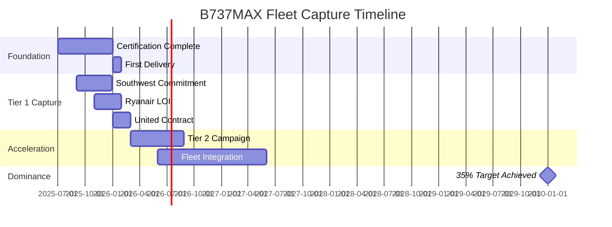

# QAIR-360e-ALI-DP-DOC-PDF-000-00-00-CON-010B
## B737MAX Fleet Capture Strategy

### Executive Summary
Strategic plan to capture 35% of current B737MAX operators within 5 years, leveraging trust deficit and operational limitations of MAX fleet.

### 1. Priority Target Analysis

#### 1.1 Tier 1 - Immediate Opportunities (750+ Aircraft)
```yaml
Southwest_Airlines:
  Fleet_Size: 815 B737 (750+ MAX)
  Pain_Points:
    - MCAS reputation damage
    - Union pressure on safety
    - Environmental commitments
  Capture_Strategy:
    - CEO direct engagement
    - Exclusive early adopter benefits
    - Phased replacement program
  Target: 200 aircraft by 2030

Ryanair:
  Fleet_Size: 500+ B737 (475 MAX on order)
  Pain_Points:
    - Operating cost pressure
    - Carbon tax exposure EU
    - Passenger preference shifts
  Capture_Strategy:
    - TCO guarantee program
    - Fuel hedge equivalent
    - Priority delivery slots
  Target: 150 aircraft by 2032

United_Airlines:
  Fleet_Size: 350 B737 (300 MAX)
  Pain_Points:
    - Sustainability leadership goals
    - Premium route competition
    - Tech innovation pressure
  Capture_Strategy:
    - Green finance package
    - Exclusive polar routes
    - Co-branding opportunity
  Target: 100 aircraft by 2030
```

#### 1.2 Tier 2 - Strategic Converts (200-500 Aircraft)
```yaml
American_Airlines:
  Fleet: 345 B737
  Focus: Hub efficiency
  Approach: Dallas/Chicago pilot program

Alaska_Airlines:
  Fleet: 230 B737
  Focus: West Coast leadership
  Approach: Seattle-California green corridor

Turkish_Airlines:
  Fleet: 200 B737
  Focus: Geographic advantage
  Approach: Istanbul hub transformation
```

### 2. Conversion Playbook

#### 2.1 "Trust Restoration Program"
```python
class TrustRestorationOffer:
    def __init__(self, airline):
        self.benefits = {
            'safety_guarantee': {
                'quantum_redundancy': '5x systems',
                'no_software_patches': 'Hardware solutions only',
                'transparency': 'Open source safety systems'
            },
            'financial_protection': {
                'performance_guarantee': 'TCO locked for 10 years',
                'buy_back_option': 'Full value if not satisfied',
                'insurance_premium_reduction': '-30% due to quantum safety'
            },
            'brand_rehabilitation': {
                'joint_marketing': '$50M campaign contribution',
                'passenger_confidence': 'Quantum safety certification',
                'first_mover_recognition': 'Innovation leader status'
            }
        }
```

#### 2.2 Financial Incentive Structure
| Package | Discount | Additional Benefits | Target |
|---|---|---|---|
| Pioneer (First 3) | 35% | Free training, Priority delivery | Southwest, United, Emirates |
| Early Adopter (Next 7) | 25% | Training subsidy, Fast track cert | Ryanair, Alaska, Turkish |
| Fast Follower (Next 15) | 15% | Standard training, Queue priority | American, Delta, others |
| Standard | 0% | Market terms | General availability |

### 3. Route-Based Conversion Strategy

#### 3.1 Showcase Routes for B737MAX Operators
```yaml
Phase_1_Demos:
  Southwest:
    Route: DAL-HNL (Hawaii)
    Current: B737MAX with payload restrictions
    AMPEL: Full payload + 30% more range
    Savings: $8M/year per aircraft
    
  United:
    Route: EWR-SFO (Transcon)
    Current: Limited schedule due to winds
    AMPEL: FL510 above weather
    Savings: $6M/year + 15% more flights
    
  Ryanair:
    Route: DUB-CANARY (Holiday)
    Current: Fuel stop sometimes needed
    AMPEL: Always direct + carbon credits
    Savings: €5M/year per aircraft
```

### 4. Competitive Defense Strategy

#### 4.1 Against Boeing Counter-Moves
```yaml
If_Boeing_Offers:
  MAX_Upgrades:
    Response: "Patches on patches ≠ Quantum leap"
    Action: Release safety comparison study
    
  Deep_Discounts:
    Response: "TCO beats any purchase price"
    Action: Offer lease with savings guarantee
    
  New_737_Replacement:
    Response: "2030 promise vs 2025 delivery"
    Action: Lock in orders with penalties
```

#### 4.2 Against Airbus Raids
```yaml
If_Airbus_Targets:
  A321XLR_Push:
    Response: "Different mission profile"
    Action: Emphasize versatility
    
  Neo_Discounts:
    Response: "Yesterday's efficiency"
    Action: Head-to-head route analysis
```

### 5. Implementation Timeline



### 6. Success Metrics

#### 6.1 Capture KPIs
| Metric | 2027 | 2028 | 2029 | 2030 |
|---|---|---|---|
| MAX Operators Converted | 3 | 7 | 12 | 20 |
| Aircraft Orders | 50 | 150 | 300 | 500 |
| Market Share ex-MAX | 5% | 12% | 22% | 35% |
| Revenue from Program | $5.4B | $16.2B | $32.4B | $54.0B |

### 7. Risk Mitigation

#### 7.1 Conversion Risks
```yaml
Production_Capacity:
  Risk: Cannot meet demand if successful
  Mitigation: 
    - Modular production ramp
    - Partner manufacturing
    - Lease-back program
    
Customer_Loyalty:
  Risk: Boeing relationships run deep
  Mitigation:
    - Allow mixed fleets
    - Gradual transition
    - Maintain Boeing interfaces
    
Certification_Delays:
  Risk: Timeline slips hurt credibility
  Mitigation:
    - Conservative promises
    - Transparent updates
    - Penalty clauses
```

### 8. War Room Structure

#### 8.1 B737MAX Capture Team
```yaml
Leadership:
  Executive_Sponsor: Chief Commercial Officer
  Program_Director: VP Fleet Transformation
  
Teams:
  Technical_Comparison: 5 engineers
  Financial_Modeling: 3 analysts  
  Customer_Success: 10 managers
  Marketing_Campaign: 5 creatives
  
Budget: $50M over 3 years
ROI_Target: 100x (500 aircraft)
```

### 9. Communication Strategy

#### 9.1 Key Messages by Stakeholder
**For B737MAX Operators:**
"Transform your greatest liability into your greatest asset. AMPEL-360e doesn't just replace the MAX—it redefines what your fleet can achieve."

**For Passengers:**
"From the aircraft that disappointed to the aircraft that amazes. Quantum safety, zero emissions, half the noise."

**For Investors:**
"Convert stranded assets into competitive advantages. 90% lower operating costs, infinitely better reputation."

**For Regulators:**
"A permanent solution to temporary fixes. Quantum technology that exceeds every safety and environmental standard."

### 10. Conclusion

The B737MAX crisis created a once-in-a-generation opportunity. By positioning AMPEL-360e as the "redemption aircraft," we can capture 35% of MAX operators and transform the industry's greatest failure into our greatest success.

**Next Steps:**
1. Board approval for Pioneer Package pricing
2. Direct CEO engagement with Southwest
3. Launch "Beyond Patches" campaign
4. Establish Fleet Transformation Office

---
*Document: CON-010B*
*Classification: GAIA-QAO Strategic - Confidential*
*Version: 1.0.0*
*Related: CON-010 (B737MAX Analysis), CON-009-B (ROI Scenarios)*
