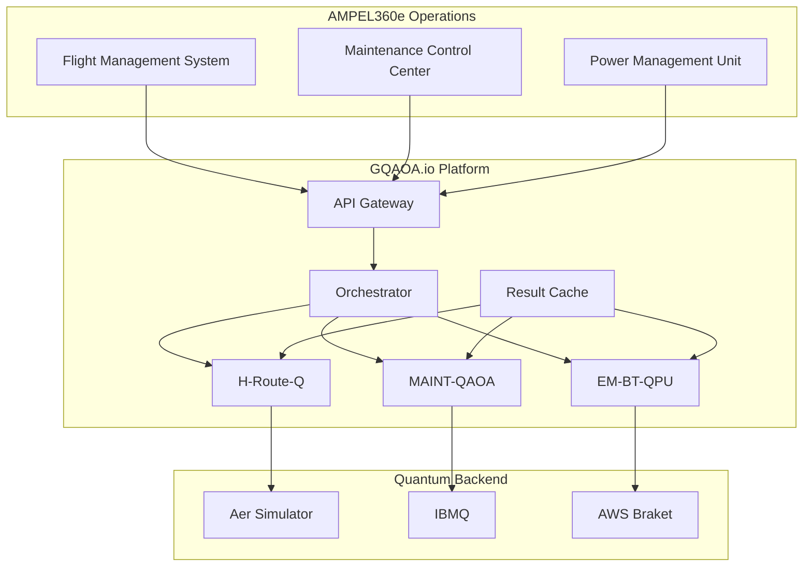

# Integración de Módulos de Optimización Cuántica en AMPEL360e
**Documento:** QAIR-360e-ALI-DP-DOC-PDF-000-00-00-CON-008  
**Estado:** Draft v1.0  
**Fecha:** 2025-07-26  
**Clasificación:** GAIA-QAO Confidential

## Resumen Ejecutivo

Este documento define la integración de tres módulos de optimización cuántica-clásica dentro del ecosistema AMPEL360e, elevando las capacidades operacionales de la aeronave híbrida-eléctrica mediante algoritmos QAOA/GQAOA. Los módulos abordan: (1) optimización de rutas híbridas, (2) scheduling de mantenimiento, y (3) gestión energética en tiempo real. Esta integración posiciona al AMPEL360e como la primera aeronave comercial con optimización cuántica operacional.

## 1. Visión y Arquitectura Integrada

### 1.1 Contexto Estratégico
La incorporación de optimización cuántica en el AMPEL360e representa una evolución natural del programa:
- **Diferenciación competitiva**: Primera aeronave con QPU-assisted operations
- **Eficiencia mejorada**: +5-10% adicional sobre optimización clásica
- **Preparación futura**: Infraestructura lista para QPUs más potentes
- **Alineación GAIA-QAO**: Cumple visión de tecnologías cuánticas integradas

### 1.2 Arquitectura de Alto Nivel



## 2. Módulo 1: H-Route-Q (Optimización Cuántica de Rutas Híbridas)

### 2.1 Especificación Funcional

**Objetivo**: Optimizar rutas de vuelo considerando el sistema de propulsión híbrida, minimizando coste total mientras maximiza eficiencia energética y cumple restricciones operacionales.

**Entradas**:
- Grafo de rutas aéreas con waypoints
- Estado inicial de baterías (SOC)
- Pronóstico meteorológico 4D
- Slots ATC disponibles
- Precio combustible SAF en tiempo real

**Salidas**:
- Secuencia óptima de waypoints
- Perfil de modo propulsión por segmento
- Distribución potencia eléctrica/turbina
- Tiempo estimado y consumo total

### 2.2 Formulación QUBO Detallada

#### Variables de Decisión
```python
# Binarias
x[i,j] = 1 si se usa segmento i→j
m[k,e] = 1 si modo eléctrico en segmento k
m[k,h] = 1 si modo híbrido en segmento k
m[k,t] = 1 si modo turbina en segmento k

# Discretizadas (5 niveles)
p[k,l] = 1 si potencia eléctrica = l*20% en segmento k
```

#### Función Objetivo
$$\min \sum_{i,j} x_{i,j} \cdot \left( \alpha C_{fuel}(i,j) + \beta C_{battery}(i,j) + \gamma C_{CO2}(i,j) + \delta T(i,j) \right) + \sum_k \eta P_{slot}(k)$$

Donde:
- $C_{fuel}$: Coste combustible SAF según modo
- $C_{battery}$: Degradación batería (ciclos equivalentes)
- $C_{CO2}$: Coste emisiones (EU-ETS + voluntario)
- $T$: Tiempo de vuelo penalizado
- $P_{slot}$: Penalización por miss de slot ATC

#### Restricciones como Penalizaciones

**Continuidad de ruta**:
$$H_1 = \lambda_1 \sum_v \left( \sum_i x_{i,v} - \sum_j x_{v,j} \right)^2$$

**Capacidad batería**:
$$H_2 = \lambda_2 \left( \sum_k p_k \cdot E_k - E_{max} \right)^2 \cdot \Theta(violación)$$

**Un modo por segmento**:
$$H_3 = \lambda_3 \sum_k \left( m_{k,e} + m_{k,h} + m_{k,t} - 1 \right)^2$$

### 2.3 Implementación GQAOA

```python
class HRouteQOptimizer:
    def __init__(self, config):
        self.graph = config.route_graph
        self.weights = config.objective_weights
        self.cache = ParamCache('h-route-q')
        
    def build_greedy_ansatz(self, problem_instance):
        """Construye circuito QAOA incrementalmente"""
        H_cost = self.problem_to_hamiltonian(problem_instance)
        
        circuit = QuantumCircuit(self.n_qubits)
        circuit.h(range(self.n_qubits))  # Superposición inicial
        
        for layer in range(self.p_max):
            # Ranking de términos por impacto estimado
            terms = self.rank_cost_terms(H_cost, self.cache)
            
            # Selección greedy de k mejores
            selected = terms[:self.greedy_k]
            
            # Añadir al circuito
            for term in selected:
                circuit = self.add_cost_layer(circuit, term, layer)
                circuit = self.add_mixer_layer(circuit, layer)
                
            # Evaluar ganancia marginal
            if self.marginal_gain(selected) < self.epsilon:
                break
                
        return circuit
        
    def optimize(self, origin, destination, constraints):
        # 1. Preprocesado clásico
        subgraph = self.extract_relevant_graph(origin, destination)
        
        # 2. Formulación QUBO
        Q = self.build_qubo_matrix(subgraph, constraints)
        
        # 3. Circuit GQAOA
        circuit = self.build_greedy_ansatz(Q)
        
        # 4. Optimización de parámetros
        params = self.cache.get_warm_start(Q.signature())
        optimized = self.classical_optimize(circuit, params)
        
        # 5. Sampling y post-proceso
        bitstrings = self.sample(circuit, optimized, shots=2048)
        route = self.decode_route(bitstrings[0], subgraph)
        
        # 6. Validación y refinamiento
        route = self.validate_and_repair(route, constraints)
        
        return RouteResult(route, metrics=self.evaluate(route))
```

### 2.4 Integración con FMS

**Interfaz FMS → H-Route-Q**:
```json
POST /api/v1/route-optimize
{
  "flight_id": "QA361",
  "origin": "LEMD",
  "destination": "ESSA", 
  "departure_time": "2034-03-15T08:30:00Z",
  "aircraft": {
    "model": "AMPEL360e",
    "battery_soc": 0.95,
    "fuel_kg": 12000,
    "payload_kg": 16800
  },
  "constraints": {
    "max_flight_time_min": 180,
    "required_reserve_fuel_kg": 1500,
    "min_battery_soc_arrival": 0.30
  },
  "weather": {
    "wind_grid_url": "https://api.weather.gov/grid/...",
    "turbulence_forecast": "moderate_FL350_370"
  },
  "atc": {
    "available_slots": ["08:45","09:00","09:15"],
    "preferred_altitudes": [35000, 37000, 39000]
  },
  "optimization": {
    "weights": {
      "fuel_cost": 0.35,
      "battery_wear": 0.20,
      "co2_cost": 0.25,
      "time": 0.15,
      "slot_penalty": 0.05
    },
    "solver": "GQAOA",
    "backend": "simulator",
    "timeout_ms": 8000
  }
}
```

**Respuesta H-Route-Q → FMS**:
```json
{
  "status": "success",
  "flight_id": "QA361",
  "solution": {
    "route": [
      {"waypoint": "LEMD", "lat": 40.4168, "lon": -3.7038},
      {"waypoint": "PINAR", "lat": 40.5833, "lon": -3.5667},
      {"waypoint": "ADUXO", "lat": 42.8500, "lon": -2.4833},
      ...
    ],
    "segments": [
      {
        "from": "LEMD",
        "to": "PINAR", 
        "mode": "hybrid",
        "electric_power_pct": 60,
        "altitude_ft": 15000,
        "distance_nm": 45,
        "time_min": 8,
        "fuel_burn_kg": 120,
        "battery_used_kwh": 85
      },
      ...
    ],
    "totals": {
      "distance_nm": 1180,
      "time_min": 165,
      "fuel_burn_kg": 2850,
      "battery_used_kwh": 450,
      "co2_emissions_kg": 8978,
      "cost_eur": 3420
    }
  },
  "optimization_metrics": {
    "objective_value": 0.7823,
    "approximation_ratio": 0.92,
    "quantum_advantage": 1.07,
    "circuit_depth": 124,
    "execution_time_ms": 6234
  },
  "cache_hit": true,
  "backend_used": "aer_simulator"
}
```

### 2.5 Validación y Métricas

**KPIs Operacionales**:
- Reducción consumo vs. ruta clásica: >5%
- Cumplimiento slots ATC: >98%
- Tiempo cálculo: <10s (sim), <30s (QPU)
- Factibilidad primera solución: >95%

**Validación**:
- Backtesting con 1000 vuelos históricos
- Simulación Monte Carlo con perturbaciones
- Validación en simulador de vuelo certificado
- A/B testing en operaciones reales (post-EIS)

## 3. Módulo 2: MAINT-QAOA (Scheduling de Mantenimiento Cuántico)

### 3.1 Especificación Funcional

**Objetivo**: Optimizar la asignación de tareas de mantenimiento a recursos (hangares, equipos, ventanas temporales) minimizando downtime y costes mientras cumple restricciones regulatorias.

**Alcance**:
- Line maintenance diario
- A-checks (1000 FH)
- B-checks (eliminados en AMPEL360e)
- C-checks (10,000 FH)
- Mantenimiento no programado

### 3.2 Formulación del Problema

#### Variables
```python
# Asignación tarea-slot
x[t,s] = 1 si tarea t se ejecuta en slot temporal s

# Asignación recurso-slot  
y[r,s] = 1 si recurso r está asignado a slot s

# Variables auxiliares
z[a,d] = 1 si aeronave a está disponible en día d
```

#### Objetivo Multi-criterio
$$\min \alpha \sum_a T_{down}(a) + \beta \sum_r C_{overtime}(r) + \gamma \sum_t P_{delay}(t) + \delta C_{resources}$$

Donde:
- $T_{down}$: Tiempo aeronave en tierra
- $C_{overtime}$: Coste horas extra personal
- $P_{delay}$: Penalización por retraso vs. plan
- $C_{resources}$: Coste recursos adicionales

#### Restricciones Principales

**No solapamiento de recursos**:
```python
for each slot s:
    sum(y[r,s] for r in resources) <= capacity[s]
```

**Precedencia de tareas**:
```python
for each (t1, t2) in precedence_pairs:
    slot(t1) < slot(t2)
```

**Ventanas de mantenimiento regulatorias**:
```python
for each task t:
    earliest[t] <= slot(t) <= latest[t]
```

### 3.3 Arquitectura MAINT-QAOA

```python
class MaintenanceQAOA:
    def __init__(self, fleet_config):
        self.fleet = fleet_config
        self.resources = ResourcePool()
        self.regulatory = RegulatoryConstraints()
        
    def schedule_optimization(self, planning_horizon_days=30):
        # 1. Recopilar tareas pendientes
        tasks = self.collect_maintenance_tasks(self.fleet)
        
        # 2. Generar slots disponibles
        slots = self.generate_time_slots(planning_horizon_days)
        
        # 3. Construir QUBO
        Q = self.build_scheduling_qubo(tasks, slots)
        
        # 4. Warm-start desde schedule actual
        current_schedule = self.get_current_schedule()
        initial_params = self.encode_schedule_as_bitstring(current_schedule)
        
        # 5. Optimización GQAOA
        optimizer = GQAOAScheduler(
            Q, 
            p_max=5,
            warm_start=initial_params
        )
        
        result = optimizer.run(
            backend='aer_simulator',
            shots=4096
        )
        
        # 6. Decodificar y validar
        schedule = self.decode_schedule(result.best_bitstring)
        schedule = self.ensure_regulatory_compliance(schedule)
        
        return MaintenanceSchedule(schedule)
```

### 3.4 Integración con MCC (Maintenance Control Center)

**API Request**:
```json
POST /api/v1/maintenance/optimize-schedule
{
  "fleet": [
    {
      "aircraft_id": "EC-001",
      "model": "AMPEL360e",
      "location": "LEMD",
      "flight_hours": 987,
      "cycles": 456,
      "last_a_check": "2034-01-15",
      "battery_cycles": 2341,
      "scheduled_flights": [...]
    },
    ...
  ],
  "tasks": [
    {
      "task_id": "A-CHECK-001",
      "aircraft_id": "EC-001",
      "type": "A-check",
      "estimated_hours": 8,
      "required_by": "2034-04-01",
      "precedence": []
    },
    {
      "task_id": "BAT-INSP-001",
      "aircraft_id": "EC-001", 
      "type": "battery_inspection",
      "estimated_hours": 2,
      "required_by": "2034-03-20",
      "precedence": ["A-CHECK-001"]
    },
    ...
  ],
  "resources": {
    "hangar_bays": 3,
    "teams": {
      "mechanical": 5,
      "electrical": 3,
      "battery_specialist": 2
    },
    "shifts": ["day", "evening", "night"]
  },
  "constraints": {
    "minimize_aircraft_downtime": true,
    "max_overtime_hours_per_week": 10,
    "preferred_maintenance_days": ["tuesday", "wednesday"]
  },
  "horizon_days": 30,
  "optimization": {
    "solver": "MAINT-QAOA",
    "backend": "ibmq_qasm_simulator",
    "timeout_ms": 15000
  }
}
```

**Response**:
```json
{
  "status": "success",
  "schedule": {
    "tasks": [
      {
        "task_id": "A-CHECK-001",
        "aircraft_id": "EC-001",
        "scheduled_start": "2034-03-25T22:00:00Z",
        "scheduled_end": "2034-03-26T06:00:00Z",
        "assigned_bay": 2,
        "assigned_teams": ["MECH-A", "ELEC-B"],
        "status": "scheduled"
      },
      ...
    ],
    "resource_utilization": {
      "hangar_bays": {
        "average_utilization": 0.78,
        "peak_utilization": 1.0,
        "peak_date": "2034-03-26"
      },
      "teams": {
        "mechanical": 0.85,
        "electrical": 0.72,
        "battery_specialist": 0.90
      }
    },
    "kpis": {
      "total_downtime_hours": 234,
      "overtime_hours": 45,
      "on_time_completion_rate": 0.98,
      "cost_savings_vs_baseline": 12500
    }
  },
  "optimization_metrics": {
    "objective_value": 0.6234,
    "approximation_ratio": 0.89,
    "constraints_satisfied": true,
    "quantum_speedup": 1.15,
    "execution_time_ms": 12450
  }
}
```

### 3.5 Características Especiales AMPEL360e

**Mantenimiento Predictivo Cuántico**:
- Integración con gemelo digital
- Predicción degradación batería mediante QML
- Optimización preventiva vs. correctiva

**Consideraciones Híbridas**:
- Sincronización mantenimiento batería/turbina
- Gestión térmica en hangar para baterías
- Certificación dual personal (eléctrico + turbina)

## 4. Módulo 3: EM-BT-QPU (Gestión Energética Batería/Turbina)

### 4.1 Especificación Funcional

**Objetivo**: Control óptimo en tiempo real del reparto de potencia entre sistemas eléctrico y turbina, minimizando consumo total y degradación mientras mantiene performance.

**Contexto Operacional**:
- Decisiones cada 10 segundos
- Horizonte predictivo: 5-10 minutos
- Integración con PMU (Power Management Unit)
- Fallback a control clásico por seguridad

### 4.2 Formulación MPC Cuántico

#### Estado del Sistema
```python
state = {
    'battery_soc': 0.75,          # State of charge
    'battery_temp': 25.3,         # °C
    'turbine_n1': [92.5, 93.1],   # % RPM
    'altitude': 37000,            # ft
    'airspeed': 453,              # knots
    'phase_of_flight': 'cruise',
    'ambient_temp': -56.5,        # °C
    'requested_thrust': 18500     # lbf total
}
```

#### Variables de Control (Discretizadas)
```python
# Reparto de potencia próximos N steps
u[t,k] = porcentaje potencia eléctrica en paso t, nivel k
# k ∈ {0%, 20%, 40%, 60%, 80%, 100%}

# Modo de operación
m[t] = modo en paso t
# modes: 'turbine_only', 'hybrid_economy', 'hybrid_power', 'electric_boost'
```

#### Función Objetivo MPC
$$J = \sum_{t=0}^{N-1} \left[ w_f F(u_t) + w_b B(u_t) + w_e E(u_t) + w_{\Delta} |u_t - u_{t-1}|^2 \right]$$

Donde:
- $F$: Consumo combustible instantáneo
- $B$: Degradación batería (modelo rainflow)
- $E$: Emisiones (NOx, CO2)
- Término suavizado para evitar chattering

### 4.3 Implementación Tiempo Real

```python
class EnergyManagementQPU:
    def __init__(self, aircraft_config):
        self.pmu = PowerManagementUnit()
        self.predictor = TrajectoryPredictor()
        self.thermal_model = BatteryThermalModel()
        self.qpu_pool = QPUResourcePool()
        
    def control_loop(self):
        """Loop principal 10Hz con decisión cuántica asíncrona"""
        quantum_suggestion = None
        last_quantum_update = 0
        
        while self.active:
            # Control clásico rápido (100ms)
            state = self.read_system_state()
            classical_control = self.classical_mpc(state)
            
            # Aplicar control con blend cuántico si disponible
            if quantum_suggestion and (time.now() - last_quantum_update < 10):
                control = self.blend_controls(
                    classical_control, 
                    quantum_suggestion,
                    confidence=0.7
                )
            else:
                control = classical_control
                
            self.pmu.apply_control(control)
            
            # Trigger optimización cuántica asíncrona
            if self.should_update_quantum(state):
                self.async_quantum_optimize(state)
                
            time.sleep(0.1)  # 10Hz
            
    async def async_quantum_optimize(self, state):
        """Optimización QAOA en background"""
        # Predicción trayectoria próximos 5 min
        future_profile = self.predictor.predict(state, horizon_min=5)
        
        # Formulación QUBO para horizonte
        Q = self.build_energy_qubo(state, future_profile)
        
        # Ejecución en QPU disponible
        backend = await self.qpu_pool.get_available()
        
        optimizer = QAOA(
            Q,
            p=3,  # Shallow circuit para latencia
            optimizer='COBYLA'
        )
        
        result = await optimizer.run_async(
            backend=backend,
            shots=1024
        )
        
        # Decodificar estrategia energética
        strategy = self.decode_energy_strategy(result)
        self.quantum_suggestion = strategy
        self.last_quantum_update = time.now()
```

### 4.4 Interfaz PMU ↔ EM-BT-QPU

**Telemetría PMU → QPU (10Hz)**:
```json
{
  "timestamp": "2034-03-15T10:45:32.156Z",
  "state": {
    "battery": {
      "soc": 0.68,
      "voltage": 798.5,
      "current": -285.3,
      "temperature": [24.5, 25.1, 24.8, 25.3],
      "health": 0.95
    },
    "turbines": [
      {
        "n1": 91.8,
        "n2": 98.2,
        "egt": 823,
        "fuel_flow": 0.823
      },
      {
        "n1": 92.1,
        "n2": 98.5,
        "egt": 819,
        "fuel_flow": 0.819
      }
    ],
    "flight": {
      "phase": "cruise",
      "altitude": 37000,
      "mach": 0.79,
      "oat": -56.5,
      "weight": 67840
    },
    "demand": {
      "thrust_total": 18600,
      "electrical_load": 145.2
    }
  }
}
```

**Control QPU → PMU (1Hz o por evento)**:
```json
{
  "timestamp": "2034-03-15T10:45:35.000Z",
  "control": {
    "mode": "hybrid_economy",
    "power_split": {
      "electric_percent": 35,
      "turbine_percent": 65
    },
    "projected_10min": {
      "fuel_burn_kg": 82.3,
      "battery_discharge_kwh": 45.2,
      "co2_emissions_kg": 259.6
    },
    "confidence": 0.92,
    "source": "quantum_optimizer"
  }
}
```

### 4.5 Modos de Operación y Transiciones

```python
class EnergyModes:
    TURBINE_ONLY = {
        'electric': 0,
        'conditions': ['battery_soc < 0.2', 'emergency', 'battery_fault']
    }
    
    HYBRID_ECONOMY = {
        'electric': 20-40,
        'conditions': ['cruise', 'battery_soc > 0.4', 'normal_ops']
    }
    
    HYBRID_POWER = {
        'electric': 40-60,
        'conditions': ['climb', 'heavy_weight', 'battery_soc > 0.6']
    }
    
    ELECTRIC_BOOST = {
        'electric': 60-80,
        'conditions': ['takeoff', 'go_around', 'windshear']
    }
    
    REGENERATIVE = {
        'electric': -20-0,  # Carga
        'conditions': ['descent', 'battery_soc < 0.8', 'low_brake_energy']
    }
```

## 5. Infraestructura Común y Telemetría

### 5.1 Result Cache Unificado

```python
class QuantumResultCache:
    """Cache compartido entre módulos con indexación inteligente"""
    
    def __init__(self, redis_config):
        self.redis = Redis(**redis_config)
        self.ttl = {
            'route': 3600,      # 1 hora
            'maintenance': 86400,  # 24 horas  
            'energy': 300       # 5 minutos
        }
        
    def get_signature(self, problem_type, features):
        """Genera firma única del problema para indexación"""
        if problem_type == 'route':
            return f"route:{features['origin']}:{features['dest']}:{features['weight_hash']}"
        elif problem_type == 'maintenance':
            return f"maint:{features['fleet_size']}:{features['task_count']}:{features['horizon']}"
        elif problem_type == 'energy':
            return f"energy:{features['altitude_band']}:{features['weight_class']}:{features['soc_band']}"
            
    def store_result(self, problem_type, signature, result):
        key = f"qcache:{problem_type}:{signature}"
        self.redis.setex(
            key,
            self.ttl[problem_type],
            json.dumps({
                'params': result.optimal_params,
                'objective': result.objective_value,
                'circuit_structure': result.circuit.to_dict(),
                'metadata': result.metadata
            })
        )
```

### 5.2 Meta-Learning para Parameter Transfer

```python
class QuantumMetaLearner:
    """Aprende a transferir parámetros entre problemas similares"""
    
    def __init__(self):
        self.feature_extractor = ProblemFeatureExtractor()
        self.param_predictor = self._build_predictor_network()
        self.training_buffer = deque(maxlen=10000)
        
    def _build_predictor_network(self):
        """Red neuronal para predecir parámetros iniciales"""
        return Sequential([
            Dense(128, activation='relu', input_dim=64),
            Dropout(0.2),
            Dense(64, activation='relu'),
            Dense(32, activation='tanh'),  # params ∈ [-π, π]
            Lambda(lambda x: x * np.pi)
        ])
        
    def suggest_initial_params(self, problem):
        features = self.feature_extractor.extract(problem)
        features_normalized = self.normalize_features(features)
        
        # Predicción base
        params_pred = self.param_predictor.predict(features_normalized)
        
        # Añadir ruido para exploración
        noise = np.random.normal(0, 0.1, size=params_pred.shape)
        params_init = params_pred + noise
        
        return params_init
        
    def update_from_result(self, problem, final_params, performance):
        """Actualiza el modelo con resultados reales"""
        self.training_buffer.append({
            'features': self.feature_extractor.extract(problem),
            'params': final_params,
            'performance': performance
        })
        
        if len(self.training_buffer) >= 100:
            self._retrain_predictor()
```

### 5.3 Telemetría y KPIs Unificados

```yaml
# Prometheus metrics
ampel360_quantum_optimization_requests_total{module="route|maintenance|energy",status="success|failure"}
ampel360_quantum_optimization_latency_seconds{module="...",backend="simulator|ibmq|braket"}
ampel360_quantum_approximation_ratio{module="..."}
ampel360_quantum_circuit_depth{module="..."}
ampel360_quantum_cache_hit_rate{module="..."}
ampel360_quantum_cost_savings_euros{module="..."}

# Grafana dashboards
- Real-time optimization status
- Historical performance trends  
- Cost savings accumulated
- QPU utilization and queuing
- Cache effectiveness
- Parameter transfer learning curves
```

## 6. Plan de Implementación y Rollout

### 6.1 Fases de Desarrollo

**Fase 1: Simulación y Validación (Q3 2025 - Q2 2026)**
- Desarrollo de los 3 módulos con simulador Aer
- Validación con datos históricos
- Integración con simuladores de vuelo

**Fase 2: Piloto QPU (Q3 2026 - Q4 2027)**
- Acceso a QPUs IBMQ/Braket
- Pruebas con flotas virtuales
- Refinamiento de algoritmos

**Fase 3: Integración Pre-EIS (2028 - 2030)**
- Integración con sistemas AMPEL360e reales
- Certificación software (DO-178C)
- Training de operadores

**Fase 4: Operaciones Shadow (2031 - 2033)**
- Ejecución paralela sin control activo
- Recopilación de métricas
- Validación de savings

**Fase 5: Go-Live (Q2 2034 con EIS)**
- Activación gradual por operador
- Monitoreo intensivo
- Optimización continua

### 6.2 Presupuesto Estimado

| Concepto | Coste (M€) |
|----------|------------|
| Desarrollo software | 12.5 |
| Acceso QPU (5 años) | 8.0 |
| Integración y certificación | 15.0 |
| Training y soporte | 5.5 |
| **Total** | **41.0** |

### 6.3 ROI Proyectado

- Ahorro combustible: 5-7% adicional = 15M€/año para flota 50 aviones
- Reducción mantenimiento: 10% = 8M€/año
- Mejora utilización: 2% = 12M€/año
- **Payback period: <2 años post-EIS**

## 7. Gestión de Riesgos

| Riesgo | Probabilidad | Impacto | Mitigación |
|--------|--------------|---------|------------|
| QPUs no escalan como esperado | Media | Alto | Algoritmos híbridos robustos |
| Latencia QPU excesiva | Alta | Medio | Cache agresivo + sim fallback |
| Certificación software compleja | Media | Alto | Early engagement con EASA |
| Resistencia operadores | Baja | Medio | Beneficios demostrados en shadow |
| Costes QPU prohibitivos | Media | Medio | Modelo pay-per-optimization |

## 8. Conclusiones y Próximos Pasos

La integración de optimización cuántica en el AMPEL360e representa un salto evolutivo en la eficiencia operacional de aeronaves comerciales. Los tres módulos propuestos abordan los mayores generadores de coste en aviación: combustible, mantenimiento y utilización de activos.

### Acciones Inmediatas:
1. **Formar equipo quantum**: 5-7 ingenieros con expertise QAOA
2. **Establecer partnerships**: IBM Quantum Network, AWS Braket
3. **Desarrollar PoC**: H-Route-Q con datos reales de rutas EU
4. **Validar business case**: Con 2-3 aerolíneas early adopter
5. **Roadmap certificación**: Workshop con EASA sobre DO-178C quantum

### Entregables Q3 2025:
- [ ] Especificación técnica detallada los 3 módulos
- [ ] Arquitectura microservicios completa
- [ ] PoC H-Route-Q funcional con simulator
- [ ] Plan de certificación software
- [ ] Acuerdos NDA con proveedores QPU

---

**Control de documento:**
- Versión: 1.0
- Estado: Draft para revisión técnica
- Fecha: 2025-07-26
- Clasificación: GAIA-QAO Confidential
- Distribución: CTO, Head of Innovation, Quantum Team Lead

**Anexos disponibles bajo petición:**
- A: Especificación matemática completa QUBO
- B: Benchmark algoritmos clásicos vs QAOA
- C: Arquitectura software detallada
- D: Análisis de patentes y freedom-to-operate
- E: Quantum readiness assessment aerolíneas
