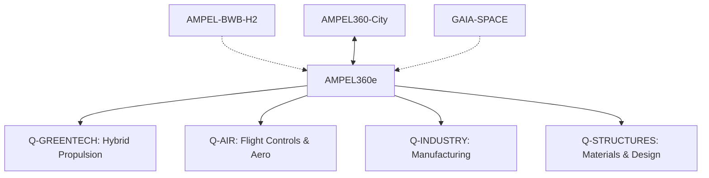

# ✈️ AMPEL360e – Aeronave Híbrido-Eléctrica de Nueva Generación

**Identificador del Programa**: AMPEL360e-v2.0  
**Código GQOIS**: Q360e-ALI-DP-AMTA-000-00-00-CON-001  
**Versión del Documento**: 2.0.0  
**Fecha de Publicación**: 24 de julio de 2025  
**Clasificación**: CONFIDENCIAL DEL CONSORCIO GAIA-QAO  
**Estado**: Documento Maestro – Programa Activo  
**Responsable Técnico**: Amedeo Pelliccia  
**División Coordinadora**: Q-AIR  
**Aprobación**: ORB-PMO / ORB-LEG  

---

## 🌍 Descripción General del Programa

**AMPEL360e** es una aeronave comercial de nueva generación con arquitectura **ala y tubo optimizada**, propulsada mediante un sistema **híbrido-eléctrico paralelo certificable**, diseñada para rutas de corto a medio alcance (180-220 pasajeros). Representa el primer paso estratégico hacia la aviación descarbonizada mediante tecnologías maduras, de rápida integración y **completamente certificables bajo marcos regulatorios existentes (CS-25, DO-178C, DO-254)**.

### Enfoque de Certificación
- **Sin integración cuántica embarcada** para garantizar elegibilidad de certificación temprana
- **Tecnologías certificables** bajo estándares aeronáuticos actuales
- **Timeline conservador** con Entry Into Service (EIS) en 2038

---

## ⚙️ Especificaciones Técnicas Certificables (CS-25 Compliance)

### Configuración Aerodinámica y Estructural
| Parámetro                      | Valor Certificable    | Estándar de Cumplimiento |
|-------------------------------|------------------------|---------------------------|
| **Capacidad pasajeros**       | 180–220 (configuración dual) | CS-25.807/CS-25.815 |
| **Alcance máximo**            | 3,500 km (ISA, MTOW)   | CS-25.1001 |
| **Configuración wing**        | Ala baja cantilever    | CS-25.301-CS-25.397 |
| **Material fuselaje**         | Aluminio 2024-T3 + composites certificados | CS-25.603 |
| **Sistemas de escape**        | 8 salidas (Type III/Type A) | CS-25.809/CS-25.813 |

### Sistema de Propulsión Híbrido-Eléctrico Certificable
| Parámetro                      | Especificación        | Estándar de Cumplimiento |
|-------------------------------|------------------------|---------------------------|
| **Arquitectura propulsión**   | Híbrido paralelo 2+2   | CS-E 510 (Proposed) |
| **Motores térmicos**          | 2x turbofan SAF-ready   | CS-E 500 series |
| **Motores eléctricos**        | 2x 2.5MW distributed   | CS-E 510 (Proposed) |
| **Baterías**                  | LiFePO4 certificadas    | CS-25.1353/DO-311A |
| **Combustible**               | 100% SAF compatible     | ASTM D7566 |
| **Reducción CO₂**             | 50% vs A320neo         | ICAO CORSIA |
| **Certificación**             | CS-25 + E-UTCS         | EASA certification |
| **EIS objetivo**              | Q2 2038                | Program milestone |

---

## 📐 UTCS Architecture Compliance

### ATA Chapters (000-099) - Aerospace Technology Architecture
| ATA Code | Sistema | División Responsable | Estándar |
|----------|---------|---------------------|----------|
| **ATA 20** | Standard Practices | Q-INDUSTRY | ATA 2200 |
| **ATA 21** | Air Conditioning | Q-MECHANICS | CS-25.831 |
| **ATA 24** | Electrical Power | Q-MECHANICS | CS-25.1351 |
| **ATA 27** | Flight Controls | Q-AIR | CS-25.671-685 |
| **ATA 29** | Hydraulic Power | Q-MECHANICS | CS-25.1189 |
| **ATA 32** | Landing Gear | Q-MECHANICS | CS-25.721-745 |
| **ATA 71** | Power Plant | Q-GREENTECH | CS-E 500/510 |

### AMTA Integration (500-599) - Advanced Materials
| AMTA Code | Aplicación | Material | Certificación |
|-----------|------------|----------|---------------|
| **AMTA 520** | Wing Structure | CFRP T800/M21 | CS-25.603 |
| **AMTA 530** | Battery Housing | Titanium Ti-6Al-4V | DO-311A |
| **AMTA 540** | Composite Repairs | Prepreg Carbon | CS-25.603 |

### EPTA Integration (400-499) - Energy & Propulsion Technology
| EPTA Code | Sistema | Tecnología | Estándar |
|-----------|---------|------------|----------|
| **EPTA 450** | Hybrid Propulsion | Parallel Architecture | CS-E 510 |
| **EPTA 420** | Battery Systems | LiFePO4 Banks | DO-311A |
| **EPTA 460** | Energy Management | Smart Distribution | DO-178C DAL B |

---

## 🏗️ Arquitectura del Repositorio por Fases de Ciclo de Vida

```
01-PROGRAMS/AMPEL360E/
├── 01-01-CONCEPT-CON/                    # Fase Conceptual (2025)
│   ├── market-analysis/
│   │   ├── QMKT-360e-ALI-DP-CON-001_Market_Research.pdf
│   │   └── QFIN-360e-ALI-DP-CON-002_Business_Case.xlsx
│   ├── stakeholder-engagement/
│   │   ├── QPMO-360e-ALI-DP-CON-003_Stakeholder_Matrix.pdf
│   │   └── QLEG-360e-ALI-DP-CON-004_Regulatory_Roadmap.pdf
│   └── technology-assessment/
│       ├── QSCR-360e-ALI-DP-CON-005_TRL_Assessment.pdf
│       └── QAIR-360e-ALI-DP-CON-006_Concept_Definition.pdf
│
├── 01-02-DESIGN-DES/                     # Diseño Preliminar (2025-2027)
│   ├── system-architecture/
│   │   ├── QHPC-360e-BOB-DT-DES-001_System_Architecture.json
│   │   └── QDGO-360e-ALI-DP-DES-002_Interface_Control.pdf
│   ├── propulsion-system/
│   │   ├── QGRN-360e-BOB-CAD-DES-003_Hybrid_System.step
│   │   └── QGRN-360e-ALI-DP-DES-004_Energy_Management.pdf
│   ├── aerodynamics/
│   │   ├── QAIR-360e-BOB-CFD-DES-005_Wing_Design.py
│   │   └── QAIR-360e-ALI-DP-DES-006_Performance_Analysis.pdf
│   └── structures/
│       ├── QSTR-360e-BOB-CAD-DES-007_Fuselage_Structure.step
│       └── QSTR-360e-ALI-DP-DES-008_Materials_Specification.pdf
│
├── 01-03-TESTING-TST/                    # Validación y Pruebas (2027-2029)
│   ├── component-testing/
│   │   ├── QGRN-360e-ALI-DP-TST-001_Battery_Tests.pdf
│   │   └── QMEC-360e-ALI-DP-TST-002_Hydraulic_Tests.pdf
│   ├── integration-testing/
│   │   ├── QHPC-360e-BOB-SIM-TST-003_System_Integration.py
│   │   └── QAIR-360e-ALI-DP-TST-004_Flight_Test_Plan.pdf
│   └── certification-testing/
│       ├── QLEG-360e-ALI-DP-TST-005_CS25_Compliance.pdf
│       └── QIND-360e-ALI-DP-TST-006_Production_Conformity.pdf
│
├── 01-04-CERTIFICATION-CRT/              # Certificación (2029-2031)
│   ├── regulatory-compliance/
│   │   ├── QLEG-360e-ALI-DP-CRT-001_Type_Certificate.pdf
│   │   └── QLEG-360e-ALI-DP-CRT-002_Conformity_Declaration.pdf
│   ├── safety-assessment/
│   │   ├── QAIR-360e-ALI-DP-CRT-003_Safety_Assessment.pdf
│   │   └── QHPC-360e-ALI-DP-CRT-004_Software_Certification.pdf
│   └── operational-approval/
│       ├── QAIR-360e-ALI-DP-CRT-005_Operations_Manual.pdf
│       └── QGRD-360e-ALI-DP-CRT-006_Maintenance_Program.pdf
│
├── 01-05-PRODUCTION-PRD/                 # Producción (2031-2038)
│   ├── manufacturing/
│   │   ├── QIND-360e-ALI-DP-PRD-001_Production_Plan.pdf
│   │   └── QIND-360e-BOB-PLM-PRD-002_Assembly_Line.dwg
│   ├── quality-assurance/
│   │   ├── QIND-360e-ALI-DP-PRD-003_QA_Procedures.pdf
│   │   └── QIND-360e-BOB-QMS-PRD-004_Quality_Dashboard.exe
│   └── supply-chain/
│       ├── QIND-360e-ALI-DP-PRD-005_Supplier_Qualification.pdf
│       └── QIND-360e-BOB-SCM-PRD-006_Inventory_Management.jar
│
├── 01-06-OPERATIONS-OPS/                 # Operaciones de Vuelo (2038+)
│   ├── flight-operations/
│   │   ├── QAIR-360e-ALI-DP-OPS-001_Flight_Manual.pdf
│   │   └── QGRD-360e-ALI-DP-OPS-002_Ground_Handling.pdf
│   ├── performance-monitoring/
│   │   ├── QHPC-360e-BOB-DT-OPS-003_Digital_Twin.py
│   │   └── QAIR-360e-ALI-DP-OPS-004_Performance_Reports.pdf
│   └── regulatory-compliance/
│       ├── QLEG-360e-ALI-DP-OPS-005_Continuing_Airworthiness.pdf
│       └── QLEG-360e-ALI-DP-OPS-006_Operational_Directives.pdf
│
├── 01-07-MAINTENANCE-MNT/                # Mantenimiento en Línea (2038+)
│   ├── maintenance-planning/
│   │   ├── QGRD-360e-ALI-DP-MNT-001_MSG3_Analysis.pdf
│   │   └── QHPC-360e-BOB-AI-MNT-002_Predictive_Maintenance.py
│   ├── procedures/
│   │   ├── QDGO-360e-ALI-DP-MNT-003_AMM_Volume1.pdf
│   │   └── QGRD-360e-ALI-DP-MNT-004_Line_Maintenance.pdf
│   └── troubleshooting/
│       ├── QHPC-360e-BOB-AI-MNT-005_Diagnostic_System.py
│       └── QDGO-360e-ALI-DP-MNT-006_TSM_Manual.pdf
│
├── 01-08-SUPPORT-SUP/                    # Soporte en Servicio (2038+)
│   ├── service-bulletins/
│   │   ├── QDGO-360e-ALI-DP-SUP-001_Service_Bulletin_001.pdf
│   │   └── QLEG-360e-ALI-DP-SUP-002_Airworthiness_Directives.pdf
│   ├── modifications/
│   │   ├── QSTR-360e-ALI-DP-SUP-003_Modification_Package.pdf
│   │   └── QHPC-360e-BOB-SW-SUP-004_Software_Updates.bin
│   └── customer-support/
│       ├── QGRD-360e-ALI-DP-SUP-005_Customer_Support_Manual.pdf
│       └── QMKT-360e-BOB-CRM-SUP-006_Customer_Portal.html
│
├── 01-09-REPAIR-REP/                     # Reparación y Reciclaje (2038+)
│   ├── structural-repairs/
│   │   ├── QSTR-360e-ALI-DP-REP-001_SRM_Manual.pdf
│   │   └── QSTR-360e-ALI-DP-REP-002_Composite_Repairs.pdf
│   ├── component-overhaul/
│   │   ├── QGRN-360e-ALI-DP-REP-003_Battery_Overhaul.pdf
│   │   └── QMEC-360e-ALI-DP-REP-004_Landing_Gear_OH.pdf
│   └── recycling/
│       ├── QGRN-360e-ALI-DP-REP-005_Material_Recovery.pdf
│       └── QGRN-360e-BOB-LCA-REP-006_Lifecycle_Assessment.py
│
└── 01-10-RETIREMENT-RET/                 # Retiro del Servicio (2050+)
    ├── decommissioning/
    │   ├── QGRN-360e-ALI-DP-RET-001_Retirement_Plan.pdf
    │   └── QIND-360e-ALI-DP-RET-002_Asset_Disposal.pdf
    ├── circular-economy/
    │   ├── QGRN-360e-ALI-DP-RET-003_Component_Reuse.pdf
    │   └── QGRN-360e-BOB-CE-RET-004_Circular_Economy.py
    └── knowledge-preservation/
        ├── QDGO-360e-ALI-DP-RET-005_Lessons_Learned.pdf
        └── QSCR-360e-ALI-DP-RET-006_Technology_Legacy.pdf
```

---

## 🧠 Tecnologías Certificables Integradas

### Sistemas de Control Certificables (DO-178C DAL B)
- **Flight Management System**: FMS certificado con IA asistida (NO quantum)
- **Fly-by-Wire Controls**: Sistema FBW convencional con mejoras algorítmicas
- **Predictive Maintenance**: IA basada en datos históricos certificables
- **Energy Management System**: Control híbrido certificable bajo CS-E 510

### Aviónica Modular Certificable (DO-254 DAL B)
- **Modular Avionics Platform**: Conforme a ARINC 653/664
- **Integrated Modular Avionics**: IMA certificable DO-297
- **Communication Systems**: SATCOM/VHF/HF estándar certificado
- **Navigation Systems**: GNSS/ILS/VOR convencional (NO quantum)

### Propulsión Híbrida Certificable
- **Thermal Engines**: Turbofan convencional SAF-ready certificado CS-E
- **Electric Motors**: Motores eléctricos certificados RTCA DO-160G
- **Battery Systems**: Baterías LiFePO4 certificadas DO-311A
- **Energy Distribution**: Sistema eléctrico certificado CS-25.1351

> ✅ **Enfoque de Certificación**: Todas las tecnologías integradas son certificables bajo estándares aeronáuticos actuales (CS-25, DO-178C, DO-254, CS-E) sin dependencia de tecnologías cuánticas embarcadas.

---

## 🔗 Relaciones entre Programas GAIA-QAO

### Programas Complementarios
| Programa | Relación Funcional | Nivel de Integración | Sinergias Tecnológicas |
|----------|-------------------|---------------------|------------------------|
| **AMPEL-BWB-H2** | Sucesor tecnológico | Media | Sistemas de control, materiales |
| **AMPEL360-City** | Propulsión compartida | Alta | Baterías, motores eléctricos |
| **GAIA-SPACE-LAUNCHER** | Tecnologías terrestres | Baja | Materiales compuestos, software |
| **Q-GREENTECH Program** | Base tecnológica | Crítica | Propulsión híbrida, sostenibilidad |

### Dependencies Matrix


---

## 🤝 Colaboraciones Activas Especificadas

### Q-Divisions Integration
| División | Responsabilidad en AMPEL360e | Contacto Técnico | Presupuesto 2025-2027 |
|----------|-----------------------------|-----------------|-----------------------|
| **Q-GREENTECH** | Propulsión híbrida certificable | Dr. Elena Martinez | €45M |
| **Q-AIR** | Aerodinámica y sistemas de vuelo | Ing. Carlos Rodriguez | €35M |
| **Q-INDUSTRY** | Manufactura y control de calidad | Ing. María González | €30M |
| **Q-STRUCTURES** | Diseño estructural y materiales | Dr. Antonio López | €25M |
| **Q-HPC** | Sistemas digitales y simulación | Dr. Francesco Rossi | €20M |
| **Q-MECHANICS** | Integración mecánica y hidráulica | Ing. Paolo Bianchi | €18M |

### ORB-Functions Support
| Función | Rol en AMPEL360e | Responsable | Budget Allocation |
|---------|------------------|-------------|------------------|
| **ORB-PMO** | Gestión integral del programa | PMO Director | €15M |
| **ORB-FIN** | Financiación y control financiero | CFO GAIA-QAO | €8M |
| **ORB-LEG** | Certificación y cumplimiento | Chief Legal Officer | €12M |
| **ORB-HR** | Gestión de talento especializado | CHRO | €5M |

### External Partnerships
| Partner | Tipo de Colaboración | Contribución | Duración |
|---------|---------------------|--------------|----------|
| **Airbus** | Consultoría en certificación CS-25 | Expertise técnica | 2025-2030 |
| **Safran** | Propulsión térmica híbrida | Motores SAF-ready | 2025-2035 |
| **Thales** | Aviónica y sistemas críticos | Sistemas certificados | 2025-2040 |
| **EASA** | Proceso de certificación acelerado | Fast-track certification | 2027-2031 |

---

## 📂 Estructura del Repositorio (por Fase de Ciclo de Vida)

```
AMPEL360e/
├── CON/                       # Fase Conceptual
│   ├── ATA/
│   │   ├── 000_Informacion_General/
│   │   ├── 020_Sistemas_Core/
│   │   └── 060_Propulsion_Hibrida/
│   └── docs/
│       └── Concept_Whitepapers/
│
├── DES/                       # Diseño detallado
│   ├── CAD_3D/
│   ├── Esquemas_Eléctricos/
│   └── Arquitectura_IA/
│
├── TST/                       # Validación y simulación
│   ├── Simulaciones/
│   └── Resultados/
│
├── CRT/                       # Certificación
│   ├── CS25_Checklists/
│   └── Evidencias_Formales/
│
├── PRD/                       # Producción
│   └── Software_Embarcado/
│
├── MNT/                       # Mantenimiento
│   ├── Estrategias_Predictivas/
│   └── Documentacion_PPM/
│
├── SUP/                       # Soporte logístico
│   └── Manuales_Partes/
│
├── OPS/                       # Operaciones
│   └── Procedimientos_Vuelo/
│
├── REP/                       # Repuestos y reparaciones
│   └── Reparabilidad/
│
├── RET/                       # Retiro y circularidad
│   └── Planes_Reutilizacion/
└── docs/
    └── README.md 
```

---

## 📜 Cumplimiento Normativo

- **DO-178C / DO-254 / ARP4754A / CS-25**
- **DO-297 / ISO 14040 (LCA) / ISO 21434**
- **UTCS Arquitectura**:  
  - **ATA 000–099**  
  - **AMTA 400–499**  
  - **EPTA 300–399**

---

## 📈 Estado del Proyecto

| Fase | Estado      | Fechas Estimadas      |
|------|-------------|------------------------|
| CON  | ✅ Finalizada | Jul 2025 – Sep 2025   |
| DES  | ⏳ En curso  | Oct 2025 – Mar 2026   |
| TST  | � Prevista  | Abr 2026 – Oct 2026   |
| CRT  | 🕒 Prevista  | Nov 2026 – Ene 2027   |
| PRD  | ❌ No iniciada | Feb 2027 – Sep 2027 |

---

## 🧩 Colaboraciones Activas

- **Q-GREENTECH**: Propulsión híbrida certificable
- **Q-AIR**: Aerodinámica, aviónica e IA embarcada
- **Q-INDUSTRY**: Integración con fábricas RT-FAL
- **ORB-PMO & ORB-FIN**: Planificación, financiación y certificación

---

## 🔐 Clasificación

**Confidencial del Consorcio GAIA-QAO**  
Todos los entregables están trazados mediante GQOIS y validados conforme al ciclo de certificación CS-25.

---

## 📝 Contacto del Programa

- **Responsable Técnico**: Amedeo Pelliccia  
- **Unidad Coordinadora**: Q-AIR  
- **Repositorio GQOIS**: `Q100-BOB-DP-AMTA-000-00-00-CON-XXX`  
- **Canal de Contribuciones**: ORB-HR / Pull Requests autorizados

---

## 📜 Marco de Cumplimiento Normativo v2.0

### Certificación Aeronáutica Primaria
| Estándar | Aplicación | Estado de Cumplimiento | Responsible Authority |
|----------|------------|----------------------|----------------------|
| **CS-25** | Large Aircraft Certification | Planned (2027-2031) | EASA |
| **FAR-25** | FAA Large Aircraft Rules | Planned (2028-2032) | FAA |
| **CS-E 500** | Turbine Engine Certification | Planned (2026-2029) | EASA |
| **CS-E 510** | Electric/Hybrid Propulsion | Development (TBD) | EASA |

### Software y Hardware Crítico
| Estándar | Aplicación AMPEL360e | DAL Level | Verificación |
|----------|---------------------|-----------|-------------|
| **DO-178C** | Flight Management Software | DAL B | Independent V&V |
| **DO-254** | Avionics Hardware Design | DAL B | Hardware verification |
| **DO-297** | Integrated Modular Avionics | System Level | Platform certification |
| **DO-311A** | Electric Battery Systems | Equipment Level | Battery safety |

### Timeline Realista EIS 2038
| Fase | Duración | Estado Actual | Hitos Principales | Riesgo |
|------|----------|---------------|-------------------|--------|
| **CON** - Concepto | Q3-Q4 2025 | ✅ En Curso | Market validation, concept freeze | Bajo |
| **DES** - Diseño Preliminar | Q1 2026 - Q2 2027 | 📋 Planificado | PDR, CDR completion | Medio |
| **TST** - Prototipado y Pruebas | Q3 2027 - Q2 2029 | 📋 Planificado | Ground tests, system integration | Medio |
| **CRT** - Certificación | Q3 2029 - Q1 2031 | 📋 Planificado | Type certificate, production certificate | Alto |
| **PRD** - Producción en Serie | Q2 2031 - Q4 2037 | 📋 Planificado | First delivery, ramp-up production | Medio |
| **OPS** - Entrada en Servicio | **Q2 2038** | 📋 Target EIS | Commercial operations start | Bajo |

---

**© 2025 GAIA-QAO ADVENT - Enhanced Program Documentation v2.0**  
**Clasificación**: CONFIDENCIAL DEL CONSORCIO GAIA-QAO  
**GQOIS Traceability**: Q360e-ALI-DP-AMTA-000-00-00-CON-001  
**Próxima Revisión**: Q4 2025
