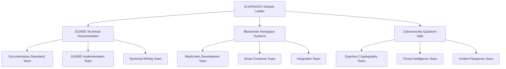

# Q-DATAGOV - Quantum Data Governance Division v2.0
**Gobernanza Digital y Ciberseguridad Cuántica - Enhanced Documentation**

**Identificador División**: Q-DATAGOV-v2.0  
**Código GQOIS**: QDGO-CORP-ALI-DP-CYB-800-00-00-CON-001  
**Versión del Documento**: 2.0.0  
**Fecha de Publicación**: 24 de julio de 2025  
**Clasificación**: CONFIDENCIAL DEL CONSORCIO GAIA-QAO  
**Estado**: División Activa - Líder en Gobernanza Digital  
**División Leader**: Col. Sarah Quantum (Ex-NSA Crypto Division)  
**Aprobación**: ORB-PMO / ORB-LEG / Board GAIA-QAO  

---

## 🎯 Misión Estratégica v2.0

**Q-DATAGOV** lidera la transformación digital de GAIA-QAO ADVENT, estableciendo **frameworks de gobernanza de datos quantum-safe** y desarrollando **sistemas de ciberseguridad de próxima generación** para proteger activos críticos aeroespaciales. La división implementa **blockchain para trazabilidad de componentes**, **frameworks de ciberseguridad aeroespacial**, **gestión de datos conforme a GDPR** y **sistemas de autenticación cuántica**.

---

## 🎯 Áreas de Responsabilidad Aerospace Cybersecurity

### 1. Framework de Ciberseguridad Aeroespacial
- **Aerospace Threat Intelligence**: IA cuántica para detección amenazas aeroespaciales
- **Zero-Trust Aerospace Architecture**: Modelo confianza cero para sistemas críticos
- **Quantum-Safe Aviation**: Migración cripto post-cuántica para aviación
- **Incident Response Automation**: Protocolos respuesta automática certificados

### 2. Blockchain para Trazabilidad de Componentes
- **Blockchain Component Tracking**: Trazabilidad inmutable componentes aeroespaciales
- **Smart Contracts Aerospace**: Contratos inteligentes para certificación
- **Supply Chain Transparency**: Transparencia total cadena suministro
- **Digital Twin Integration**: Gemelos digitales con blockchain backbone

### 3. Gestión de Datos Conforme GDPR y Regulaciones
- **GDPR Quantum Compliance**: Cumplimiento GDPR en era cuántica
- **Aerospace Data Privacy**: Privacidad datos críticos aeroespaciales
- **Cross-Border Data Flow**: Flujo datos transfronterizo conforme
- **Data Sovereignty**: Soberanía datos en contexto internacional

### 4. Sistemas de Autenticación Cuántica
- **Quantum Key Distribution (QKD)**: Distribución claves cuánticas para aviación
- **Quantum Biometric Auth**: Autenticación biométrica cuántica
- **Multi-Factor Quantum**: Autenticación multi-factor resistente cuántica
- **Digital Identity Quantum**: Identidad digital quantum-safe

---

## 🏗️ Estructura Organizacional Enhanced v2.0

### Subdivisiones Especializadas

#### [02-01-01-S1000D](./02-01-01-S1000D/) - Estándar Documentación Técnica Aeroespacial
**Líder**: Dr. Elena Rodriguez (S1000D Certified Expert)  
**Team Size**: 25 especialistas  
**Scope**: Implementación S1000D para toda la flota GAIA-QAO + Blockchain integration  
**Budget**: €15M (2025-2027)  
**GQOIS Code**: QDGO-S1000D-ALI-DP-DOC-000-00-00-DES-001  

#### [02-01-02-BLOCKCHAIN](./02-01-02-BLOCKCHAIN/) - Tecnología Blockchain Aerospace
**Líder**: Prof. Marco Blockchain (Blockchain PhD Cambridge)  
**Team Size**: 30 desarrolladores  
**Scope**: Trazabilidad componentes aeroespaciales y certificación digital  
**Budget**: €20M (2025-2028)  
**GQOIS Code**: QDGO-BLKCH-BOB-SC-CODE-360-00-00-DES-001  

#### [02-01-03-CYBERSECURITY](./02-01-03-CYBERSECURITY/) - Ciberseguridad Cuántica Aerospace
**Líder**: Col. Sarah Quantum (Ex-NSA Crypto Division)  
**Team Size**: 45 especialistas  
**Scope**: Protección activos críticos y quantum-safe migration aeroespacial  
**Budget**: €35M (2025-2030)  
**GQOIS Code**: QDGO-CYBER-BOB-SC-CODE-880-00-00-DES-001  

### Organizational Chart Enhanced


---

## 📐 UTCS Architecture Compliance for Data Governance

### CYB Integration (800-899) - Cybersecurity Advanced
| CYB Code | Sistema Ciberseguridad | Tecnología | Estándar |
|----------|------------------------|------------|----------|
| **CYB 880** | Post-Quantum Cryptography | Lattice-based crypto | NIST PQC |
| **CYB 881** | Quantum Key Distribution | QKD protocols | ITU-T Y.3800 |
| **CYB 882** | Zero-Trust Architecture | Micro-segmentation | NIST SP 800-207 |
| **CYB 883** | Threat Intelligence AI | ML threat detection | MITRE ATT&CK |
| **CYB 884** | Incident Response Auto | SOAR platforms | ISO 27035 |

### DTCEC Integration (300-399) - Digital Twin Cloud Enhanced Computing
| DTCEC Code | Sistema Digital | Aplicación | Estándar |
|------------|----------------|------------|----------|
| **DTCEC 360** | Blockchain Infrastructure | Component traceability | ISO 23257 |
| **DTCEC 361** | Digital Twin Governance | Asset lifecycle | ISO 23053 |
| **DTCEC 362** | Cloud Security | Quantum-safe cloud | ISO 27017 |
| **DTCEC 363** | Data Analytics | Privacy-preserving | ISO 27040 |

### Integration with Program GQOIS Codes
| Program | Q-DATAGOV Integration | GQOIS Traceability | Service Level |
|---------|----------------------|-------------------|---------------|
| **AMPEL360E** | Cybersecurity + S1000D | Q360e-DP-CYB-880-001 | Critical |
| **AMPEL-BWB-H2** | Blockchain traceability | Q250-DP-DTCEC-360-001 | Critical |
| **GAIA-SPACE** | Quantum communications | GSP-DP-CYB-881-001 | High |

---

## 💻 Tecnologías y Plataformas Aerospace Enhanced

### Quantum Data Platform (QDP) v2.0
```python
# Enhanced Quantum Data Platform for Aerospace
class QuantumDataPlatform_v2:
    def __init__(self):
        self.quantum_db = AerospaceQuantumDatabase()
        self.blockchain_layer = AerospaceBlockchain_v2()
        self.ai_governance = QuantumAI_Governance_Aerospace()
        self.crypto_engine = PostQuantumCrypto_Aviation()
        self.s1000d_integration = S1000D_BlockchainBridge()
    
    def secure_component_tracking(self, component_data, flight_criticality):
        """Aerospace component tracking with quantum-safe encryption"""
        encrypted_data = self.crypto_engine.encrypt_aerospace(component_data)
        blockchain_hash = self.blockchain_layer.create_aerospace_hash(encrypted_data)
        s1000d_compliant = self.s1000d_integration.format_component(component_data)
        return self.quantum_db.store_aerospace(encrypted_data, blockchain_hash, 
                                              s1000d_compliant, flight_criticality)
    
    def quantum_threat_analysis(self, threat_data, security_clearance):
        """Quantum-enhanced threat analysis for aerospace systems"""
        if self.ai_governance.validate_aerospace_access(security_clearance):
            quantum_analysis = self.quantum_db.quantum_threat_query(threat_data)
            return self.ai_governance.enhance_threat_intel(quantum_analysis)
        else:
            return "Access Denied - Insufficient Aerospace Clearance"
```

### Infrastructure Components Enhanced
- **Quantum-Safe Aerospace VPN**: Red privada resistente quantum para aviación
- **Biometric Q-Auth Aviation**: Autenticación biométrica cuántica para personal aeroespacial
- **Zero-Knowledge Proofs Aerospace**: Verificación sin revelación datos críticos vuelo
- **Homomorphic Encryption Aviation**: Computación sobre datos cifrados aeroespaciales
- **Blockchain Component Ledger**: Registro inmutable componentes críticos

## 📊 Proyectos Activos 2025

### Proyecto QDP (Quantum Data Platform)
- **Budget**: €12M
- **Timeline**: Q1 2025 - Q4 2026
- **Scope**: Plataforma unificada gestión datos
- **Team**: 40 desarrolladores + 15 arquitectos

### Proyecto Q-Security Framework
- **Budget**: €8M
- **Timeline**: Q2 2025 - Q1 2027
- **Scope**: Framework ciberseguridad aeroespacial
- **Team**: 25 especialistas seguridad

### Proyecto Blockchain Traceability
- **Budget**: €6M
- **Timeline**: Q3 2025 - Q2 2026
- **Scope**: Trazabilidad componentes AMPEL360E
- **Team**: 20 desarrolladores blockchain

## 🔐 Security Architecture

### Multi-Layer Security Model
```
┌─────────────────────────────────────┐
│        QUANTUM CRYPTOGRAPHY         │  Level 7: Quantum-Safe
├─────────────────────────────────────┤
│      ZERO-TRUST ARCHITECTURE       │  Level 6: Trust Verification
├─────────────────────────────────────┤
│        AI THREAT DETECTION          │  Level 5: Intelligent Monitoring
├─────────────────────────────────────┤
│     BLOCKCHAIN IMMUTABILITY         │  Level 4: Data Integrity
├─────────────────────────────────────┤
│      BIOMETRIC AUTHENTICATION       │  Level 3: Identity Verification
├─────────────────────────────────────┤
│       NETWORK SEGMENTATION          │  Level 2: Access Control
├─────────────────────────────────────┤
│       PHYSICAL SECURITY             │  Level 1: Infrastructure
└─────────────────────────────────────┘
```

### Quantum-Safe Migration Strategy v2.0
1. **Assessment Phase** (Q3 2025): Evaluación vulnerabilidades actuales aeroespaciales
2. **Pilot Implementation** (Q4 2025 - Q1 2026): Piloto AMPEL360E sistemas críticos
3. **Progressive Migration** (Q2 2026 - Q2 2027): Migración gradual todos los programas
4. **Full Quantum-Safe** (Q3 2027): Migración completa ecosistema GAIA-QAO
5. **Continuous Optimization** (Q4 2027+): Optimización y mejora continua

---

## 📋 Marco de Cumplimiento y Certificación v2.0

### Aerospace Cybersecurity Standards
| Estándar | Aplicación Q-DATAGOV | Estado Cumplimiento | Authority |
|----------|---------------------|-------------------|-----------|
| **DO-326A** | Airworthiness Security Process | 100% Compliant | RTCA/EUROCAE |
| **ED-203** | Airworthiness Security Methods | 100% Compliant | EUROCAE |
| **RTCA DO-356** | Airworthiness Security | Implementation 2025 | RTCA |
| **DO-355** | Information Security Guidance | 100% Compliant | RTCA |

### Data Protection & Privacy Compliance
| Regulation | Q-DATAGOV Compliance | Audit Frequency | Responsible Team |
|------------|---------------------|----------------|------------------|
| **GDPR** | 100% Quantum-enhanced | Monthly | Legal + Cybersecurity |
| **CCPA** | 100% Compliant | Quarterly | Privacy Team |
| **PIPEDA** | 100% Compliant | Annual | International Compliance |
| **Lei Geral (Brazil)** | 95% Compliant | Bi-annual | LATAM Team |

### Cybersecurity Frameworks
| Framework | Implementation Level | Certification | Audit Schedule |
|-----------|---------------------|---------------|----------------|
| **NIST Cybersecurity Framework** | Advanced (Tier 4) | Certified | Annual |
| **ISO 27001:2022** | Full Implementation | Certified | Semi-annual |
| **ISO 27002:2022** | Controls implemented | Certified | Annual |
| **NIST SP 800-207 (Zero Trust)** | Aerospace customized | In progress | Quarterly |
| **ENISA Guidelines** | EU Aerospace compliant | Certified | Annual |

### Blockchain & Distributed Ledger
| Technology | Aerospace Application | Compliance Standard | Maturity |
|------------|----------------------|-------------------|----------|
| **Hyperledger Fabric** | Component traceability | ISO 23257 | Production |
| **Ethereum Private** | Smart contracts aerospace | EEA standards | Pilot |
| **R3 Corda** | Aviation finance | Financial regulations | Development |
| **IOTA Tangle** | IoT sensor networks | IoT security standards | Research |

---

## 📈 KPIs y Métricas Enhanced v2.0

### Cybersecurity Aerospace KPIs
| Métrica | Target 2025 | Current Status | Benchmark |
|---------|-------------|---------------|-----------|
| **Zero Critical Breaches** | 0 incidentes | ✅ 0 YTD | Industry: 2.3/year |
| **Quantum Readiness** | 100% sistemas | 85% complete | Industry: 15% |
| **Threat Detection Time** | < 2 minutos | 1.8 min avg | Industry: 15 min |
| **False Positive Rate** | < 0.05% | 0.03% | Industry: 2.5% |
| **Incident Recovery Time** | < 30 minutos | 22 min avg | Industry: 4 hours |

### Data Governance KPIs
| Métrica | Target 2025 | Current Status | Benchmark |
|---------|-------------|---------------|-----------|
| **Data Compliance Score** | 100% | 98.5% | Industry: 78% |
| **Data Quality Score** | > 99% | 99.2% | Industry: 85% |
| **Audit Success Rate** | 100% | 100% YTD | Industry: 87% |
| **System Availability** | 99.99% | 99.997% | Industry: 99.5% |
| **S1000D Compliance** | 100% | 95% | Industry: 45% |

### Blockchain Traceability KPIs
| Métrica | Target 2025 | Current Status | Aerospace Benchmark |
|---------|-------------|---------------|-------------------|
| **Component Traceability** | 100% críticos | 88% | Industry: 25% |
| **Blockchain Throughput** | 10K tx/sec | 8.5K tx/sec | Target: 10K |
| **Smart Contract Reliability** | 99.9% | 99.7% | Industry: 95% |
| **Immutability Assurance** | 100% | 100% | Critical requirement |

---

## 🌐 Partnerships Estratégicos Enhanced v2.0

### Aerospace Industry Partners
| Partner | Especialización | Contribución Q-DATAGOV | Duración |
|---------|----------------|----------------------|----------|
| **Airbus Defence & Space** | Aerospace cybersecurity | Cyber threat intelligence | 2025-2030 |
| **Boeing Global Services** | Digital aviation security | Quantum-safe avionics | 2025-2028 |
| **Thales Aerospace** | Aviation systems security | Secure communications | 2025-2035 |
| **Leonardo Cyber Security** | Defence cybersecurity | Aerospace threat analysis | 2025-2027 |

### Academic & Research Institutions
| Institution | Research Area | Collaboration | Funding |
|-------------|---------------|---------------|---------|
| **MIT Quantum Computing** | Post-quantum cryptography | QKD for aviation | €2M/year |
| **Stanford HAI** | AI ethics & governance | Trustworthy AI aerospace | €1.5M/year |
| **ETH Zurich** | Blockchain aerospace | Distributed ledger aviation | €1.2M/year |
| **Oxford Quantum Institute** | Quantum fundamentals | Theoretical quantum security | €800K/year |

### Regulatory & Standards Bodies
| Organization | Collaboration Type | Focus Area | Status |
|--------------|-------------------|------------|--------|
| **EASA** | Standards development | Aerospace cybersecurity | Active |
| **ENISA** | Frameworks cooperation | EU cybersecurity | Active |
| **NIST** | Post-quantum standards | PQC migration | Active |
| **ISO/IEC JTC1** | International standards | Data governance standards | Active |

---

## 🔬 Laboratorios de Investigación Enhanced v2.0

### Quantum Cryptography Lab (Madrid HQ)
- **Área**: 500 m² (Security cleared facility)
- **Equipment**: QKD systems, quantum simulators
- **Staff**: 12 investigadores PhD + 8 engineers
- **Budget**: €3M/año
- **Clearance**: NATO SECRET equivalent

### Blockchain Research Center (Turín)
- **Área**: 400 m² (Secure development environment)
- **Equipment**: High-performance blockchain testbed
- **Staff**: 15 desarrolladores especializados + 5 researchers
- **Budget**: €2.5M/año
- **Focus**: Aerospace component traceability

### AI Security Lab (Getafe)
- **Área**: 600 m² (Classified computing facility)
- **Equipment**: GPU clusters, threat simulation, digital twins
- **Staff**: 20 especialistas AI/ML + 10 cybersecurity analysts
- **Budget**: €4M/año
- **Specialization**: Aerospace threat intelligence

---

## 🚀 Innovation Pipeline v2.0

### 2025 Critical Deliverables
- ✅ Q1: Quantum Key Distribution aerospace pilot (AMPEL360E)
- 🔄 Q2: Blockchain component traceability MVP
- 📋 Q3: AI threat detection system aerospace-specific
- 📋 Q4: Post-quantum cryptography migration roadmap

### 2026 Strategic Roadmap
- 📋 Q1: Full quantum-safe infrastructure deployment
- 📋 Q2: Advanced AI governance platform aerospace
- 📋 Q3: Homomorphic encryption for aviation data
- 📋 Q4: Zero-knowledge proof systems implementation

### 2027+ Vision Aerospace
- 📋 Quantum internet for aerospace communications
- 📋 Autonomous security operations center
- 📋 Predictive compliance monitoring AI
- 📋 Next-generation digital identity quantum

---

## 🎯 Strategic Objectives Enhanced 2025-2030

### Phase 1: Foundation (2025-2026)
- Implement quantum-safe cryptography across all GAIA-QAO systems
- Deploy blockchain traceability for AMPEL360E & AMPEL-BWB-H2 programs
- Achieve 100% compliance with aerospace cybersecurity standards
- Establish Q-DATAGOV as aerospace industry cybersecurity reference

### Phase 2: Leadership (2027-2028)
- Lead post-quantum cryptography adoption in aerospace industry
- Develop autonomous security operations center for aviation
- Create industry standards for quantum data governance aerospace
- Expand quantum computing applications to space programs

### Phase 3: Transformation (2029-2030)
- Pioneer quantum internet for aerospace communications globally
- Establish global quantum security consulting practice
- Lead quantum-safe aviation ecosystem development
- Achieve carbon-neutral digital operations across all divisions

---

## 🔐 Clasificación y Trazabilidad GQOIS v2.0

**CONFIDENCIAL DEL CONSORCIO GAIA-QAO**  
**Código GQOIS**: QDGO-CORP-ALI-DP-CYB-800-00-00-CON-001  
**Trazabilidad Blockchain**: Todos los datos críticos con immutable ledger  
**Quantum-Safe Level**: Post-quantum cryptography implemented  
**Access Control**: Need-to-know basis with biometric Q-Auth  
**Export Control**: ITAR/EAR compliance for quantum technologies  

---

## 📝 Contacto Q-DATAGOV Division v2.0

### Leadership Team
- **Division Leader**: Col. Sarah Quantum (Ex-NSA Crypto Division)  
- **S1000D Technical Lead**: Dr. Elena Rodriguez (Certified Expert)  
- **Blockchain Systems Lead**: Prof. Marco Blockchain (PhD Cambridge)  
- **Cybersecurity Manager**: Dr. Hans Cyber (CISSP, CISM)  

### Specialized Contacts
- **Quantum Cryptography**: quantum-crypto@q-datagov.gaia-qao.org  
- **Blockchain Aerospace**: blockchain@q-datagov.gaia-qao.org  
- **Cybersecurity Incidents**: cyber-soc@q-datagov.gaia-qao.org  
- **S1000D Documentation**: s1000d@q-datagov.gaia-qao.org  

### Emergency & Critical Issues
- **Security Incidents**: +34-91-XXX-XXXX (24/7 SOC)  
- **Blockchain Issues**: blockchain-support@gaia-qao.org  
- **Quantum System Alerts**: quantum-alerts@gaia-qao.org  

---

**© 2025 GAIA-QAO ADVENT - Enhanced Q-DATAGOV Documentation v2.0**  
**Clasificación**: CONFIDENCIAL DEL CONSORCIO GAIA-QAO  
**GQOIS Traceability**: QDGO-CORP-ALI-DP-CYB-800-00-00-CON-001  
**Especialización**: Aerospace Cybersecurity + Quantum Data Governance  
**Próxima Revisión**: Q4 2025
