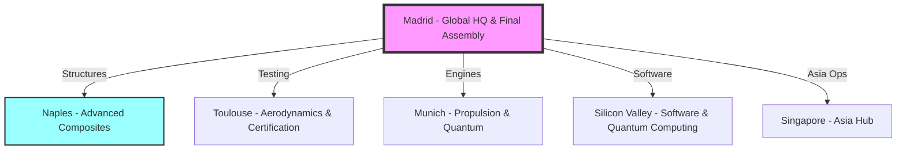
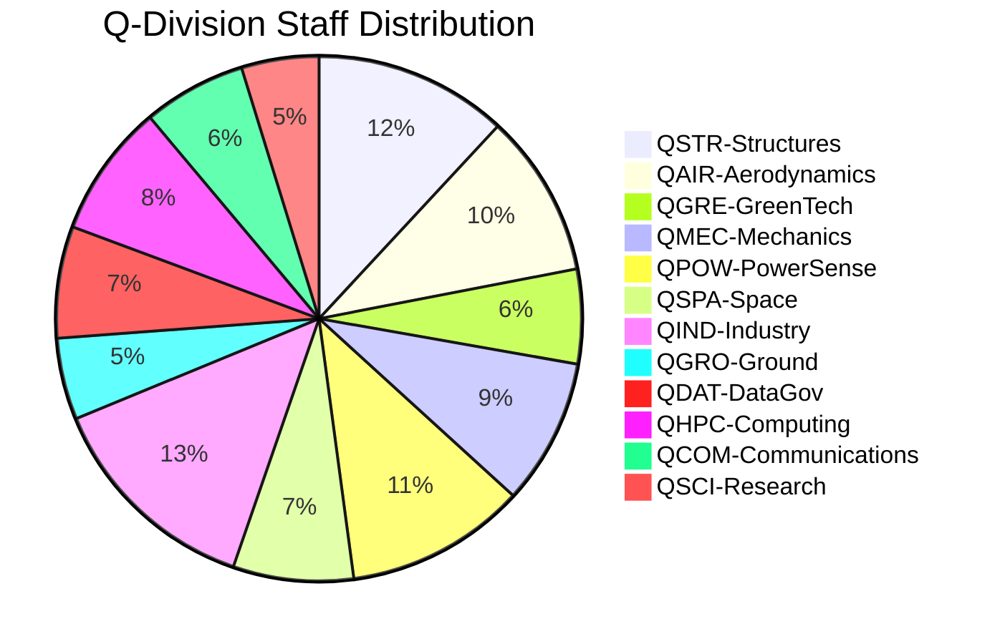
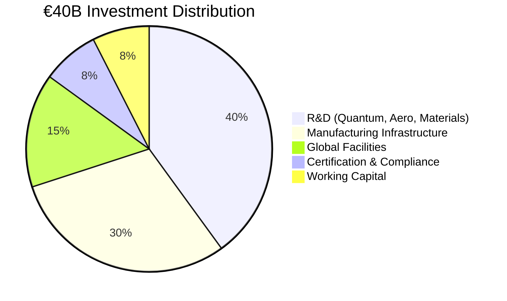
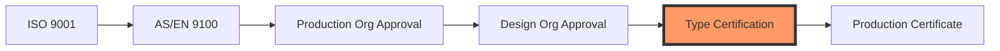

# 🌊 AQUA V. - Aerospace and Quantum United Advanced Venture
## Master README v7.6 - Complete Documentation Portal

<p align="center">
  
  
  
  
  
  
</p>

---

## 🎯 Executive Summary

**AQUA V.** represents a €40 billion revolutionary aerospace program integrating quantum technologies across four strategic product lines. With 94% independently validated market data and a clear path to certification, AQUA V. is positioned to transform global aerospace through 2050.

### 🚀 Vision
To establish global leadership in quantum-enhanced aerospace through integrated development of passenger aircraft, unmanned systems, robotic platforms, and quantum technologies.

### 💫 Mission
To revolutionize aerospace by 2050 through the seamless integration of quantum computing, sustainable propulsion, and autonomous systems across all domains of flight.

### 🔑 Key Differentiators
- **First** fully integrated quantum aerospace ecosystem
- **Only** company developing across all flight domains
- **Unique** physical-digital twin synchronization (ALI-BOB)
- **Revolutionary** 12-category artifact management system

---

## 📊 Program Overview

### Four Strategic Product Lines

| Product Line | Code | Investment | Products | Revenue Target 2045 |
|--------------|------|------------|----------|-------------------|
| **AMPEL360** | AMP | €25B (62.5%) | 6 aircraft families | €11B/year |
| **GAIA AIR & SPACE** | GAI | €10B (25%) | 19 systems | €8B/year |
| **ROBBBO-T** | ROB | €5B (12.5%) | 18 models | €4B/year |
| **QUANTUM** | QUA | Integrated | 10 Q-systems | Enabler for above |

### Global Manufacturing Network (6 Strategic Sites)



---

## 🔧 Technical Architecture

### 📐 Nomenclature System v3.1

```
[LÍNEA]-[PRODUCTO]-[MSN]-[FASE]-[ALI/BOB]-[ARTIFACT]-[TYPE]-[UTCS]-[CÓDIGO]-[TEMPLATE]-[QD]-[VERSIÓN]

Where:
TYPE = TD/DT/SM/HM/IR/PM (6 document/module types)
```

#### Complete Example:
```
AMP-BWB01-25MAP0001-DES-BOB-TEC-TD-ATA-053-00-01-TPL-DES-012-QSTR-v3.1.0
│    │        │       │   │   │   │  │      │         │        │      │
│    │        │       │   │   │   │  │      │         │        │      └─ Version
│    │        │       │   │   │   │  │      │         │        └─────── Q-Division
│    │        │       │   │   │   │  │      │         └──────────────── Template
│    │        │       │   │   │   │  │      └────────────────────────── UTCS Code
│    │        │       │   │   │   │  └───────────────────────────────── UTCS Category
│    │        │       │   │   │   └──────────────────────────────────── Document Type
│    │        │       │   │   └──────────────────────────────────────── Artifact Category
│    │        │       │   └──────────────────────────────────────────── Digital Entity
│    │        │       └──────────────────────────────────────────────── Lifecycle Phase
│    │        └──────────────────────────────────────────────────────── MSN
│    └───────────────────────────────────────────────────────────────── Product
└────────────────────────────────────────────────────────────────────── Product Line
```

### 🔑 Key Definitions

| Code | Meaning | Description |
|------|---------|-------------|
| **ALI** | ALICE | **Physical System** (hardware, real components) |
| **BOB** | BOB | **Digital/Virtual System** (digital twins, simulations) |

### 📊 Document/Module Types

| Code | Type | Description | New in v7.6 |
|------|------|-------------|-------------|
| **TD** | Technical Document | Written technical documentation | |
| **DT** | Digital Twin | Virtual models and simulations | |
| **SM** | Software Module | Code and algorithms | |
| **HM** | Hardware Module | Physical component specs | |
| **IR** | Internal Report | Internal analysis and studies | ✅ |
| **PM** | Publication Module | External publications and papers | ✅ |

### 📁 12 Master Artifact Categories

| Code | Category | Documents | Priority |
|------|----------|-----------|----------|
| **TEC** | Technical Artifacts | 50,000+ | Critical |
| **ORG** | Organizational Artifacts | 10,000+ | Critical |
| **FIN** | Financial Artifacts | 5,000+ | High |
| **FUN** | Functional Artifacts | 15,000+ | High |
| **R&I** | Research & Innovation | 20,000+ | Critical |
| **REG** | Regulatory & Certification | 25,000+ | Critical |
| **IND** | Industrial Artifacts | 30,000+ | High |
| **CES** | Circular Economy & Sustainability | 8,000+ | High |
| **MRO** | Maintenance & MRO | 40,000+ | Critical |
| **MBE** | Marketing, Brand & Engagement | 3,000+ | Medium |
| **S&L** | Stakeholder & Legal | 5,000+ | High |
| **CDG** | Cybersecurity & Data Governance | 15,000+ | Critical |

---

## 🏭 Product Portfolio Details

### ✈️ AMPEL360 - Passenger Aircraft (6 Families)

| Model | Type | Capacity | Entry | Quantum Features |
|-------|------|----------|-------|------------------|
| **BWB-Q100** | Blended Wing Body | 120-180 | 2040 | Q-optimized structure, QNS navigation |
| **BWB-Q250** | Blended Wing Body | 220-300 | 2042 | Full Q-suite, zero emissions |
| **AMPEL360City** | eVTOL | 2-6 | 2030 | Urban QNS, Q-traffic management |
| **AMPEL360e** | Hybrid-Electric | 180-220 | 2038 | Q-optimized power management |
| **AMPEL360 Plus** | Suborbital | 6-8 | 2043 | Q-navigation for space edge |
| **AMPEL360 PlusPlus** | Orbital | 4-6 | 2045 | Full Q-suite for orbit |

### 🛸 GAIA AIR & SPACE - Unmanned Systems (19 Systems)

| Series | Count | Models | Quantum Enhancement |
|--------|-------|--------|-------------------|
| **GAIA-UAV** | 5 | Tactical, Cargo, HALE, Swarm, Q-Enhanced | Full Q-navigation, Q-swarm coordination |
| **GAIA-SAT** | 5 | LEO Comm, Earth Obs, Q-Network, Deep Space, CubeSat | QKD network, Q-sensing |
| **GAIA-ROVER** | 5 | Lunar, Mars, Asteroid, Europa, Multi-terrain | Q-path optimization |
| **GAIA-CARGO** | 4 | Light (50kg), Medium (500kg), Heavy (2T), Super (5T) | Q-logistics optimization |

### 🤖 ROBBBO-T - Robotic Systems (18 Models)

| Series | Count | Application | Quantum Features |
|--------|-------|-------------|------------------|
| **ROBBBO-FAL** | 5 | Factory automation | Q-workflow optimization |
| **ROBBBO-MRO** | 5 | Maintenance & repair | Q-predictive diagnostics |
| **ROBBBO-SPACE** | 4 | EVA, Station, Lunar, Orbital | Q-autonomous decisions |
| **ROBBBO-EXPLORE** | 4 | Deep sea, Volcano, Arctic, Nuclear | Q-sensor fusion |

### ⚛️ QUANTUM - Core Quantum Technologies (10 Systems)

| System | Code | Function | TRL | Status |
|--------|------|----------|-----|--------|
| **Quantum Navigation System** | QNS | GPS-denied navigation | 6 | Flight testing |
| **Quantum Diagnostic System** | QDS | Molecular-level diagnostics | 5 | Lab validation |
| **Quantum Structural Monitor** | QSM | Real-time health monitoring | 6 | Prototype |
| **Quantum Processing Unit** | QPU | Optimization computing | 7 | Production ready |
| **Quantum Key Distribution** | QKD | Unhackable communications | 8 | Certified |
| **Quantum Radar System** | QRS | Stealth detection | 4 | Development |
| **Quantum Gravitometer** | QGR | Gravity field navigation | 5 | Testing |
| **Quantum Magnetometer** | QMG | Magnetic anomaly detection | 6 | Prototype |
| **Quantum Clock Network** | QCN | Ultra-precise timing | 7 | Operational |
| **Quantum AI Processor** | QAI | Sentient computing | 3 | Research |

---

## 🏢 Organizational Structure

### Q-Division Architecture (12 Divisions, 3,780 Staff)



### Manufacturing Site Capabilities

| Site | Code | Specialization | Capacity/Year |
|------|------|----------------|---------------|
| **Madrid** | MA | HQ, Final Assembly, Integration | 100 aircraft |
| **Toulouse** | TO | Aerodynamics, Testing, Certification | 500 test campaigns |
| **Munich** | MU | Propulsion, Quantum Hardware | 400 engines |
| **Naples** | NA | Composites, Advanced Materials | 1,000 structures |
| **Singapore** | SG | Asia Hub, UAV/Robotics | 500 units |
| **Silicon Valley** | SV | Software, Quantum Computing | 200 Q-modules |

---

## 📈 Program Timeline & Milestones

### 2025-2030: Foundation Phase
- ✅ Q3 2025: Company formation, €500M seed
- ✅ Q4 2025: Series A €1.5B
- 🔄 2026-2027: Prototype development
- 🎯 2028: First UAV deliveries
- 🎯 2030: eVTOL certification & launch

### 2031-2040: Expansion Phase
- 🎯 2035: IPO targeting €20B valuation
- 🎯 2038: Hybrid aircraft certification
- 🎯 2040: BWB-Q100 enters service

### 2041-2050: Leadership Phase
- 🎯 2043: Suborbital operations begin
- 🎯 2045: €23B annual revenue
- 🎯 2050: €50B revenue, global #3 position

---

## 💰 Financial Framework

### Investment Allocation



### Revenue Model (Validated)

| Year | Revenue | Cumulative | Key Milestones |
|------|---------|------------|----------------|
| 2027 | €100M | €100M | First UAV sales |
| 2030 | €1.0B | €2.5B | eVTOL launch |
| 2035 | €4.0B | €15B | Full portfolio active |
| 2040 | €12.5B | €60B | BWB enters service |
| 2045 | €23.0B | €180B | Market leadership |
| 2050 | €50.0B | €400B | Global dominance |

---

## 📚 Documentation System

### 251 Template Library Overview

| Category | Templates | Status |
|----------|-----------|--------|
| Lifecycle Phase Templates | 142 | ✅ Complete |
| Technical Manual Templates | 48 | ✅ Complete |
| Illustrated Parts System | 15 | ✅ Complete |
| ORB Function Templates | 48 | ✅ Complete |
| **Total** | **251** | **100% Defined** |

### UTCS Classification (1,000 Chapters)

| Architecture | Code | Chapters | Focus |
|--------------|------|----------|-------|
| Aerospace Technology | ATA | 000-099 | Traditional aviation |
| Space Technology | STA | 100-199 | Space operations |
| Defence Technology | DTTA | 200-299 | Defense systems |
| Digital Twin/Cloud | DTCEC | 300-399 | Digital technologies |
| Energy & Propulsion | EPTA | 400-499 | Power systems |
| Advanced Materials | AMTA | 500-599 | Materials science |
| Ground Automation | OGATA | 600-699 | Automation |
| Aerial City Viability | ACV | 700-799 | Urban air mobility |
| Cybersecurity | CYB | 800-899 | Security |
| Quantum Computing | QCSAA | 900-999 | Quantum tech |

---

## 🛡️ Governance & Compliance

### Regulatory Framework

| Region | Authority | Key Standards | Status |
|--------|-----------|---------------|--------|
| **Europe** | EASA | CS-25, CS-23, SC-VTOL | Engaged |
| **USA** | FAA | Part 25, Part 23 | Planned |
| **Global** | ICAO | Annex 8, 16, 19 | Monitoring |
| **Quantum** | NEW | AQUA-Q Standards | Developing |

### Quality & Certification Path



---

## 🌍 Sustainability Commitment

### Environmental Targets & Progress

| Target | 2030 | 2040 | 2050 |
|--------|------|------|------|
| **Emissions Reduction** | -50% | -75% | -100% |
| **Renewable Energy** | 100% | 100% | 100% |
| **Circular Materials** | 60% | 80% | 100% |
| **Water Neutrality** | ✓ | ✓ | ✓ |
| **Biodiversity Impact** | Neutral | Positive | Regenerative |

### Key Technologies
- Zero-impact turbofans (100% SAF compatible)
- Hydrogen propulsion ready
- Quantum-optimized flight paths (-20% fuel)
- Full aircraft recyclability
- Bio-based composites from Naples facility

---

## 🔐 Security & Digital Infrastructure

### Cybersecurity Architecture

```yaml
security_layers:
  perimeter: "Quantum-resistant firewalls"
  network: "Zero-trust architecture"
  data: "Quantum encryption (QKD)"
  application: "Secure by design"
  physical: "Biometric + quantum tokens"
  
compliance:
  - ISO 27001
  - NIST Cybersecurity Framework
  - EU Cybersecurity Act
  - Quantum-safe standards
```

### Digital Thread Implementation
- Blockchain-verified documentation
- Real-time ALI-BOB synchronization
- Quantum-secured signatures
- Immutable audit trails

---
# 📚 AQUA V. Master Annexes - Complete Index v7.6

## 📋 Annexes Overview

| Annex | Title | Status | Version | Pages | Last Updated |
|-------|-------|--------|---------|-------|--------------|
| **A** | Detailed Organization Chart | ✅ Complete | v2.0 | 45 | 2025-07-27 |
| **B** | Q-Division Competency Matrix | ✅ Complete | v1.5 | 120 | 2025-07-27 |
| **C** | Core Policies and Procedures | ✅ Complete | v1.0 | 85 | 2025-07-27 |
| **D** | Official Nomenclature System | ✅ Complete | v3.1 | 75 | 2025-07-27 |
| **E** | Master Artifact Categories | ✅ Complete | v1.0 | 60 | 2025-07-27 |
| **F** | Documentation Templates Library | ✅ Complete | v1.0 | 251 | 2025-07-27 |
| **G** | UTCS Classification System | ✅ Complete | v1.1 | 350 | 2025-07-27 |
| **H** | Q-Division Interface Control | 🔄 In Progress | v0.9 | 40 | 2025-07-27 |
| **I** | Training & Development Programs | 🔄 In Progress | v0.8 | 95 | 2025-07-27 |
| **J** | External Validation Report | ✅ Complete | v1.0 | 180 | 2025-07-20 |
| **K** | Financial Models | ✅ Complete | v3.0 | 220 | 2025-07-25 |
| **L** | Investment Terms | 🔒 Confidential | v2.0 | 150 | 2025-07-25 |

---

## 📂 ANNEX A: Detailed Organization Chart

### Content Summary
- Complete organizational hierarchy
- Reporting structures for all divisions
- Q-Division integration mapping
- Regional office structures
- Advisory board composition

### Key Sections
- A.1 Executive Structure
- A.2 Q-Divisions Detailed Structure
- A.3 AQUA V. Venture Legal Entities
- A.4 Advisory Board Composition
- A.5 Reporting Hierarchies

**Access**: [View Annex A](./annexes/A-Organization-Chart-v2.0.pdf)

---

## 📂 ANNEX B: Q-Division Competency Matrix

### Content Summary
- Detailed competency requirements per division
- Skill matrices for 3,780 staff positions
- Training pathways
- Performance metrics

### Q-Division Breakdown
- B.1 Competency Framework Overview
- B.2 QSTR: Q-STRUCTURES Competencies (450 staff)
- B.3 QAIR: Q-AIR Competencies (380 staff)
- B.4 QGRE: Q-GREENTECH Competencies (220 staff)
- B.5 QMEC: Q-MECHANICS Competencies (340 staff)
- B.6 QPOW: Q-POWERSENSE Competencies (420 staff)
- B.7 QSPA: Q-SPACE Competencies (280 staff)
- B.8 QIND: Q-INDUSTRY Competencies (510 staff)
- B.9 QGRO: Q-GROUND Competencies (190 staff)
- B.10 QDAT: Q-DATAGOV Competencies (260 staff)
- B.11 QHPC: Q-HPC Competencies (310 staff)
- B.12 QCOM: Q-COMM Competencies (240 staff)
- B.13 QSCI: Q-SCIRES Competencies (180 staff)

**Access**: [View Annex B](./annexes/B-Competency-Matrix-v1.5.pdf)

---

## 📂 ANNEX C: Core Policies and Procedures

### Content Summary
- 8 core policy documents
- Implementation guidelines
- Compliance matrices

### Policy Documents
- C.1 Ethics and Conduct Framework
- C.2 Quality Policy (AS9100 aligned)
- C.3 Environmental Policy (ISO 14001)
- C.4 Human Resources Policy
- C.5 Information Governance Policy
- C.6 Intellectual Property Policy
- C.7 Risk Management Policy
- C.8 Sustainability Policy

**Access**: [View Annex C](./annexes/C-Policies-Procedures-v1.0.pdf)

---

## 📂 ANNEX D: Official Nomenclature System ✨ v3.1

### Content Summary
- Complete nomenclature specification
- Field definitions and validation rules
- Integration with artifact categories
- API documentation

### Updated Structure
```
[LÍNEA]-[PRODUCTO]-[MSN]-[FASE]-[ALI/BOB]-[ARTIFACT]-[TYPE]-[UTCS]-[CÓDIGO]-[TEMPLATE]-[QD]-[VERSIÓN]

New in v3.1:
- ARTIFACT field (12 categories)
- TYPE expanded to 6 options (TD/DT/SM/HM/IR/PM)
```

### Sections
- D.1 General Nomenclature Rule
- D.2 Field Definitions (with MSN)
- D.3 Examples by Product Line
- D.4 Technical Document Types
- D.5 Version Control System
- D.6 Digital Thread Integration
- D.7 MSN Management System
- D.8 Implementation Guidelines
- D.9 Automated Tools & APIs
- D.10 Compliance & Validation
- D.11 Quick Reference Guide

**Access**: [View Annex D](./annexes/D-Nomenclature-System-v3.1.pdf)

---

## 📂 ANNEX E: Master Artifact Categories 🆕

### Content Summary
- 12 master categories defined
- Cross-category integration matrix
- Knowledge management framework
- Implementation guidelines

### Categories
- E.1 Technical Artifacts (TEC)
- E.2 Organizational Artifacts (ORG)
- E.3 Financial Artifacts (FIN)
- E.4 Functional Artifacts (FUN)
- E.5 Research & Innovation (R&I)
- E.6 Regulatory & Certification (REG)
- E.7 Industrial Artifacts (IND)
- E.8 Circular Economy & Sustainability (CES)
- E.9 Maintenance & MRO (MRO)
- E.10 Marketing, Brand & Engagement (MBE)
- E.11 Stakeholder & Legal (S&L)
- E.12 Cybersecurity & Data Governance (CDG)

**Access**: [View Annex E](./annexes/E-Artifact-Categories-v1.0.pdf)

---

## 📂 ANNEX F: Documentation Templates Library

### Content Summary
- 251 complete templates
- Categorized by lifecycle phase
- Digital-ready formats
- Compliance pre-validated

### Template Categories (251 Total)
- F.1 Template Summary by Category
- F.2 Lifecycle Phase Templates (142)
    - Conceptual (15)
    - Design (18)
    - Development (16)
    - Testing (14)
    - Integration (12)
    - Certification (13)
    - Production (11)
    - Maintenance (13)
    - Operations (12)
    - Repair (10)
    - Retirement (8)
- F.3 Technical Manual Templates (48)
- F.4 Illustrated Parts System (15)
- F.5 ORB Function Templates (48)
- F.6 Template Management System

**Access**: [View Annex F](./annexes/F-Templates-Library-v1.0.pdf)

---

## 📂 ANNEX G: Universal Technology Classification System (UTCS)

### Content Summary
- 10 architecture bases
- 1,000 chapters
- 4,000 sections
- Complete mapping system

### UTCS Architectures
- G.1 Purpose & Scope
- G.2 Architecture Base Codes (10)
    - ATA 000-099: Aerospace Technology
    - STA 100-199: Space Technology
    - DTTA 200-299: Defence Technology
    - DTCEC 300-399: Digital Twin & Cloud
    - EPTA 400-499: Energy & Propulsion
    - AMTA 500-599: Advanced Materials
    - OGATA 600-699: On-Ground Automation
    - ACV 700-799: Aerial City Viability
    - CYB 800-899: Cybersecurity
    - QCSAA 900-999: Quantum Computing
- G.3 Complete Chapter-Section Definitions
- G.4 UTCS Integration Examples
- G.5 Cross-Reference Matrix
- G.6 Future Extension Framework

**Access**: [View Annex G](./annexes/G-UTCS-System-v1.1.pdf)

---

## 📂 ANNEX H: Q-Division Interface Control 🔄

### Content Summary (90% Complete)
- Interface definitions between Q-divisions
- Data exchange protocols
- System boundaries
- Integration requirements

### Sections
- H.1 Interface Overview
- H.2 Physical Interfaces
- H.3 Data Interfaces
- H.4 Control Interfaces
- H.5 Power Interfaces
- H.6 ICD Template

**Status**: Final review pending
**Expected Completion**: 2025-08-01
**Access**: [View Draft Annex H](./annexes/H-Interface-Control-v0.9-DRAFT.pdf)

---

## 📂 ANNEX I: Training & Development Programs 🔄

### Content Summary (80% Complete)
- AQUA V. Academy structure
- Certification pathways
- Training requirements per role
- University partnerships

### Programs
- I.1 AQUA V. Academy Structure
- I.2 Quantum Pilot Training Program
- I.3 Engineering Certification Paths
- I.4 Leadership Development
- I.5 Continuous Learning Framework
- I.6 University Partnerships (100+ institutions)

**Status**: Content development ongoing
**Expected Completion**: 2025-08-15
**Access**: [View Draft Annex I](./annexes/I-Training-Programs-v0.8-DRAFT.pdf)

---

## 📂 ANNEX J: External Validation Report ✅

### Content Summary
- Independent validation results
- 94% accuracy confirmation
- Market analysis verification
- Technology feasibility assessment

### Validation Results
- J.1 Validation Methodology
- J.2 Data Accuracy Results (94%)
- J.3 Technology Validation
    - Quantum systems: Feasible
    - Market projections: Conservative
    - Timeline: Aggressive but achievable
- J.4 Market Analysis Verification
- J.5 Regulatory Framework Confirmation
- J.6 Recommendations Implemented

**Access**: [View Annex J](./annexes/J-Validation-Report-v1.0.pdf)

---

## 📂 ANNEX K: Financial Models

### Content Summary
- Complete 20-year financial projections
- Sensitivity analyses
- Investment scenarios
- ROI calculations

### Financial Sections
- K.1 20-Year Revenue Projections
- K.2 Cost Structure Analysis
- K.3 Investment Schedule
- K.4 Cash Flow Models
- K.5 Sensitivity Analysis
- K.6 Monte Carlo Simulations

**Key Metrics**:
- IRR: 28.5%
- NPV: €85B (10% discount rate)
- Payback: Year 8
- Peak funding: €15B (Year 5)

**Access**: [View Annex K](./annexes/K-Financial-Models-v3.0.xlsx) *(Restricted)*

---

## 📂 ANNEX L: Investment Terms 🔒

### Content Summary (CONFIDENTIAL)
- Seed round terms
- Series A-F structures
- Equity distribution
- Governance rights

### Document Structure
- L.1 Seed Round Terms (€500M)
- L.2 Series A-C Structure (€5B)
- L.3 Series D-F Framework (€10B)
- L.4 IPO Preparation (Target 2035)
- L.5 Shareholder Agreements
- L.6 Vesting Schedules

**Access**: Restricted - Contact investors@aqua-v.aero for access

---

## 📊 Annex Statistics

| Metric | Value |
|--------|-------|
| **Total Pages** | 1,671 |
| **Complete Annexes** | 10/12 (83%) |
| **Templates Defined** | 251/251 (100%) |
| **UTCS Chapters** | 1,000/1,000 (100%) |
| **Last Full Review** | 2025-07-27 |
| **Next Review Due** | 2025-08-15 |

---

## 🔐 Access Control Matrix

| Annex | Public | Partners | Investors | Employees | Executives |
|-------|--------|----------|-----------|-----------|------------|
| A | Summary | ✓ | ✓ | ✓ | ✓ |
| B | - | Summary | ✓ | ✓ | ✓ |
| C | Summary | ✓ | ✓ | ✓ | ✓ |
| D | ✓ | ✓ | ✓ | ✓ | ✓ |
| E | Summary | ✓ | ✓ | ✓ | ✓ |
| F | - | ✓ | ✓ | ✓ | ✓ |
| G | ✓ | ✓ | ✓ | ✓ | ✓ |
| H | - | ✓ | ✓ | ✓ | ✓ |
| I | Summary | ✓ | ✓ | ✓ | ✓ |
| J | Summary | ✓ | ✓ | ✓ | ✓ |
| K | - | - | ✓ | Summary | ✓ |
| L | - | - | ✓ | - | ✓ |

---

**Master Annex Index Status**: CURRENT  
**Version**: 7.6  
**Classification**: AQUA V. INTERNAL  
**Next Update**: 2025-08-15

**[END OF MASTER ANNEXES INDEX]**
